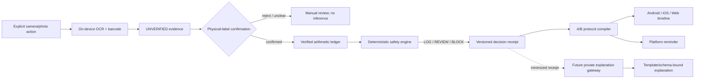
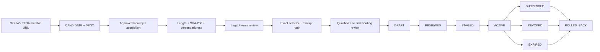
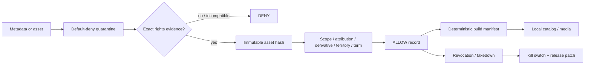
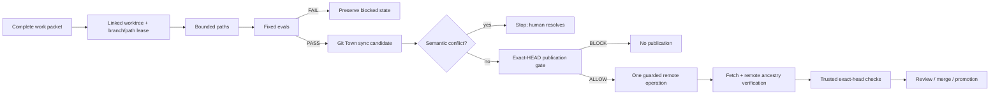

# Gym Come True

[繁體中文](README.zh-TW.md)

Evidence-first fitness protocol execution for Android, iOS, and Web, built with Kotlin Multiplatform and Compose Multiplatform.

> **Current truth:** `main` now contains the cross-platform foundation, Taiwan supplement-evidence contracts, immutable Taiwan source lifecycle, the documentation/Git Town delivery graph, and the machine-verified stacked delivery contract. Integration is not admission: no hosted CI run has ever allocated a runner on this repository, so nothing below is backed by hosted evidence. It is not a medical device, is not store-ready, has no clinically admitted Taiwan rule pack, has no licensed third-party exercise-media catalog, and has not admitted a Git Town executable.

## Authority and status vocabulary

Read this file for the repository-wide map, then read [AGENTS.md](AGENTS.md), [Architecture](docs/architecture.md), and the [Git / Stacked-PR governance index](docs/git/README.md).

| Term | Meaning |
|---|---|
| **OPEN DRAFT PR** | A GitHub PR exists. It is not merged, released, or production-admitted. |
| **PLANNED WORK PACKET** | A bounded future slice with parent, path lease, evals, rollback, and Human Admit boundary. No branch or PR is implied. |
| **EXTERNAL GATE** | Legal, clinical, store, billing, device, credential, or rights evidence that repository code cannot manufacture. |
| `ABSENT` | Required evidence or executable is unavailable. |
| `NOT_IMPLEMENTED` | The repository intentionally does not yet contain the capability. |
| `NOT_EXERCISED` | A subject-bound runtime canary has not run. |
| `SKIPPED_BY_POLICY` | Policy deliberately prevented the operation; this is not a test pass. |
| `PASS` / `FAIL` | A named command actually executed against the stated subject. |

## Published delivery stack

The stack was strictly linear, contained no merge conflicts, and was integrated into `main`
as a single fast-forward from `agent/git-town-admission-candidate` (owner-directed merge).

| PR | Merged head | Exact subject | Admission |
|---:|---|---|---|
| [#2](https://github.com/ed3c/gym-come-true/pull/2) | `58492815f22af65665172bcf98bfb661639ece92` | `agent/bootstrap-kmp-fitness-platform` | Merged into `main`; hosted exact-head success still required |
| [#15](https://github.com/ed3c/gym-come-true/pull/15) | `79f8a65b370806925c32f0a15da88c7c0d7bda36` | `agent/taiwan-supplement-evidence` | Merged into `main`; no clinically reviewed pack |
| [#16](https://github.com/ed3c/gym-come-true/pull/16) | `f58a2feac580ca37bb4d7b3c30e122908bfd6b07` | `agent/taiwan-source-lifecycle` | Merged into `main`; official sources remain denied |
| [#20](https://github.com/ed3c/gym-come-true/pull/20) | `ad065c8ac944f2fb4f9d60e65b008367b1291c43` | `agent/document-git-town-delivery-graph` | Merged into `main`; documentation/convergence slice |
| [#22](https://github.com/ed3c/gym-come-true/pull/22) | `a70a52cc6e3e2f4107edae2f7bb2034029161568` | `agent/git-town-admission-candidate` | Merged into `main`; Git Town runtime still `NOT_EXERCISED` |

Merging integrated the code. It did not produce hosted evidence: every workflow run on this
repository so far ended before runner allocation (`PRE_RUN_BLOCKED_BY_ACTIONS_BUDGET`, Issue #45).
Issues #24–#48 are requirements and future work packets, not completed PRs.

## Product thesis

Gym Come True is not a generic workout logger or free-form supplement chatbot. Its intended differentiator is a verifiable protocol executor for Taiwan and Traditional Chinese users:

1. **Copyright-clean exercise intelligence** — metadata, media, anatomy assets, rendering code, and UGC are separate rights domains. Unknown rights fail closed.
2. **Evidence-first label capture** — on-device OCR and barcode scanning create candidates, never automatic product truth.
3. **Deterministic supplement boundaries** — generic code normalizes compatible mass units; IU, medication context, symptoms, missing servings, and conflicts fail closed.
4. **Daily Body Hacker ledger** — confirmed arithmetic and duplicate ingredients are visible without interpreting a safe or recommended dose.
5. **A/B protocol execution** — one plan can project a 16:00 or 22:00 training day with cross-midnight ordering, meals, recovery, and reminders.
6. **Proof before explanation** — a future LLM gateway may explain an immutable decision receipt. It cannot own the decision, create rules, recommend dosage, or suppress warnings.

## Repository map: directory ownership and state machines

```text
.
├── shared/                     # deterministic domain truth and shared UI
├── androidApp/                 # Android permission, capture, ML Kit, temp-file, reminder adapters
├── iosApp/                     # canonical XcodeGen host, Vision evidence, local notifications
├── webApp/                     # JS/Wasm browser projection; no native-health parity claim
├── data/                       # synthetic/Draft fixtures and transport schemas
├── legal/                      # source/media/provenance admission and revocation truth
├── assets/                     # first-party or explicitly admitted immutable assets
├── scripts/                    # validators and local-only source capture
├── docs/                       # architecture, safety, delivery, Git/Stacked-PR SSOT
├── .github/workflows/          # exact-head hosted evidence
├── AGENTS.md                   # root execution law and shared-Skill routing
└── THIRD_PARTY_NOTICES.md      # dependency and asset notice obligations
```

### Directory responsibility matrix

| Directory | Owning plane | State machine | Inputs | Outputs | Current state |
|---|---|---|---|---|---|
| `shared/` | Deterministic domain | `UNVERIFIED -> USER_CONFIRMED -> RULE_EVALUATED -> DECISION_RECEIPT`; source `CANDIDATE -> CAPTURED -> HASH_VERIFIED -> LEGAL_REVIEWED -> VERIFIED_MAPPING -> REVIEWED -> STAGED -> ACTIVE` | Confirmed evidence, reviewed manifests, user-authored plan | Decisions, receipts, A/B timeline, shared UI state | Contract layer implemented; no production health-rule admission |
| `androidApp/` | Android adapter | permission; temporary capture; OCR candidate; inexact reminder | Explicit user actions and shared commands | Unverified ML Kit evidence and reminder events | Foundation only; Health Connect/reliability is Issue #10 |
| `iosApp/` | Apple adapter | picker/Vision candidate; notification authorization/schedule | Explicit photo choice and shared commands | Unverified Vision evidence and local notifications | Canonical `project.yml` + `NativeCapabilityBridge.swift`; HealthKit/AlarmKit is Issue #9 |
| `webApp/` | Browser projection | `BOOTSTRAP -> SHARED_UI_READY -> USER_INPUT -> LOCAL_RESULT` | Manual/imported evidence and shared state | JS/Wasm UI | Compatibility distribution implemented; native parity not claimed |
| `data/` | Fixture/transport | `SYNTHETIC_OR_DRAFT -> STRUCTURALLY_VALIDATED -> TEST_ONLY` | Repository-authored fixtures and schemas | Test records and transport contracts | Real corpus remains external; fixture cannot self-admit production |
| `legal/` | Rights/source admission | `UNKNOWN -> REVIEW -> ALLOW/DENY -> REVOKED` | License, contract, source evidence | Admission records and prohibited-use boundaries | Default deny; no third-party exercise media or official source admitted |
| `assets/` | Immutable asset | `QUARANTINED -> HASHED -> RIGHTS_REVIEWED -> ADMITTED -> PACKAGED -> REVOKED` | First-party work or executed rights | Content-addressed assets and provenance | First-party schematic only |
| `scripts/` | Verification | `INPUT -> VALIDATED -> PASS/FAIL`; source capture `LOCAL_FILE -> HASH_VERIFIED + DENY` | Repository files or approved local bytes | Deterministic reports/receipts | Validators and no-network source capture implemented |
| `docs/` | Decision/handoff | `OBSERVED -> DOCUMENTED -> REVIEWED -> SUPERSEDED` | Code, Issues, PR graph, receipts | Human/Agent SSOT | PR #20 reconciles current state and branch graph |
| `.github/workflows/` | Hosted verification | `QUEUED -> RUNNER_ALLOCATED -> EXECUTED -> PASS/FAIL`; may be `PRE_RUN_BLOCKED` | Exact commit | Hosted checks/artifacts | Current account budget blocks runner allocation |
| `docs/git/` | Branch/work governance | `TASK_PACKET_DRAFT -> LEASED -> SYNCED -> LOCALLY_VERIFIED -> PUBLICATION_ALLOW/BLOCK -> HUMAN_ADMIT` | Shared Skill, profile, packet, leases, evals | Branch graph and receipts | Policy documented; Git Town executable/canaries absent or not exercised |

## End-to-end data flows

### Supplement label and protocol



### Taiwan regulatory source and rule pack



`HASH_VERIFIED`, `LEGAL_REVIEWED`, `REVIEWED`, `ACTIVE`, and `ADMITTED` are distinct. A live URL, dataset ID, status field, model output, or handwritten hash cannot skip a gate.

### Exercise metadata and media



### Worker, Git Town, and publication



Git Town owns branch hierarchy and synchronization only. It never proves correctness, publication admission, merge readiness, release readiness, or legal/clinical acceptance.

## Git Town adoption status

Canonical method: shared [`git-town-stacked-pr-worker`](https://github.com/ed3c/skills-shared/tree/main/skills/git-town-stacked-pr-worker). This repository references it and does not vendor a shadow copy.

| Evidence | State |
|---|---|
| Shared canonical Skill resolved | `PASS` — inspected blob `eb2d915bca3e8a3938625f7d33a10fae95a15769` |
| Repo-owned profile, Worker policy, packet template, stack graph | Documented in `docs/git/` |
| Exact Git Town version/executable | `ABSENT` |
| Checksum/provenance/license/SBOM/notices/legal admission | `ABSENT` |
| `.git-town.toml` | `NOT_IMPLEMENTED` |
| Worktree/lease, no-push sync, conflict, publication canaries | `NOT_EXERCISED` |
| Background synchronization | Disabled |
| Merge, ship, promotion, rollback | Human / trusted operator only |

See [Git Town admission](docs/git/GIT_TOWN_ADMISSION.md), [repository profile](docs/git/REPO_PROFILE.md), [Worker protocol](docs/git/WORKER_PROTOCOL.md), and [molecular stack index](docs/git/STACKED_PRS.md).

## Molecular terminal Stack PR index

This table is the human view. The gated machine view is
[`docs/git/stacked-delivery-manifest.json`](docs/git/stacked-delivery-manifest.json), checked by
`python3 scripts/validate_stacked_delivery.py --self-test`. Any row below that disagrees with the
manifest is a documentation bug.

`MERGED` means the code is in `main`, not that hosted evidence exists. Every other branch below is a
proposed `PLANNED WORK PACKET` unless stated otherwise.

| ID | Issue | Parent | Branch | Primary transition | Status |
|---|---:|---|---|---|---|
| S0 | #1 | `main` | `agent/bootstrap-kmp-fitness-platform` | `EMPTY_REPOSITORY -> FOUNDATION` | **MERGED (PR #2)** |
| S1 | #8 | foundation | `agent/taiwan-supplement-evidence` | `FOUNDATION -> EVIDENCE_CONTRACT_DRAFT` | **MERGED (PR #15)** |
| S2 | #17 | Taiwan evidence | `agent/taiwan-source-lifecycle` | `EVIDENCE_DRAFT -> SOURCE_LIFECYCLE_DRAFT` | **MERGED (PR #16)** |
| S3 | #19 | source lifecycle | `agent/document-git-town-delivery-graph` | `SOURCE_LIFECYCLE_DRAFT -> DOCUMENTED_DELIVERY_GRAPH_DRAFT` | **MERGED (PR #20)** |
| S4 | #21 | delivery graph | `agent/git-town-admission-candidate` | `DELIVERY_GRAPH_DRAFT -> GIT_TOWN_CANDIDATE_RECORDED` | **MERGED (PR #22)** |
| S5 | #23 | Git Town candidate | delivered on `main` | `CANDIDATE_RECORDED -> MACHINE_VERIFIED_STACKED_DELIVERY` | **MERGED** |
| TW1 | #24 | source lifecycle | `agent/tw-consent-corpus-contract` | `CORPUS_UNKNOWN -> CONSENT_CONTRACT_DRAFT` | PLANNED; consent/privacy gate |
| TW2 | #25 | TW1 | `agent/tw-ocr-evaluation-contract` | `CONSENT_DRAFT -> OCR_EVALUATION_DRAFT` | PLANNED; corpus/device gate |
| TW3 | #26 | TW2 | `agent/tw-reviewed-rule-pack` | `OCR_EVALUATED -> REVIEWED_TAIWAN_RULE_PACK` | PLANNED; external source/reviewer gate |
| I1 | #27 | foundation | `agent/ios-evidence-bridge` | `IOS_SHELL -> IOS_EVIDENCE_HANDOFF` | PLANNED sibling stack |
| I2 | #28 | I1 | `agent/ios-healthkit-minimal` | `IOS_EVIDENCE -> MINIMAL_HEALTH_READS` | PLANNED; Apple entitlement gate |
| I3 | #29 | I2 | `agent/ios-reminder-alarmkit-assessment` | `HEALTH_READS -> IOS_DELIVERY_EVIDENCE` | PLANNED; device evidence gate |
| A1 | #30 | foundation | `agent/android-health-connect-minimal` | `ANDROID_SHELL -> MINIMAL_HEALTH_READS` | PLANNED sibling stack |
| A2 | #31 | A1 | `agent/android-reminder-reliability` | `HEALTH_READS -> ANDROID_DELIVERY_EVIDENCE` | PLANNED; device-farm gate |
| C1 | #32 | foundation | `agent/exercise-taxonomy-contract` | `DEMO_CATALOG -> TAXONOMY_CONTRACT` | PLANNED sibling stack |
| C2 | #33 | C1 | `agent/exercise-top50-content` | `TAXONOMY -> RIGHTS_CLEAN_TOP50` | PLANNED; editorial/rights gate |
| C3 | #34 | C2 | `agent/exercise-media-admission` | `TOP50 -> LICENSED_MEDIA_PIPELINE` | PLANNED; external rights gate |
| L1 | #35 | TW3 | `agent/explanation-gateway-contract` | `REVIEWED_RECEIPT -> GATEWAY_CONTRACT` | PLANNED; security review gate |
| L2 | #36 | L1 | `agent/explanation-gateway-provider` | `CONTRACT -> PROVIDER_DRAFT` | PLANNED; credential gate |
| L3 | #37 | L2 | `agent/explanation-gateway-adversarial-evals` | `PROVIDER_DRAFT -> EVALUATED_GATEWAY` | PLANNED; red-team gate |
| R1 | #38 | foundation | `agent/entitlement-contract` | `NO_ENTITLEMENT -> VERIFIED_ENTITLEMENT_DRAFT` | PLANNED sibling stack |
| R2 | #39 | R1 | `agent/privacy-delete-export` | `ENTITLEMENT -> ACCOUNT_DATA_LIFECYCLE_DRAFT` | PLANNED; storage/privacy gate |
| R3 | #40 | admitted domain heads | `agent/store-release-candidate` | `DOMAIN_SLICES -> STORE_RELEASE_CANDIDATE` | PLANNED; store/signing gate |
| M1 | #41 | foundation | `agent/market-interview-protocol` | `MARKET_UNKNOWN -> PROBLEM_EVIDENCE_DRAFT` | PLANNED sibling stack |
| M2 | #42 | M1 | `agent/creator-rights-contract` | `PROBLEM_EVIDENCE -> RIGHTS_CLEARED_CREATIVE` | PLANNED; creator contract gate |
| M3 | #43 | M2 | `agent/market-experiment-ledger` | `CREATIVE -> RETENTION_EVIDENCE_DRAFT` | PLANNED; audited campaign gate |
| N1 | #46 | Taiwan evidence | `agent/taiwan-food-nutrition-data` | `NO_FOOD_LAYER -> COPYRIGHT_CLEAN_FOOD_DATA_DRAFT` | PLANNED; reuse-terms gate |
| N2 | #47 | N1 | `agent/meal-plan-compiler` | `FOOD_DATA_DRAFT -> DETERMINISTIC_MEAL_PLAN_DRAFT` | PLANNED; nutrition review gate |
| V1 | #48 | C1 | `agent/muscle-visualization-ui` | `SCHEMATIC_ASSET -> LOCAL_MUSCLE_VISUALIZATION` | PLANNED; first-party asset gate |
| X1 | #44 | admitted heads | `agent/release-convergence-index` | `REVIEWABLE_SLICES -> RELEASE_CONVERGENCE_DRAFT` | PLANNED Human-Admit convergence |

Full path leases, eval commands, negative controls, rollback subjects, and Human Admit operations are in [STACKED_PRS.md](docs/git/STACKED_PRS.md). Independent domains are sibling stacks from the foundation, not one artificial serial chain.

## Current implementation

- Shared parser, compatible mass normalization, daily arithmetic, duplicate detection, safety gates, A/B timetable, and Compose UI.
- Android camera handoff, bundled Chinese/Latin ML Kit OCR, barcode extraction, temporary-image deletion, and inexact reminders.
- iOS canonical XcodeGen host, PhotosPicker/Vision candidates, and local notifications.
- JS/Wasm browser distribution.
- Taiwan product/corpus identity, OCR metrics, rule-pack admission, decision receipts, source snapshot/mapping/release lifecycle, synthetic fixtures, and fail-closed validators.
- Default-deny source/media governance and first-party schematic assets.

See [Implementation status](docs/implementation-status.md).

## Honest capability matrix

| Capability | Android | iOS | Web | Current state |
|---|---:|---:|---:|---|
| Shared dashboard and A/B timetable | Yes | Yes | Yes | Foundation |
| OCR label extraction | Bundled Chinese/Latin ML Kit | Vision via photo picker | Manual/import later | Candidate evidence only |
| Barcode extraction | ML Kit | Vision | Planned | Not product truth |
| Daily intake arithmetic | Shared | Shared | Shared | No safety-limit interpretation |
| Taiwan rule-pack admission contract | Shared | Shared | Shared | Draft; no production pack |
| Source snapshot / mapping / release lifecycle | Shared | Shared | Shared | Draft; official sources remain denied |
| Local reminders | Inexact AlarmManager | UserNotifications | Browser later | No exact-delivery guarantee |
| Health data | Adapter boundary | Adapter boundary | N/A | Not implemented |
| System alarm challenge | Future exact-alarm review | Future AlarmKit review | N/A | No coercive/undismissable promise |
| LLM explanation | Contract only | Contract only | Contract only | Server gateway not implemented |
| Licensed third-party exercise media | None | None | None | Default deny |

## Safety contract

- OCR and barcode results always begin `UNVERIFIED`.
- Only `mcg/µg/μg`, `mg`, and `g` use generic mass conversion.
- IU, volume, count, proprietary blends, medication context, pregnancy, procedures, symptoms, missing evidence, and conflicts fail closed.
- Daily totals are arithmetic observations, not safety limits or recommendations.
- Production corpus retention requires consent, encryption, expiry, withdrawal, hashes, and provenance.
- No official-source byte, legal state, clinical review, signature, store approval, revenue result, or CI result may be fabricated.
- LLM output is explanatory and cannot own decisions or warnings.
- Android inexact alarms and iOS notifications are reminders, not guaranteed alarms; AlarmKit keeps system stop semantics.

## Copyright and data admission

No third-party exercise image, GIF, video, SVG anatomy map, 3D model, scraped dataset, media ID, or vendor CDN URL ships merely because it is publicly reachable. Every production asset requires an `ALLOW` record with rights holder, scope, license evidence, immutable hash, review date, attribution, derivative/redistribution boundaries, and takedown path.

Current visual assets are first-party schematic material. No third-party exercise media is admitted. Metadata rights, media rights, rendering-code rights, model rights, and user-upload rights remain separate.

See [Copyright and data governance](docs/copyright-and-data-governance.md) and `legal/*.json`.

## Delivery state machine

```text
EMPTY_REPOSITORY
  -> AUDITABLE_CROSS_PLATFORM_FOUNDATION       # PR #2
  -> TAIWAN_EVIDENCE_CONTRACT_DRAFT            # PR #15
  -> TAIWAN_SOURCE_LIFECYCLE_DRAFT             # PR #16
  -> DOCUMENTED_DELIVERY_GRAPH                 # PR #20
  -> GIT_TOWN_CANDIDATE_RECORDED               # PR #22; executable not admitted
  -> REVIEWED_TAIWAN_RULE_PACK                 # Issue #26; real evidence/review missing
  -> LICENSED_EXERCISE_CATALOG                 # Issues #32 / #33 / #34
  -> NATIVE_HEALTH_AND_ALARM_INTEGRATION       # Issues #27-#31
  -> PRIVATE_LLM_EXPLANATION_GATEWAY           # Issues #35 / #36 / #37
  -> STORE_RELEASE_CANDIDATE                   # Issues #38 / #39 / #40
```

Each transition requires code, policy, provenance, privacy review, deterministic tests, rollback, and exact-head hosted build evidence. Later phases must not weaken earlier safety or rights guarantees.

## Validation commands

```bash
python3 scripts/validate_repository.py
python3 scripts/validate_taiwan_rule_pack.py
python3 scripts/validate_taiwan_source_lifecycle.py
python3 scripts/validate_taiwan_source_hardening.py
python3 scripts/validate_stacked_delivery.py --self-test
sh ./gradlew :shared:jvmTest
sh ./gradlew :androidApp:assembleDebug :androidApp:lintDebug
sh ./gradlew :webApp:composeCompatibilityBrowserDistribution
```

Canonical iOS host:

```bash
cd iosApp
xcodegen generate --spec project.yml
xcodebuild \
  -project GymComeTrue.xcodeproj \
  -scheme GymComeTrue \
  -sdk iphonesimulator \
  -configuration Debug \
  CODE_SIGNING_ALLOWED=NO \
  ONLY_ACTIVE_ARCH=YES \
  ARCHS=arm64 \
  build
```

Only a command that actually ran against the stated commit can be `PASS` or `FAIL`.

## Hosted evidence and external gates

PR #16 exact head `f58a2feac580ca37bb4d7b3c30e122908bfd6b07` produced workflow run `31878284072` (run #79). All jobs ended before runner allocation because Actions budget prevented use. Classification: `PRE_RUN_BLOCKED_BY_ACTIONS_BUDGET`, not test pass and not product-code failure.

External gates remain:

- restored GitHub Actions capacity;
- approved immutable MOHW/TFDA bytes and exact reuse terms;
- consented Traditional Chinese corpus and operational deletion/withdrawal;
- qualified Taiwan reviewer, COI, rule/wording attestation;
- executed exercise-media rights and takedown;
- provider/store credentials and independently reviewed server adapters;
- App Store / Google Play signing, privacy forms, device evidence, and release-console operations;
- real rights-cleared creator campaigns and audited retention/contribution evidence.

## Document index

- [Architecture and directory state machines](docs/architecture.md)
- [Implementation status](docs/implementation-status.md)
- [Roadmap](docs/roadmap.md)
- [GitHub Issue / PR index](docs/github-issue-index.md)
- [Git and Stacked-PR governance](docs/git/README.md)
- [Repository Git Town profile](docs/git/REPO_PROFILE.md)
- [Molecular Stacked PR graph](docs/git/STACKED_PRS.md)
- [Worker protocol](docs/git/WORKER_PROTOCOL.md)
- [Git Town admission state](docs/git/GIT_TOWN_ADMISSION.md)
- [Work-packet template](docs/git/WORK_PACKET.template.md)
- [Health and supplement safety](docs/health-safety.md)
- [Taiwan supplement evidence](docs/taiwan-supplement-evidence.md)
- [Taiwan source lifecycle](docs/taiwan-source-lifecycle.md)
- [Copyright and data governance](docs/copyright-and-data-governance.md)
- [Platform capability matrix](docs/platform-capability-matrix.md)
- [Store compliance](docs/store-compliance.md)
- [Product strategy](docs/product-strategy.md)
- [Marketing plan](docs/marketing-plan.md)

## License

Application code is currently proprietary and all rights are reserved. Third-party dependencies keep their own licenses; see [THIRD_PARTY_NOTICES.md](THIRD_PARTY_NOTICES.md). This repository grants no third-party exercise-media license, official-source redistribution right, medical approval, or release authorization.
