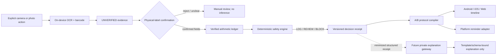
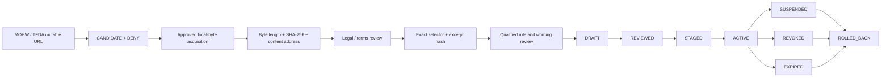
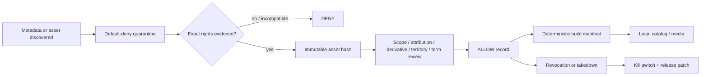
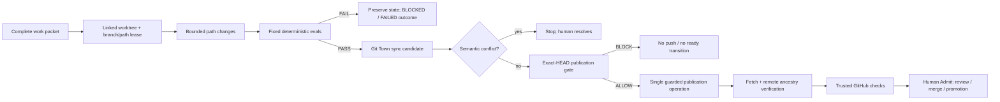

# Gym Come True

[繁體中文](README.zh-TW.md)

Evidence-first fitness protocol execution for Android, iOS, and Web, built with Kotlin Multiplatform and Compose Multiplatform.

> **Current truth:** the repository has an open Draft stack for the cross-platform foundation, Taiwan supplement-evidence contracts, and immutable Taiwan source lifecycle. It is not a medical device, is not store-ready, has no clinically admitted Taiwan rule pack, has no licensed third-party exercise-media catalog, and has not admitted a Git Town executable.

## Authority and status vocabulary

Read this file for the repository-wide operating map, then read [AGENTS.md](AGENTS.md), [Architecture](docs/architecture.md), and the [Git / Stacked-PR governance index](docs/git/README.md).

| Term | Meaning |
|---|---|
| **OPEN DRAFT PR** | A branch is published for review. It is not merged, released, or production-admitted. |
| **PLANNED WORK PACKET** | A bounded future slice with an intended parent, path lease, evals, rollback, and Human Admit boundary. No PR is implied. |
| **EXTERNAL GATE** | Legal, clinical, store, billing, device, credential, or rights evidence that repository code cannot manufacture. |
| `ABSENT` | Required evidence or executable is not available. |
| `NOT_IMPLEMENTED` | The repository intentionally does not yet contain the capability. |
| `NOT_EXERCISED` | The capability may be designed, but no subject-bound runtime canary has run. |
| `SKIPPED_BY_POLICY` | A policy deliberately prevented an operation; this is not a test pass. |
| `PASS` / `FAIL` | A named command actually executed against the stated subject. |

## Published delivery stack

```text
main
└── PR #2  agent/bootstrap-kmp-fitness-platform
    AUDITABLE_CROSS_PLATFORM_FOUNDATION
    └── PR #15  agent/taiwan-supplement-evidence
        TAIWAN_EVIDENCE_CONTRACT_DRAFT
        └── PR #16  agent/taiwan-source-lifecycle
            TAIWAN_SOURCE_LIFECYCLE_DRAFT
            └── Issue #19 / agent/document-git-town-delivery-graph
                DOCUMENTED_GIT_TOWN_DELIVERY_GRAPH_DRAFT
                # branch exists; Draft PR is created by this documentation slice
```

| Layer | Base | Exact head at documentation start | Admission |
|---|---|---|---|
| [PR #2](https://github.com/ed3c/gym-come-true/pull/2) | `main` | `58492815f22af65665172bcf98bfb661639ece92` | Open Draft; hosted exact-head success still required |
| [PR #15](https://github.com/ed3c/gym-come-true/pull/15) | `agent/bootstrap-kmp-fitness-platform` | `79f8a65b370806925c32f0a15da88c7c0d7bda36` | Open Draft; no clinically reviewed pack |
| [PR #16](https://github.com/ed3c/gym-come-true/pull/16) | `agent/taiwan-supplement-evidence` | `f58a2feac580ca37bb4d7b3c30e122908bfd6b07` | Open Draft; official sources remain denied |
| [Issue #19](https://github.com/ed3c/gym-come-true/issues/19) | `agent/taiwan-source-lifecycle` | branch created from `f58a2fe...` | Documentation / convergence packet |

PRs #2, #15, and #16 are the only published implementation PRs at the start of this documentation slice. Issues #8–#14 are requirements and future work; they are not completed PRs.

## Product thesis

Gym Come True is not a generic workout logger or a free-form supplement chatbot. Its intended differentiator is a verifiable protocol executor for Taiwan and Traditional Chinese users:

1. **Copyright-clean exercise intelligence** — metadata, media, anatomy assets, rendering code, and UGC are separate rights domains. Unknown rights fail closed.
2. **Evidence-first label capture** — on-device OCR and barcode scanning create candidates, never automatic product truth.
3. **Deterministic supplement boundaries** — generic code may normalize compatible mass units; IU, medication context, symptoms, missing servings, and conflicting evidence fail closed.
4. **Daily Body Hacker ledger** — confirmed arithmetic and duplicate ingredients are visible without interpreting a safe or recommended dose.
5. **A/B protocol execution** — the same plan can project a 16:00 or 22:00 training day with cross-midnight ordering, meals, recovery, and reminders.
6. **Proof before explanation** — a future LLM gateway may explain an immutable decision receipt. It cannot own the decision, create rules, recommend dosage, or suppress warnings.

## Repository map: directory ownership and state machines

```text
.
├── shared/                     # deterministic domain truth and shared UI
│   ├── domain/                 # evidence, ledger, rule-pack, source-lifecycle state machines
│   └── commonTest/             # deterministic contract and negative-control tests
├── androidApp/                 # Android permission, capture, ML Kit, temporary-file, reminder adapters
├── iosApp/                     # canonical XcodeGen host, Vision evidence adapter, local notifications
├── webApp/                     # JS/Wasm browser projection; no native-health parity claim
├── data/                       # synthetic/Draft fixtures and transport schemas; never self-admits production
├── legal/                      # source/media/provenance decisions and revocation truth
├── assets/                     # first-party or explicitly admitted immutable assets
├── scripts/                    # validators and local-only source capture
├── docs/                       # architecture, safety, product, delivery, Git/Stacked-PR SSOT
├── .github/workflows/          # exact-head hosted evidence; runner allocation is a separate state
├── AGENTS.md                   # root execution law and shared-Skill routing
└── THIRD_PARTY_NOTICES.md      # dependency and asset notice obligations
```

### Directory responsibility matrix

| Directory | Owning plane | State machine owned by the directory | Inputs | Outputs | Current integration state |
|---|---|---|---|---|---|
| `shared/` | Deterministic domain | `UNVERIFIED -> USER_CONFIRMED -> RULE_EVALUATED -> DECISION_RECEIPT`; source lifecycle `CANDIDATE -> CAPTURED -> HASH_VERIFIED -> LEGAL_REVIEWED -> VERIFIED_MAPPING -> REVIEWED -> STAGED -> ACTIVE` | Confirmed evidence, reviewed manifests, user-authored schedule | Decisions, receipts, A/B timeline, shared UI state | Implemented contract layer; no production health-rule admission |
| `androidApp/` | Android adapter | `PERMISSION_UNKNOWN -> REQUESTED -> GRANTED/DENIED`; `CAPTURE_REQUESTED -> TEMP_FILE -> OCR_CANDIDATE -> FILE_DELETED`; reminder `UNSCHEDULED -> SCHEDULED_INEXACT -> FIRED/CANCELLED` | Explicit user actions and shared commands | Unverified ML Kit evidence, reminder events | Foundation only; Health Connect and reliability harness planned in Issue #10 |
| `iosApp/` | Apple adapter | `PICKER_IDLE -> USER_SELECTED -> VISION_CANDIDATE -> RELEASED`; notification `UNAUTHORIZED -> REQUESTED -> AUTHORIZED/DENIED -> SCHEDULED/CANCELLED` | Explicit photo choice and shared commands | Unverified Vision evidence, local notifications | Canonical `project.yml` + `NativeCapabilityBridge.swift`; HealthKit/AlarmKit planned in Issue #9 |
| `webApp/` | Browser projection | `BOOTSTRAP -> SHARED_UI_READY -> USER_INPUT -> LOCAL_RESULT`; unsupported native capability remains `NOT_IMPLEMENTED` | Manual/imported evidence and shared state | JS/Wasm UI | Compatibility distribution implemented; camera/health/reminder parity not claimed |
| `data/` | Fixture/transport plane | `SYNTHETIC_OR_DRAFT -> STRUCTURALLY_VALIDATED -> TEST_ONLY`; production promotion is forbidden from fixture state | Repository-authored fixtures, schemas | Test records and transport contracts | Taiwan fixtures are synthetic or Draft; real corpus remains external |
| `legal/` | Rights/source admission | `UNKNOWN -> REVIEW -> ALLOW/DENY -> REVOKED`; mutable official source stays `CANDIDATE + DENY` | License/contract/source evidence | Admission records and prohibited-use boundaries | Default deny; no third-party exercise media or official source is production-admitted |
| `assets/` | Immutable asset plane | `QUARANTINED -> HASHED -> RIGHTS_REVIEWED -> ADMITTED -> PACKAGED -> REVOKED` | First-party work or executed asset rights | Content-addressed assets and provenance | First-party schematic only |
| `scripts/` | Verification/orchestration | `INPUT -> VALIDATED -> PASS/FAIL`; source capture `LOCAL_REGULAR_FILE -> COPIED -> HASH_VERIFIED + DENY` | Repository files or approved local bytes | Deterministic reports/receipts | Validators and local-only source capture implemented; no mutable network capture in CI |
| `docs/` | Decision and handoff | `OBSERVED -> DOCUMENTED -> REVIEWED -> SUPERSEDED` | Code, issues, PR graph, evidence receipts | Human/Agent SSOT | This slice reconciles stale paths, issue numbers, state machines, and Stack PR graph |
| `.github/workflows/` | Hosted verification | `QUEUED -> RUNNER_ALLOCATED -> EXECUTED -> PASS/FAIL`; account gate may yield `PRE_RUN_BLOCKED` | Exact Git commit | Hosted checks and artifacts | Current exact-head jobs are blocked before runner allocation by Actions budget |
| `docs/git/` | Branch/work governance | `TASK_PACKET_DRAFT -> LEASED -> SYNCED -> LOCALLY_VERIFIED -> PUBLICATION_ALLOW/BLOCK -> HUMAN_ADMIT` | Shared Skill, repo profile, work packet, leases, evals | Branch graph and subject-bound receipts | Repo policy documented; Git Town executable and live canaries remain absent/not exercised |

## End-to-end data flows

### Supplement label and protocol flow



### Taiwan regulatory source and rule-pack flow



`HASH_VERIFIED`, `LEGAL_REVIEWED`, `REVIEWED`, `ACTIVE`, and `ADMITTED` are distinct. A live URL, dataset ID, status field, model output, or handwritten hash cannot skip a gate.

### Exercise metadata and media flow



### Worker, Git Town, and publication flow



Git Town owns branch hierarchy and synchronization only. It never proves correctness, publication admission, merge readiness, release readiness, or legal/clinical acceptance.

## Git Town adoption status

The canonical method is the shared [`git-town-stacked-pr-worker`](https://github.com/ed3c/skills-shared/tree/main/skills/git-town-stacked-pr-worker). This repository references that shared body; it does not vendor a shadow copy.

| Evidence | State |
|---|---|
| Shared canonical Skill resolved | `PASS` — inspected `skills-shared` blob `eb2d915bca3e8a3938625f7d33a10fae95a15769` |
| Repo-owned profile and Worker policy | Documented in `docs/git/` |
| Exact Git Town version | `ABSENT` |
| Executable checksum/provenance/SBOM/notices/legal admission | `ABSENT` |
| `.git-town.toml` | `NOT_IMPLEMENTED` until executable admission |
| Linked-worktree / lease canary | `NOT_EXERCISED` |
| Dry-run no-push sync canary | `NOT_EXERCISED` |
| Planted conflict canary | `NOT_EXERCISED` |
| Guarded publication canary | `NOT_EXERCISED` |
| Background synchronization | Disabled |
| Merge, ship, promotion, rollback | Human / trusted operator only |

See [Git Town admission](docs/git/GIT_TOWN_ADMISSION.md), [repository profile](docs/git/REPO_PROFILE.md), and [Worker protocol](docs/git/WORKER_PROTOCOL.md).

## Molecular terminal Stack PR index

Published branches are listed as `OPEN DRAFT PR`. Every other row is a `PLANNED WORK PACKET`; the branch name is a proposed immutable subject, not evidence that a PR exists.

| Order / class | Issue | Parent branch | Proposed branch | Primary path lease | State transition | Status |
|---|---:|---|---|---|---|---|
| S0 | #1 | `main` | `agent/bootstrap-kmp-fitness-platform` | foundation-wide bootstrap | `EMPTY_REPOSITORY -> AUDITABLE_CROSS_PLATFORM_FOUNDATION` | **OPEN DRAFT PR #2** |
| S1 | #8 | `agent/bootstrap-kmp-fitness-platform` | `agent/taiwan-supplement-evidence` | Taiwan evidence domain/data/legal/docs | `FOUNDATION -> TAIWAN_EVIDENCE_CONTRACT_DRAFT` | **OPEN DRAFT PR #15** |
| S2 | #8 | `agent/taiwan-supplement-evidence` | `agent/taiwan-source-lifecycle` | source snapshots/mappings/lifecycle | `EVIDENCE_DRAFT -> SOURCE_LIFECYCLE_DRAFT` | **OPEN DRAFT PR #16** |
| S3 | #19 | `agent/taiwan-source-lifecycle` | `agent/document-git-town-delivery-graph` | root docs + `docs/git/**` | `SOURCE_LIFECYCLE_DRAFT -> DOCUMENTED_DELIVERY_GRAPH_DRAFT` | Branch published; Draft PR created by this slice |
| TW1 | #8 | `agent/taiwan-source-lifecycle` | `agent/tw-consent-corpus-contract` | consent/withdrawal/retention manifests only | `CORPUS_UNKNOWN -> CONSENT_CONTRACT_DRAFT` | PLANNED |
| TW2 | #8 | `agent/tw-consent-corpus-contract` | `agent/tw-ocr-evaluation-contract` | OCR evaluation fixtures/metrics only | `CONSENT_DRAFT -> OCR_EVALUATION_DRAFT` | PLANNED |
| TW3 | #8 | `agent/tw-ocr-evaluation-contract` | `agent/tw-reviewed-rule-pack` | exact rules, reviewer/wording/release receipts | `OCR_EVALUATED -> REVIEWED_TAIWAN_RULE_PACK` | PLANNED; external source/reviewer gate |
| I1 | #9 | `agent/bootstrap-kmp-fitness-platform` | `agent/ios-evidence-bridge` | `iosApp` evidence bridge + shared transport DTO | `IOS_SHELL -> IOS_EVIDENCE_HANDOFF` | PLANNED sibling stack |
| I2 | #9 | `agent/ios-evidence-bridge` | `agent/ios-healthkit-minimal` | HealthKit adapter/privacy declarations | `IOS_EVIDENCE_HANDOFF -> IOS_MINIMAL_HEALTH_READS` | PLANNED |
| I3 | #9 | `agent/ios-healthkit-minimal` | `agent/ios-reminder-alarmkit-assessment` | reminder/timezone/AlarmKit capability tests | `IOS_HEALTH_READS -> IOS_DELIVERY_EVIDENCE` | PLANNED |
| A1 | #10 | `agent/bootstrap-kmp-fitness-platform` | `agent/android-health-connect-minimal` | Health Connect adapter/data-safety docs | `ANDROID_SHELL -> ANDROID_MINIMAL_HEALTH_READS` | PLANNED sibling stack |
| A2 | #10 | `agent/android-health-connect-minimal` | `agent/android-reminder-reliability` | reboot/timezone/OEM reminder harness | `ANDROID_HEALTH_READS -> ANDROID_DELIVERY_EVIDENCE` | PLANNED |
| C1 | #11 | `agent/bootstrap-kmp-fitness-platform` | `agent/exercise-taxonomy-contract` | canonical exercise/muscle/equipment schemas | `DEMO_CATALOG -> TAXONOMY_CONTRACT` | PLANNED sibling stack |
| C2 | #11 | `agent/exercise-taxonomy-contract` | `agent/exercise-top50-content` | independently authored top-50 metadata | `TAXONOMY -> RIGHTS_CLEAN_TOP50_METADATA` | PLANNED |
| C3 | #11 | `agent/exercise-top50-content` | `agent/exercise-media-admission` | private asset manifests/derivatives/takedown | `TOP50_METADATA -> LICENSED_MEDIA_PIPELINE` | PLANNED; external rights gate |
| L1 | #12 | `agent/tw-reviewed-rule-pack` | `agent/explanation-gateway-contract` | server gateway contracts only | `REVIEWED_RECEIPT -> EXPLANATION_GATEWAY_CONTRACT` | PLANNED; depends TW3 |
| L2 | #12 | `agent/explanation-gateway-contract` | `agent/explanation-gateway-provider` | provider adapter/secret boundary | `GATEWAY_CONTRACT -> PROVIDER_INTEGRATION_DRAFT` | PLANNED; credential gate |
| L3 | #12 | `agent/explanation-gateway-provider` | `agent/explanation-gateway-adversarial-evals` | eval corpus/filters/kill switch | `PROVIDER_DRAFT -> EVALUATED_EXPLANATION_GATEWAY` | PLANNED |
| R1 | #13 | `agent/bootstrap-kmp-fitness-platform` | `agent/entitlement-contract` | entitlement DTO/state projection | `NO_ENTITLEMENT -> SERVER_VERIFIED_ENTITLEMENT_DRAFT` | PLANNED sibling stack |
| R2 | #13 | `agent/entitlement-contract` | `agent/privacy-delete-export` | privacy inventory/export/delete/retention | `ENTITLEMENT_DRAFT -> ACCOUNT_DATA_LIFECYCLE_DRAFT` | PLANNED |
| R3 | #13 | convergence parents | `agent/store-release-candidate` | signing/store manifests/SBOM/rollback | `DOMAIN_SLICES -> STORE_RELEASE_CANDIDATE` | PLANNED; external store/signing gate |
| M1 | #14 | `agent/bootstrap-kmp-fitness-platform` | `agent/market-interview-protocol` | interview/concierge protocol docs | `MARKET_UNKNOWN -> PROBLEM_EVIDENCE_DRAFT` | PLANNED sibling stack |
| M2 | #14 | `agent/market-interview-protocol` | `agent/creator-rights-contract` | UGC rights/disclosure/claim review | `PROBLEM_EVIDENCE -> RIGHTS_CLEARED_CREATIVE_DRAFT` | PLANNED |
| M3 | #14 | `agent/creator-rights-contract` | `agent/market-experiment-ledger` | aggregate cohort/experiment receipts | `CREATIVE_DRAFT -> RETENTION_EVIDENCE_DRAFT` | PLANNED |
| X1 | #13 | admitted domain heads | `agent/release-convergence-index` | shared indexes and final traceability only | `REVIEWABLE_SLICES -> RELEASE_CONVERGENCE_DRAFT` | PLANNED Human-Admit convergence |

Full path leases, eval commands, negative controls, rollback subjects, and Human Admit operations are in [Stacked PR index](docs/git/STACKED_PRS.md). Independent domain stacks are siblings from the foundation; they must not be serialized merely for visual convenience.

## What is currently implemented

- Shared deterministic parser, compatible mass normalization, daily intake arithmetic, duplicate detection, safety gates, A/B timetable compiler, and Compose UI.
- Android system-camera handoff, bundled Chinese/Latin ML Kit OCR, barcode extraction, temporary image deletion, and inexact reminders.
- iOS canonical XcodeGen project, PhotosPicker/Vision candidate extraction, and local notifications.
- JS/Wasm browser compatibility distribution.
- Taiwan product/corpus identity, OCR metrics, rule-pack admission, decision receipts, source snapshot/mapping/release lifecycle contracts, synthetic fixtures, and fail-closed validators.
- Default-deny source/media governance and first-party schematic assets.

The authoritative detail is in [Implementation status](docs/implementation-status.md).

## Safety and rights contract

- OCR and barcode results always begin `UNVERIFIED`.
- Only `mcg/µg/μg`, `mg`, and `g` use generic mass conversion.
- IU, volume, container count, proprietary blends, medication context, pregnancy, procedures, symptoms, missing evidence, and source conflicts fail closed.
- Daily totals are arithmetic observations, not safety limits or recommendations.
- Raw label images are temporary by default; production corpus retention requires consent, encryption, expiry, withdrawal, hashes, and provenance.
- No official-source byte, legal state, clinical review, signature, store approval, revenue result, or CI result may be fabricated.
- No third-party exercise media ships without exact rights evidence and an `ALLOW` record.
- LLM output is explanatory and cannot own decisions or warnings.
- Inexact Android alarms and iOS notifications are reminders, not guaranteed system alarms.
- AlarmKit retains system stop semantics.

## Validation

Current executable repository checks:

```bash
python3 scripts/validate_repository.py
python3 scripts/validate_taiwan_rule_pack.py
python3 scripts/validate_taiwan_source_lifecycle.py
python3 scripts/validate_taiwan_source_hardening.py

sh ./gradlew :shared:jvmTest
sh ./gradlew :androidApp:assembleDebug :androidApp:lintDebug
sh ./gradlew :webApp:composeCompatibilityBrowserDistribution
```

Canonical iOS host:

```bash
cd iosApp
xcodegen generate --spec project.yml
xcodebuild \
  -project GymComeTrue.xcodeproj \
  -scheme GymComeTrue \
  -sdk iphonesimulator \
  -configuration Debug \
  CODE_SIGNING_ALLOWED=NO \
  ONLY_ACTIVE_ARCH=YES \
  ARCHS=arm64 \
  build
```

Only a command that actually ran against the stated commit can be `PASS` or `FAIL`.

## Hosted evidence and external gates

PR #16 exact head `f58a2feac580ca37bb4d7b3c30e122908bfd6b07` produced workflow run `31878284072` (run #79). All three jobs ended before runner allocation with no executed steps because GitHub reported that an Actions budget was preventing use. Its classification is `PRE_RUN_BLOCKED_BY_ACTIONS_BUDGET`, not a test pass and not product-code failure.

External gates that remain outside repository authority:

- restored GitHub Actions runner/billing capacity;
- approved and immutable MOHW/TFDA source bytes plus exact reuse terms;
- consented representative Traditional Chinese label corpus and operational deletion/withdrawal;
- qualified Taiwan reviewer qualification, conflict-of-interest, rule and wording attestation;
- executed exercise-media rights and takedown operations;
- provider/store credentials and independently reviewed server adapters;
- App Store / Google Play signing, privacy forms, device evidence, and release-console operations;
- real rights-cleared creator campaigns and audited retention/contribution evidence.

## Document index

- [Architecture and directory state machines](docs/architecture.md)
- [Implementation status](docs/implementation-status.md)
- [Roadmap](docs/roadmap.md)
- [GitHub Issue / PR index](docs/github-issue-index.md)
- [Git and Stacked-PR governance](docs/git/README.md)
- [Repository Git Town profile](docs/git/REPO_PROFILE.md)
- [Molecular Stacked PR graph](docs/git/STACKED_PRS.md)
- [Worker protocol](docs/git/WORKER_PROTOCOL.md)
- [Git Town admission state](docs/git/GIT_TOWN_ADMISSION.md)
- [Work-packet template](docs/git/WORK_PACKET.template.md)
- [Health and supplement safety](docs/health-safety.md)
- [Taiwan supplement evidence](docs/taiwan-supplement-evidence.md)
- [Taiwan source lifecycle](docs/taiwan-source-lifecycle.md)
- [Copyright and data governance](docs/copyright-and-data-governance.md)
- [Platform capability matrix](docs/platform-capability-matrix.md)
- [Store compliance](docs/store-compliance.md)
- [Product strategy](docs/product-strategy.md)
- [Marketing plan](docs/marketing-plan.md)

## License

Application code is currently proprietary and all rights are reserved. Third-party dependencies keep their own licenses; see [THIRD_PARTY_NOTICES.md](THIRD_PARTY_NOTICES.md). This repository grants no third-party exercise-media license, official-source redistribution right, medical approval, or release authorization.
