# Gym Come True

[繁體中文](README.zh-TW.md)

Evidence-first fitness protocol planning for Android, iOS, and Web, built with Kotlin Multiplatform and Compose Multiplatform.

> **Status:** auditable cross-platform foundation plus draft Taiwan evidence and source-lifecycle contracts. This repository is not a medical device and does not provide diagnosis, treatment, medication advice, or automatic supplement dosing.

## Delivery stack

```text
PR #2   AUDITABLE_CROSS_PLATFORM_FOUNDATION
  └─ PR #15   TAIWAN_EVIDENCE_CONTRACT_DRAFT
       └─ PR #16   TAIWAN_SOURCE_LIFECYCLE_DRAFT
            └─ Issue #8   REVIEWED_TAIWAN_RULE_PACK       # not complete

Follow-up issues:
#9   iOS native evidence / Apple Health / reminders / AlarmKit
#10  Android Health Connect / reminder reliability
#11  Copyright-clean exercise catalog / licensed media
#12  Private LLM explanation gateway / adversarial evals
#13  Entitlements / privacy / stores / release operations
#14  Creator-market validation / launch evidence
```

PR #15 is stacked on PR #2. PR #16 is stacked on the exact PR #15 branch. Evidence ancestry is preserved through explicit non-force commits and relocks; no stack layer may be promoted from stale, partial, or infrastructure-only evidence.

## Product thesis

Most fitness apps optimize for workout logging or generic AI chat. Gym Come True takes a narrower position:

1. **Copyright-clean exercise intelligence** — exercise metadata, media, anatomy assets, and user-generated content are separate rights domains. Unknown rights fail closed.
2. **Taiwan and Traditional Chinese label evidence** — on-device OCR and barcode scanning produce unverified candidates, never product truth.
3. **Deterministic supplement safety** — generic code may normalize compatible mass units; IU conversion, medication context, symptoms, missing servings, and conflicting evidence fail closed.
4. **Daily Body Hacker ledger** — confirmed mass arithmetic and cross-product duplicates are visible without interpreting a safe or recommended dose.
5. **A/B protocol execution** — one plan supports 16:00 and 22:00 workout days, cross-midnight ordering, meals, recovery, and reminders.
6. **Proof before explanation** — an LLM may explain an immutable decision receipt. It may not create evidence, own a safety decision, recommend dosage, or suppress warnings.

## What is implemented

### Cross-platform foundation — PR #2

- Shared Kotlin domain models, Traditional Chinese/English label parser, compatible mass normalization, daily intake arithmetic, duplicate detection, deterministic safety gates, A/B timetable compiler, and tests.
- Shared Compose dashboard and a repository-authored schematic muscle-activation view.
- Android host with system-camera capture, bundled Google ML Kit Chinese/Latin OCR, barcode scanning, temporary-file deletion, and inexact reminders.
- iOS SwiftUI/Compose host with PhotosPicker, Apple Vision OCR/barcode extraction, and local-notification reminders.
- Kotlin/Wasm and Kotlin/JS browser compatibility distribution.
- Default-deny exercise source/media registries, first-party provenance records, and repository policy validation.

### Taiwan evidence admission contract — PR #15

- Product-variant identity across market, barcode, internal product ID, formulation, label revision, and nullable serving definition.
- Consent-aware corpus admission with no-image retention by default and fail-closed unknown/withdrawn states.
- Field-level OCR metrics separating first-pass exact accuracy from correction completion.
- Taiwan source candidates, deterministic rule-pack gates, required safety cases, reviewer/wording coverage, rollback identity, and versioned decision receipts.
- Repository-authored Traditional Chinese fixtures and JSON Schema transport contracts.

This slice does not contain a production rule pack, real consented label corpus, personalized limits, medication-interaction conclusions, or a qualified reviewer attestation.

### Taiwan immutable source and release lifecycle — PR #16

- Mutable MOHW/TFDA endpoints remain `CANDIDATE + DENY`; no official-source hash, archive receipt, legal review, or clinical state is fabricated.
- A local-only capture command binds approved bytes to SHA-256, byte length, and a content-addressed private archive while still emitting `HASH_VERIFIED + DENY`.
- Exact CSV header, JSON Pointer, XPath, PDF page/line, HTML selector, and text-range mappings bind source snapshots to domain fields and excerpt hashes.
- `HASH_VERIFIED`, `LEGAL_REVIEWED`, qualified mapping review, clinical review, and production admission remain separate gates.
- Rule-pack release follows signed `DRAFT -> REVIEWED -> STAGED -> ACTIVE` transitions with suspend, resume, revoke, expire, and exact-target rollback paths.
- One repository-authored synthetic snapshot proves the mechanism; every official-source mapping remains `DRAFT + DENY`.

See [Taiwan source snapshot and release lifecycle](docs/taiwan-source-lifecycle.md).

## Repository map

```text
.
├── androidApp/                  # Android application and device adapters
├── iosApp/                      # SwiftUI host, Vision/notification bridge, XcodeGen spec
├── shared/                      # KMP domain, rules, source lifecycle, tests, Compose UI
├── webApp/                      # JS/Wasm browser host
├── assets/                      # First-party assets with provenance
├── data/                        # Synthetic/example data and transport schemas
├── legal/                       # Source, media, provenance, and candidate registries
├── docs/                        # Architecture, compliance, strategy, safety, delivery decisions
├── scripts/                     # Policy validation and local-only source capture
├── .github/workflows/           # Hosted exact-head build evidence
├── AGENTS.md                    # Agent execution contract and hard laws
└── THIRD_PARTY_NOTICES.md       # Dependency and asset obligations
```

## Architecture

```mermaid
flowchart LR
    Camera[Camera / Photo] --> OCR[Platform OCR + Barcode]
    OCR --> Candidate[Unverified evidence]
    Candidate --> Confirm[User confirmation]
    Confirm --> Ledger[Daily intake ledger]
    Ledger --> Rules[Deterministic safety engine]
    Rules --> Receipt[Versioned decision receipt]
    Receipt --> Protocol[A/B protocol compiler]
    Protocol --> UI[Android / iOS / Web]
    Receipt --> Gateway[Future private LLM gateway]
    Gateway --> Explain[Explanation only]

    Official[MOHW / TFDA live candidate] --> Registry[Candidate + DENY registry]
    Registry --> Capture[Approved local-byte capture]
    Capture --> Snapshot[Hash-verified content address]
    Snapshot --> Legal[Legal / terms review]
    Legal --> Mapping[Exact selector + excerpt hash]
    Mapping --> Qualified[Qualified rule / wording review]
    Qualified --> Lifecycle[DRAFT -> REVIEWED -> STAGED -> ACTIVE]
    Lifecycle --> Rules

    Exercise[Exercise source] --> MediaRegistry[Source + media registry]
    MediaRegistry -->|ALLOW with evidence| Import[Build-time importer]
    MediaRegistry -->|REVIEW / DENY| Quarantine[No production shipment]
    Import --> ExerciseDB[Local exercise database]
    ExerciseDB --> UI
```



Shared code owns business state, deterministic decisions, evidence admission, and release-state resolution. Platform modules own permissions, camera/OCR, health APIs, reminders, and store behavior. No provider key or privileged health rule is stored in a mobile or web client.

## Safety contract

- OCR and barcode output always start as `UNVERIFIED`.
- Only `mcg/µg/μg`, `mg`, and `g` use generic mass conversion.
- `IU`, volume, capsule/tablet count, proprietary blends, medication context, pregnancy, procedures, and symptoms never use generic dose logic.
- Daily totals are arithmetic observations, not safety limits or recommendations.
- Missing or conflicting evidence blocks automation or routes the case to review.
- Raw label images are temporary by default; production corpus retention requires explicit consent, encryption, expiry, withdrawal support, hashes, and provenance.
- A schema-valid rule pack is not clinically reviewed or production admitted.
- A live URL or dataset ID is not immutable evidence.
- `HASH_VERIFIED` does not imply legal approval; legal approval does not imply clinical review.
- LLM output is explanatory and non-authoritative; deterministic warnings and release blockers cannot be suppressed by model text.
- Android inexact alarms and iOS local notifications are reminders, not guaranteed system alarms.
- AlarmKit retains system stop semantics; the product must not claim a movement challenge makes an alarm impossible to stop.

See [Health and supplement safety](docs/health-safety.md), [Taiwan supplement evidence](docs/taiwan-supplement-evidence.md), and [Taiwan source lifecycle](docs/taiwan-source-lifecycle.md).

## Copyright and data admission

No third-party exercise image, GIF, video, SVG anatomy map, 3D model, scraped dataset, media ID, or vendor CDN URL ships merely because it is publicly reachable. Every production asset requires an `ALLOW` record with rights holder, scope, license evidence, immutable hash, review date, attribution, derivative/redistribution boundaries, and takedown path.

Current visual assets are first-party schematic material. No third-party exercise media is admitted. Metadata rights, media rights, rendering-code rights, model rights, and user-upload rights remain separate.

See [Copyright and data governance](docs/copyright-and-data-governance.md) and `legal/*.json`.

## Local development

Prerequisites:

- JDK 21
- Gradle **9.5.0** available as `gradle`
- Android SDK Platform 36
- Xcode and XcodeGen for the iOS host

The checked-in `gradlew` is a thin fail-fast launcher that delegates to an installed Gradle 9.5.0; it does not silently download executable code.

```bash
python3 scripts/validate_repository.py
python3 scripts/validate_taiwan_rule_pack.py
python3 scripts/validate_taiwan_source_lifecycle.py
./gradlew :shared:jvmTest
./gradlew :androidApp:assembleDebug :androidApp:lintDebug
./gradlew :webApp:composeCompatibilityBrowserDistribution
```

Generate the canonical iOS host:

```bash
cd iosApp
xcodegen generate --spec project.yml
xcodebuild \
  -project GymComeTrue.xcodeproj \
  -scheme GymComeTrue \
  -sdk iphonesimulator \
  -configuration Debug \
  CODE_SIGNING_ALLOWED=NO \
  build
```

Set signing locally; never commit signing material or store credentials.

## Honest capability matrix

| Capability | Android | iOS | Web | Current state |
|---|---:|---:|---:|---|
| Shared dashboard and A/B timetable | Yes | Yes | Yes | Foundation |
| OCR label extraction | Bundled Chinese/Latin ML Kit | Vision via photo picker | Manual/import later | Candidate evidence only |
| Barcode extraction | ML Kit | Vision | Planned | Not product truth |
| Daily intake arithmetic | Shared | Shared | Shared | No safety-limit interpretation |
| Taiwan rule-pack admission contract | Shared | Shared | Shared | Draft; no production pack |
| Source snapshot / mapping / release lifecycle | Shared | Shared | Shared | Draft; official sources remain denied |
| Local reminders | Inexact AlarmManager | UserNotifications | Browser later | No exact-delivery guarantee |
| Health data | Adapter boundary | Adapter boundary | N/A | Not implemented |
| System alarm challenge | Future exact-alarm review | Future AlarmKit review | N/A | No coercive/undismissable promise |
| LLM explanation | Contract only | Contract only | Contract only | Server gateway not implemented |
| Licensed third-party exercise media | None | None | None | Default deny |

## Product and engineering documents

- [Architecture and data flow](docs/architecture.md)
- [Health and supplement safety](docs/health-safety.md)
- [Taiwan supplement evidence contract](docs/taiwan-supplement-evidence.md)
- [Taiwan source snapshot and release lifecycle](docs/taiwan-source-lifecycle.md)
- [Copyright and source governance](docs/copyright-and-data-governance.md)
- [Platform capability matrix](docs/platform-capability-matrix.md)
- [Store compliance](docs/store-compliance.md)
- [Blue-ocean product strategy](docs/product-strategy.md)
- [90-day marketing plan](docs/marketing-plan.md)
- [Implementation status](docs/implementation-status.md)
- [Delivery roadmap](docs/roadmap.md)
- [Agent execution contract](AGENTS.md)

## Delivery state machine

```text
EMPTY_REPOSITORY
  -> AUDITABLE_CROSS_PLATFORM_FOUNDATION       # PR #2
  -> TAIWAN_EVIDENCE_CONTRACT_DRAFT            # PR #15
  -> TAIWAN_SOURCE_LIFECYCLE_DRAFT             # PR #16
  -> REVIEWED_TAIWAN_RULE_PACK                  # Issue #8; real evidence/review missing
  -> LICENSED_EXERCISE_CATALOG                  # Issue #11
  -> NATIVE_HEALTH_AND_ALARM_INTEGRATION        # Issues #9 / #10
  -> PRIVATE_LLM_EXPLANATION_GATEWAY            # Issue #12
  -> STORE_RELEASE_CANDIDATE                     # Issues #13 / #14
```

Each transition requires code, policy, provenance, privacy review, deterministic tests, rollback, and exact-head hosted build evidence. Later phases must not weaken earlier safety or rights guarantees.

## Hosted evidence status

PR #2, PR #15, and PR #16 remain Draft. PR #16 exact-head workflow run #71 was created, but all three jobs failed before runner allocation with no executed steps because the repository's GitHub Actions budget prevented further use. This is an infrastructure blocker, not a passing build and not evidence of a product-code failure.

## License

Application code is currently proprietary and all rights are reserved. Third-party dependencies retain their own licenses; see [THIRD_PARTY_NOTICES.md](THIRD_PARTY_NOTICES.md). No third-party exercise-media or official-source redistribution license is granted by this repository.
