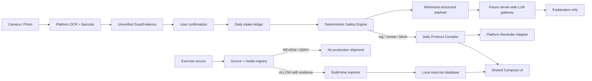

# Gym Come True

[繁體中文](README.zh-TW.md)

Evidence-first fitness planning for Android, iOS, and Web, built with Kotlin Multiplatform and Compose Multiplatform.

> **Status:** auditable foundation / draft PR. This repository is not a medical device and does not provide diagnosis, treatment, medication advice, or automatic supplement dosing.

## Product thesis

Most fitness apps optimize for workout logging or generic AI chat. Gym Come True takes a narrower position:

1. **Copyright-clean exercise intelligence** — exercise metadata, media, and anatomy assets are admitted only through a provenance registry. Unknown rights fail closed.
2. **Taiwan and Asian-label evidence capture** — on-device OCR and barcode scanning produce unverified evidence candidates, not facts.
3. **Deterministic protocol safety** — compatible mass units can be normalized by code; IU conversion, drug interactions, and dose recommendations are blocked or sent to human review.
4. **Daily Body Hacker ledger** — verified mass arithmetic can be aggregated and overlapping ingredients can be surfaced across products without interpreting a safe or recommended dose.
5. **A/B daily protocol execution** — the same plan supports a 16:00 workout day and a 22:00 workout day, including cross-midnight ordering, reminders, meals, recovery, and confirmation checkpoints.
6. **Proof before advice** — an LLM may explain verified rule-engine output. It may not invent ingredients, calculate dosage, override a warning, or act as the safety authority.

## What is implemented in this foundation

- Shared Kotlin domain models, Traditional Chinese/English supplement-label parser, unit normalization, daily intake arithmetic, duplicate-ingredient detection, safety evaluation, A/B schedule compiler, and tests.
- Shared Compose dashboard and a locally rendered muscle-activation view without third-party anatomy media.
- Android shell with system-camera capture, bundled Google ML Kit Chinese/Latin text recognition and barcode scanning, temporary-file deletion, and inexact local reminders.
- iOS SwiftUI/Compose shell with native PhotosPicker, Apple Vision OCR/barcode extraction, and a local-notification reminder control.
- Web JS and Wasm entry points plus a compatibility distribution.
- Default-deny exercise source and media registries, first-party provenance records, policy validation, and CI contracts.
- Architecture, health-safety, copyright, market strategy, launch-material, and delivery-roadmap documents.

## Repository map

```text
.
├── androidApp/                 # Android application and device adapters
├── iosApp/                     # SwiftUI host, Vision/notification bridge, XcodeGen spec
├── shared/                     # KMP domain, rules, tests, and Compose UI
├── webApp/                     # JS/Wasm browser application
├── assets/                     # First-party assets with provenance
├── data/                       # Original/example data only
├── legal/                      # Source, media, and provenance registries
├── docs/                       # Architecture, compliance, strategy, safety, roadmap
├── scripts/                    # Repository and policy verification
├── .github/workflows/          # Hosted build evidence
├── AGENTS.md                   # Agent execution contract and hard laws
└── THIRD_PARTY_NOTICES.md      # Dependency and asset obligations
```

## Architecture



The shared module owns business state and deterministic decisions. Platform modules own permissions, camera/OCR, Health APIs, reminders, and store-specific behavior. No API key or privileged health rule is stored in a mobile or web client.

## Safety contract

- OCR output always starts as `UNVERIFIED`.
- Only `mcg/µg/μg`, `mg`, and `g` use generic mass conversion.
- `IU`, volume, capsule/tablet count, and other activity or container units are never converted without ingredient-specific, reviewed rules.
- Daily totals are arithmetic observations, not safety limits or recommendations.
- Medication use, pregnancy, surgery, adverse symptoms, missing label evidence, or conflicting products require professional review.
- The application never turns a user-entered supplement schedule into a medical recommendation.
- Raw label images are temporary by default and are deleted or released after local extraction.
- LLM output is explanatory and non-authoritative; deterministic warnings cannot be suppressed by model text.

See [docs/health-safety.md](docs/health-safety.md).

## Copyright and data admission

No third-party exercise image, GIF, video, SVG body map, scraped dataset, or remote CDN URL is shipped merely because it appears in a public repository. Every production asset must have an `ALLOW` record with a source, scope, license evidence, immutable hash, and review date. Current visual assets are first-party schematic material; no third-party exercise media is admitted.

See [docs/copyright-and-data-governance.md](docs/copyright-and-data-governance.md) and `legal/*.json`.

## Local development

Prerequisites:

- JDK 21
- Gradle **9.5.0** available as `gradle`
- Android SDK for API 37
- Xcode and XcodeGen for the iOS host

The checked-in `gradlew` is a thin, fail-fast launcher that delegates to an installed Gradle 9.5.0. It does not silently download executable code.

```bash
./gradlew :shared:jvmTest
./gradlew :androidApp:assembleDebug :androidApp:lintDebug
./gradlew :webApp:composeCompatibilityBrowserDistribution
python3 scripts/validate_repository.py
```

Run browser development builds:

```bash
./gradlew :webApp:jsBrowserDevelopmentRun
# or
./gradlew :webApp:wasmJsBrowserDevelopmentRun
```

Generate and open the iOS host:

```bash
cd iosApp
xcodegen generate --spec project.yml
open GymComeTrue.xcodeproj
```

Set your Apple development team and bundle identifier through local Xcode settings; do not commit signing credentials.

## Honest capability matrix

| Capability | Android | iOS | Web | Current state |
|---|---:|---:|---:|---|
| Shared dashboard and schedule | Yes | Yes | Yes | Foundation |
| OCR label extraction | Bundled Chinese/Latin ML Kit | Vision via photo picker | Manual/import later | Candidate evidence only |
| Barcode extraction | ML Kit | Vision | Planned | Not a product truth source |
| Daily intake arithmetic | Shared | Shared | Shared | No safety-limit interpretation |
| Local reminders | Inexact AlarmManager | UserNotifications | Browser notification later | No exact-delivery guarantee |
| Health data | Adapter boundary | Adapter boundary | Not applicable | Not implemented |
| System alarm challenge | Future exact-alarm review | Future AlarmKit review | Not applicable | No coercive/undismissable promise |
| LLM explanation | Contract only | Contract only | Contract only | Server gateway not implemented |
| Licensed third-party exercise media | None | None | None | Default deny |

See [docs/platform-capability-matrix.md](docs/platform-capability-matrix.md) and [docs/store-compliance.md](docs/store-compliance.md).

## Product and launch documents

- [Architecture and data flow](docs/architecture.md)
- [Health and supplement safety](docs/health-safety.md)
- [Copyright and source governance](docs/copyright-and-data-governance.md)
- [Blue-ocean product strategy](docs/product-strategy.md)
- [90-day marketing plan and UGC material](docs/marketing-plan.md)
- [Delivery roadmap and issue stack](docs/roadmap.md)
- [Implementation status](docs/implementation-status.md)

## Delivery state machine

```text
EMPTY_REPOSITORY
  -> AUDITABLE_CROSS_PLATFORM_FOUNDATION
  -> REVIEWED_TAIWAN_RULE_PACK
  -> LICENSED_EXERCISE_CATALOG
  -> NATIVE_HEALTH_AND_ALARM_INTEGRATION
  -> PRIVATE_LLM_EXPLANATION_GATEWAY
  -> STORE_RELEASE_CANDIDATE
```

Each transition requires code, policy, provenance, privacy review, and hosted build evidence. Later phases must not weaken earlier safety or rights guarantees.

## License

Application code is currently proprietary and all rights are reserved. Third-party dependencies retain their own licenses; see [THIRD_PARTY_NOTICES.md](THIRD_PARTY_NOTICES.md). No third-party exercise media license is granted by this repository.
