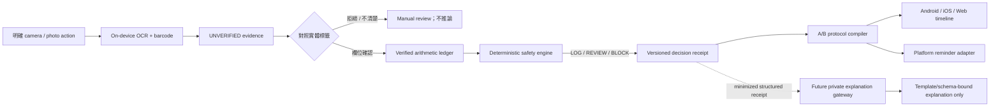
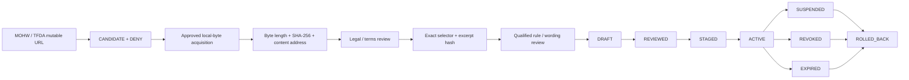
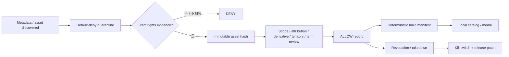
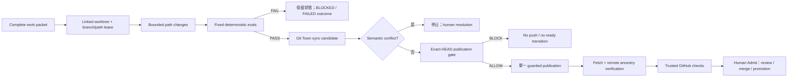

# Gym Come True

[English](README.md)

以 Kotlin Multiplatform 與 Compose Multiplatform 建立的 evidence-first 健身 protocol 執行系統，目標平台為 Android、iOS 與 Web。

> **目前真實狀態：** repository 已有跨平台 foundation、台灣補充品 evidence contract 與 immutable Taiwan source lifecycle 的開放 Draft stack。它不是醫療器材，尚未達到商店上架條件，沒有 clinically admitted Taiwan rule pack，沒有已授權的第三方健身媒體庫，也尚未 admit Git Town executable。

## 權威文件與狀態詞彙

先用本 README 了解全域，再依序閱讀 [AGENTS.md](AGENTS.md)、[Architecture](docs/architecture.md) 與 [Git / Stacked-PR governance](docs/git/README.md)。

| 詞彙 | 精確含義 |
|---|---|
| **OPEN DRAFT PR** | Branch 已發布供 review；不等於 merged、released 或 production admitted。 |
| **PLANNED WORK PACKET** | 已定義 parent、path lease、eval、rollback 與 Human Admit 邊界的未來切片；不代表 PR 已存在。 |
| **EXTERNAL GATE** | Repository 無法自行製造的 legal、clinical、store、billing、device、credential 或 rights evidence。 |
| `ABSENT` | 必要 evidence 或 executable 不存在。 |
| `NOT_IMPLEMENTED` | Repository 尚未實作該能力。 |
| `NOT_EXERCISED` | 已設計但沒有 subject-bound runtime canary。 |
| `SKIPPED_BY_POLICY` | Policy 刻意阻止操作；不是 test pass。 |
| `PASS` / `FAIL` | 指定 command 確實對指定 subject 執行。 |

## 已發布 Delivery Stack

```text
main
└── PR #2  agent/bootstrap-kmp-fitness-platform
    AUDITABLE_CROSS_PLATFORM_FOUNDATION
    └── PR #15  agent/taiwan-supplement-evidence
        TAIWAN_EVIDENCE_CONTRACT_DRAFT
        └── PR #16  agent/taiwan-source-lifecycle
            TAIWAN_SOURCE_LIFECYCLE_DRAFT
            └── Issue #19 / agent/document-git-town-delivery-graph
                DOCUMENTED_GIT_TOWN_DELIVERY_GRAPH_DRAFT
                # branch 已建立；本文件切片會建立 Draft PR
```

| Layer | Base | 文件工作開始時的 exact head | Admission |
|---|---|---|---|
| [PR #2](https://github.com/ed3c/gym-come-true/pull/2) | `main` | `58492815f22af65665172bcf98bfb661639ece92` | Open Draft；仍需 exact-head hosted success |
| [PR #15](https://github.com/ed3c/gym-come-true/pull/15) | `agent/bootstrap-kmp-fitness-platform` | `79f8a65b370806925c32f0a15da88c7c0d7bda36` | Open Draft；沒有 clinically reviewed pack |
| [PR #16](https://github.com/ed3c/gym-come-true/pull/16) | `agent/taiwan-supplement-evidence` | `f58a2feac580ca37bb4d7b3c30e122908bfd6b07` | Open Draft；官方來源仍 denied |
| [Issue #19](https://github.com/ed3c/gym-come-true/issues/19) | `agent/taiwan-source-lifecycle` | branch 由 `f58a2fe...` 建立 | Documentation / convergence packet |

在此文件切片開始時，真正已發布的 implementation PR 只有 #2、#15、#16。Issues #8–#14 是 requirements 與未來 work，不是已完成的 PR。

## 產品定位

Gym Come True 不是一般 workout logger，也不是 free-form supplement chatbot。目標是為台灣與繁體中文使用者提供可驗證的 protocol executor：

1. **Copyright-clean exercise intelligence**：metadata、media、anatomy asset、rendering code、UGC 分開治理；權利不明即 fail closed。
2. **Evidence-first label capture**：裝置端 OCR / barcode 只產生 candidate，不能自動成為 product truth。
3. **Deterministic supplement boundary**：通用程式只處理相容 mass units；IU、藥物情境、症狀、缺 serving 與 evidence conflict 都 fail closed。
4. **Daily Body Hacker ledger**：顯示已確認的算術加總與重複成分，不把總量冒充安全或建議劑量。
5. **A/B protocol execution**：同一份計畫可投影為 16:00 或 22:00 訓練日，包含跨午夜排序、餐食、恢復與提醒。
6. **Proof before explanation**：未來 LLM gateway 只能解釋 immutable decision receipt；不能擁有決策、建立規則、推薦劑量或壓過 warning。

## Repository Map：目錄分工與 State Machines

```text
.
├── shared/                     # deterministic domain truth 與 shared UI
│   ├── domain/                 # evidence、ledger、rule-pack、source-lifecycle state machines
│   └── commonTest/             # deterministic contracts / negative controls
├── androidApp/                 # Android permission、capture、ML Kit、temp-file、reminder adapters
├── iosApp/                     # canonical XcodeGen host、Vision evidence、local notifications
├── webApp/                     # JS/Wasm browser projection；不宣稱 native-health parity
├── data/                       # synthetic / Draft fixtures 與 transport schemas
├── legal/                      # source/media/provenance admission 與 revocation truth
├── assets/                     # first-party 或明確 admitted immutable assets
├── scripts/                    # validators 與 local-only source capture
├── docs/                       # architecture、safety、product、delivery、Git/Stacked-PR SSOT
├── .github/workflows/          # exact-head hosted evidence
├── AGENTS.md                   # root execution law 與 shared-Skill routing
└── THIRD_PARTY_NOTICES.md      # dependency / asset notice obligations
```

### 目錄責任矩陣

| Directory | 所屬 plane | 該目錄擁有的 State Machine | Input | Output | 目前整合狀態 |
|---|---|---|---|---|---|
| `shared/` | Deterministic domain | `UNVERIFIED -> USER_CONFIRMED -> RULE_EVALUATED -> DECISION_RECEIPT`；source lifecycle `CANDIDATE -> CAPTURED -> HASH_VERIFIED -> LEGAL_REVIEWED -> VERIFIED_MAPPING -> REVIEWED -> STAGED -> ACTIVE` | Confirmed evidence、reviewed manifests、user-authored schedule | Decisions、receipts、A/B timeline、shared UI state | Contract layer 已實作；沒有 production health-rule admission |
| `androidApp/` | Android adapter | `PERMISSION_UNKNOWN -> REQUESTED -> GRANTED/DENIED`；`CAPTURE_REQUESTED -> TEMP_FILE -> OCR_CANDIDATE -> FILE_DELETED`；reminder `UNSCHEDULED -> SCHEDULED_INEXACT -> FIRED/CANCELLED` | 明確 user action 與 shared commands | ML Kit 未驗證 evidence、reminder events | Foundation；Health Connect / reliability harness 在 Issue #10 |
| `iosApp/` | Apple adapter | `PICKER_IDLE -> USER_SELECTED -> VISION_CANDIDATE -> RELEASED`；notification `UNAUTHORIZED -> REQUESTED -> AUTHORIZED/DENIED -> SCHEDULED/CANCELLED` | 明確 photo selection 與 shared commands | Vision 未驗證 evidence、local notifications | Canonical `project.yml` + `NativeCapabilityBridge.swift`；HealthKit/AlarmKit 在 Issue #9 |
| `webApp/` | Browser projection | `BOOTSTRAP -> SHARED_UI_READY -> USER_INPUT -> LOCAL_RESULT`；不支援的 native capability 保持 `NOT_IMPLEMENTED` | Manual/imported evidence、shared state | JS/Wasm UI | Compatibility distribution 已實作；不宣稱 camera/health/reminder parity |
| `data/` | Fixture/transport | `SYNTHETIC_OR_DRAFT -> STRUCTURALLY_VALIDATED -> TEST_ONLY`；fixture 禁止自行 production promotion | Repo-authored fixtures、schemas | Test records、transport contracts | Taiwan fixtures 全部 synthetic 或 Draft；真實 corpus 在 repo 外 |
| `legal/` | Rights/source admission | `UNKNOWN -> REVIEW -> ALLOW/DENY -> REVOKED`；mutable official source 保持 `CANDIDATE + DENY` | License/contract/source evidence | Admission records、prohibited-use boundaries | Default deny；沒有 admitted third-party exercise media 或 official source |
| `assets/` | Immutable assets | `QUARANTINED -> HASHED -> RIGHTS_REVIEWED -> ADMITTED -> PACKAGED -> REVOKED` | First-party work 或 executed rights | Content-addressed assets、provenance | 只有 first-party schematic |
| `scripts/` | Verification/orchestration | `INPUT -> VALIDATED -> PASS/FAIL`；source capture `LOCAL_REGULAR_FILE -> COPIED -> HASH_VERIFIED + DENY` | Repository files 或 approved local bytes | Deterministic reports/receipts | Validators、local-only source capture 已實作；CI 不做 mutable network capture |
| `docs/` | Decision/handoff | `OBSERVED -> DOCUMENTED -> REVIEWED -> SUPERSEDED` | Code、Issues、PR graph、receipts | Human / Agent SSOT | 本切片修正 stale paths、issue numbers、state machines、Stack PR graph |
| `.github/workflows/` | Hosted verification | `QUEUED -> RUNNER_ALLOCATED -> EXECUTED -> PASS/FAIL`；account gate 可產生 `PRE_RUN_BLOCKED` | Exact Git commit | Hosted checks/artifacts | 現在 exact-head jobs 因 Actions budget 在 runner allocation 前被阻擋 |
| `docs/git/` | Branch/work governance | `TASK_PACKET_DRAFT -> LEASED -> SYNCED -> LOCALLY_VERIFIED -> PUBLICATION_ALLOW/BLOCK -> HUMAN_ADMIT` | Shared Skill、repo profile、work packet、leases、evals | Branch graph 與 subject-bound receipts | Repo policy 已文件化；Git Town executable / live canaries 仍 absent/not exercised |

## 端到端 Data Flows

### 補充品標籤與 Protocol



### Taiwan Regulatory Source 與 Rule Pack



`HASH_VERIFIED`、`LEGAL_REVIEWED`、`REVIEWED`、`ACTIVE`、`ADMITTED` 是不同狀態。Live URL、dataset ID、status field、model output 或手填 hash 都不能跳過 gate。

### Exercise Metadata / Media Rights



### Worker、Git Town 與 Publication



Git Town 只負責 branch hierarchy 與 synchronization；它不能證明 code correctness、publication admission、merge readiness、release readiness、legal 或 clinical acceptance。

## Git Town Adoption Status

Canonical method 為 shared [`git-town-stacked-pr-worker`](https://github.com/ed3c/skills-shared/tree/main/skills/git-town-stacked-pr-worker)。本 repo 只引用 shared body，不建立 shadow copy。

| Evidence | State |
|---|---|
| Shared canonical Skill resolved | `PASS` — 已檢視 `skills-shared` blob `eb2d915bca3e8a3938625f7d33a10fae95a15769` |
| Repo-owned profile / Worker policy | 已放在 `docs/git/` |
| Exact Git Town version | `ABSENT` |
| Executable checksum/provenance/SBOM/notices/legal admission | `ABSENT` |
| `.git-town.toml` | 在 executable admission 前為 `NOT_IMPLEMENTED` |
| Linked-worktree / lease canary | `NOT_EXERCISED` |
| Dry-run no-push sync canary | `NOT_EXERCISED` |
| Planted conflict canary | `NOT_EXERCISED` |
| Guarded publication canary | `NOT_EXERCISED` |
| Background synchronization | Disabled |
| Merge、ship、promotion、rollback | 只屬於 Human / trusted operator |

詳見 [Git Town admission](docs/git/GIT_TOWN_ADMISSION.md)、[repository profile](docs/git/REPO_PROFILE.md)、[Worker protocol](docs/git/WORKER_PROTOCOL.md)。

## 分子化末端 Stack PR Index

`OPEN DRAFT PR` 是已發布 branch；其他全部是 `PLANNED WORK PACKET`。Proposed branch name 不代表 PR 已存在。

| Order / class | Issue | Parent branch | Proposed branch | Primary path lease | State transition | Status |
|---|---:|---|---|---|---|---|
| S0 | #1 | `main` | `agent/bootstrap-kmp-fitness-platform` | foundation bootstrap | `EMPTY_REPOSITORY -> AUDITABLE_CROSS_PLATFORM_FOUNDATION` | **OPEN DRAFT PR #2** |
| S1 | #8 | `agent/bootstrap-kmp-fitness-platform` | `agent/taiwan-supplement-evidence` | Taiwan evidence domain/data/legal/docs | `FOUNDATION -> TAIWAN_EVIDENCE_CONTRACT_DRAFT` | **OPEN DRAFT PR #15** |
| S2 | #8 | `agent/taiwan-supplement-evidence` | `agent/taiwan-source-lifecycle` | source snapshots/mappings/lifecycle | `EVIDENCE_DRAFT -> SOURCE_LIFECYCLE_DRAFT` | **OPEN DRAFT PR #16** |
| S3 | #19 | `agent/taiwan-source-lifecycle` | `agent/document-git-town-delivery-graph` | root docs + `docs/git/**` | `SOURCE_LIFECYCLE_DRAFT -> DOCUMENTED_DELIVERY_GRAPH_DRAFT` | Branch 已發布；本切片建立 Draft PR |
| TW1 | #8 | `agent/taiwan-source-lifecycle` | `agent/tw-consent-corpus-contract` | consent/withdrawal/retention manifests | `CORPUS_UNKNOWN -> CONSENT_CONTRACT_DRAFT` | PLANNED |
| TW2 | #8 | `agent/tw-consent-corpus-contract` | `agent/tw-ocr-evaluation-contract` | OCR evaluation fixtures/metrics | `CONSENT_DRAFT -> OCR_EVALUATION_DRAFT` | PLANNED |
| TW3 | #8 | `agent/tw-ocr-evaluation-contract` | `agent/tw-reviewed-rule-pack` | exact rules、reviewer/wording/release receipts | `OCR_EVALUATED -> REVIEWED_TAIWAN_RULE_PACK` | PLANNED；需 external source/reviewer |
| I1 | #9 | `agent/bootstrap-kmp-fitness-platform` | `agent/ios-evidence-bridge` | `iosApp` evidence bridge + shared DTO | `IOS_SHELL -> IOS_EVIDENCE_HANDOFF` | PLANNED sibling stack |
| I2 | #9 | `agent/ios-evidence-bridge` | `agent/ios-healthkit-minimal` | HealthKit adapter/privacy declarations | `IOS_EVIDENCE_HANDOFF -> IOS_MINIMAL_HEALTH_READS` | PLANNED |
| I3 | #9 | `agent/ios-healthkit-minimal` | `agent/ios-reminder-alarmkit-assessment` | reminder/timezone/AlarmKit tests | `IOS_HEALTH_READS -> IOS_DELIVERY_EVIDENCE` | PLANNED |
| A1 | #10 | `agent/bootstrap-kmp-fitness-platform` | `agent/android-health-connect-minimal` | Health Connect adapter/data-safety | `ANDROID_SHELL -> ANDROID_MINIMAL_HEALTH_READS` | PLANNED sibling stack |
| A2 | #10 | `agent/android-health-connect-minimal` | `agent/android-reminder-reliability` | reboot/timezone/OEM harness | `ANDROID_HEALTH_READS -> ANDROID_DELIVERY_EVIDENCE` | PLANNED |
| C1 | #11 | `agent/bootstrap-kmp-fitness-platform` | `agent/exercise-taxonomy-contract` | exercise/muscle/equipment schemas | `DEMO_CATALOG -> TAXONOMY_CONTRACT` | PLANNED sibling stack |
| C2 | #11 | `agent/exercise-taxonomy-contract` | `agent/exercise-top50-content` | independently authored top-50 metadata | `TAXONOMY -> RIGHTS_CLEAN_TOP50_METADATA` | PLANNED |
| C3 | #11 | `agent/exercise-top50-content` | `agent/exercise-media-admission` | private manifests/derivatives/takedown | `TOP50_METADATA -> LICENSED_MEDIA_PIPELINE` | PLANNED；需 external rights |
| L1 | #12 | `agent/tw-reviewed-rule-pack` | `agent/explanation-gateway-contract` | server gateway contracts | `REVIEWED_RECEIPT -> EXPLANATION_GATEWAY_CONTRACT` | PLANNED；depends TW3 |
| L2 | #12 | `agent/explanation-gateway-contract` | `agent/explanation-gateway-provider` | provider adapter/secret boundary | `GATEWAY_CONTRACT -> PROVIDER_INTEGRATION_DRAFT` | PLANNED；需 credential |
| L3 | #12 | `agent/explanation-gateway-provider` | `agent/explanation-gateway-adversarial-evals` | eval corpus/filters/kill switch | `PROVIDER_DRAFT -> EVALUATED_EXPLANATION_GATEWAY` | PLANNED |
| R1 | #13 | `agent/bootstrap-kmp-fitness-platform` | `agent/entitlement-contract` | entitlement DTO/state projection | `NO_ENTITLEMENT -> SERVER_VERIFIED_ENTITLEMENT_DRAFT` | PLANNED sibling stack |
| R2 | #13 | `agent/entitlement-contract` | `agent/privacy-delete-export` | privacy/export/delete/retention | `ENTITLEMENT_DRAFT -> ACCOUNT_DATA_LIFECYCLE_DRAFT` | PLANNED |
| R3 | #13 | convergence parents | `agent/store-release-candidate` | signing/store manifests/SBOM/rollback | `DOMAIN_SLICES -> STORE_RELEASE_CANDIDATE` | PLANNED；需 store/signing |
| M1 | #14 | `agent/bootstrap-kmp-fitness-platform` | `agent/market-interview-protocol` | interview/concierge protocol | `MARKET_UNKNOWN -> PROBLEM_EVIDENCE_DRAFT` | PLANNED sibling stack |
| M2 | #14 | `agent/market-interview-protocol` | `agent/creator-rights-contract` | UGC rights/disclosure/claims | `PROBLEM_EVIDENCE -> RIGHTS_CLEARED_CREATIVE_DRAFT` | PLANNED |
| M3 | #14 | `agent/creator-rights-contract` | `agent/market-experiment-ledger` | aggregate cohort/experiment receipts | `CREATIVE_DRAFT -> RETENTION_EVIDENCE_DRAFT` | PLANNED |
| X1 | #13 | admitted domain heads | `agent/release-convergence-index` | shared indexes / final traceability | `REVIEWABLE_SLICES -> RELEASE_CONVERGENCE_DRAFT` | PLANNED Human-Admit convergence |

完整 path lease、eval、negative control、rollback 與 Human Admit 見 [Stacked PR index](docs/git/STACKED_PRS.md)。互相獨立的 domain stacks 必須是 foundation 的 siblings，不能為了圖形整齊而假裝 serial dependency。

## 已實作能力

- Shared parser、相容 mass normalization、daily intake arithmetic、duplicate detection、safety gates、A/B timetable compiler、Compose UI。
- Android system camera、bundled Chinese/Latin ML Kit OCR、barcode、temporary image deletion、inexact reminder。
- iOS canonical XcodeGen project、PhotosPicker/Vision candidate extraction、local notification。
- JS/Wasm browser compatibility distribution。
- Taiwan product/corpus identity、OCR metrics、rule-pack admission、decision receipt、source snapshot/mapping/release lifecycle contracts、synthetic fixtures 與 fail-closed validators。
- Default-deny source/media governance 與 first-party schematic assets。

詳細現況見 [Implementation status](docs/implementation-status.md)。

## Safety / Rights Contract

- OCR / barcode 一律從 `UNVERIFIED` 開始。
- 只有 `mcg/µg/μg`、`mg`、`g` 使用 generic mass conversion。
- IU、volume、container count、proprietary blend、藥物情境、懷孕、手術、症狀、缺 evidence、source conflict 都 fail closed。
- Daily total 只是 arithmetic observation，不是 safety limit 或 recommendation。
- Raw label image 預設暫存；production corpus retention 必須具備 consent、encryption、expiry、withdrawal、hash、provenance。
- 不得捏造 official-source bytes、legal state、clinical review、signature、store approval、revenue 或 CI result。
- 沒有 exact rights evidence 與 `ALLOW` record 的 third-party exercise media 不得出貨。
- LLM 只能解釋，不能擁有 decision 或 warning。
- Android inexact alarm / iOS notification 是 reminder，不是 guaranteed system alarm。
- AlarmKit 保留 system stop semantics。

## 驗證命令

```bash
python3 scripts/validate_repository.py
python3 scripts/validate_taiwan_rule_pack.py
python3 scripts/validate_taiwan_source_lifecycle.py
python3 scripts/validate_taiwan_source_hardening.py

sh ./gradlew :shared:jvmTest
sh ./gradlew :androidApp:assembleDebug :androidApp:lintDebug
sh ./gradlew :webApp:composeCompatibilityBrowserDistribution
```

Canonical iOS host：

```bash
cd iosApp
xcodegen generate --spec project.yml
xcodebuild \
  -project GymComeTrue.xcodeproj \
  -scheme GymComeTrue \
  -sdk iphonesimulator \
  -configuration Debug \
  CODE_SIGNING_ALLOWED=NO \
  ONLY_ACTIVE_ARCH=YES \
  ARCHS=arm64 \
  build
```

只有確實對指定 commit 執行的 command 才能標記 `PASS` 或 `FAIL`。

## Hosted Evidence / External Gates

PR #16 exact head `f58a2feac580ca37bb4d7b3c30e122908bfd6b07` 的 workflow run 為 `31878284072`（run #79）。三個 jobs 都在 runner allocation 前結束，沒有執行 steps；GitHub 回報 Actions budget 阻止使用。正確分類是 `PRE_RUN_BLOCKED_BY_ACTIONS_BUDGET`，不是 test pass，也不是 product-code failure。

仍在 repository authority 之外的 external gates：

- GitHub Actions runner / billing capacity；
- approved immutable MOHW/TFDA bytes 與 exact reuse terms；
- consented Traditional Chinese label corpus 與 operational delete/withdraw；
- qualified Taiwan reviewer qualification、COI、rule/wording attestation；
- executed exercise-media rights 與 takedown；
- provider/store credentials 與 independently reviewed server adapters；
- App Store / Google Play signing、privacy forms、device evidence、release-console operations；
- 真實 rights-cleared creator campaigns 與 audited retention/contribution evidence。

## 文件索引

- [Architecture and directory state machines](docs/architecture.md)
- [Implementation status](docs/implementation-status.md)
- [Roadmap](docs/roadmap.md)
- [GitHub Issue / PR index](docs/github-issue-index.md)
- [Git and Stacked-PR governance](docs/git/README.md)
- [Repository Git Town profile](docs/git/REPO_PROFILE.md)
- [Molecular Stacked PR graph](docs/git/STACKED_PRS.md)
- [Worker protocol](docs/git/WORKER_PROTOCOL.md)
- [Git Town admission state](docs/git/GIT_TOWN_ADMISSION.md)
- [Work-packet template](docs/git/WORK_PACKET.template.md)
- [Health and supplement safety](docs/health-safety.md)
- [Taiwan supplement evidence](docs/taiwan-supplement-evidence.md)
- [Taiwan source lifecycle](docs/taiwan-source-lifecycle.md)
- [Copyright and data governance](docs/copyright-and-data-governance.md)
- [Platform capability matrix](docs/platform-capability-matrix.md)
- [Store compliance](docs/store-compliance.md)
- [Product strategy](docs/product-strategy.md)
- [Marketing plan](docs/marketing-plan.md)

## License

Application code 目前為 proprietary / all rights reserved。Third-party dependencies 保留各自 licenses，見 [THIRD_PARTY_NOTICES.md](THIRD_PARTY_NOTICES.md)。本 repository 不授予第三方 exercise media、official-source redistribution、medical approval 或 release authorization。
