# Gym Come True

[English](README.md)

> **狀態：可稽核的 KMP 跨平台 foundation，加上台灣補充品 evidence 與 source-lifecycle drafts；尚未達到 App Store / Google Play 上架或臨床規則 admission 條件。**  
> 專案支援 Android、iOS 與 Web。它不是醫療器材，不提供診斷、治療、用藥建議或自動補充品劑量推薦。

## 目前 Delivery Stack

```text
PR #2   AUDITABLE_CROSS_PLATFORM_FOUNDATION
  └─ PR #15   TAIWAN_EVIDENCE_CONTRACT_DRAFT
       └─ PR #16   TAIWAN_SOURCE_LIFECYCLE_DRAFT
            └─ Issue #8   REVIEWED_TAIWAN_RULE_PACK      # 尚未完成

後續 Issues：
#9   iOS native evidence / Apple Health / reminders / AlarmKit
#10  Android Health Connect / reminder reliability
#11  版權乾淨的 exercise catalog / licensed media
#12  Private LLM explanation gateway / adversarial evals
#13  Entitlements / privacy / stores / release operations
#14  Creator-market validation / launch evidence
```

PR #15 疊在 PR #2；PR #16 疊在 PR #15 的 exact branch。所有 evidence ancestry 都用 non-force commit / relock 保留。任何 stack layer 都不能靠 stale、partial 或純 infrastructure receipt 升級狀態。

## 核心定位

Gym Come True 不是另一個泛用 AI 健身聊天機器人，而是：

> **面向台灣與繁體中文市場的 evidence-backed fitness protocol executor。**

核心產品命題：

1. **Copyright-clean exercise intelligence**：exercise metadata、media、anatomy asset 與 UGC 是不同 rights domain；權利不明即 fail closed。
2. **繁體中文標籤 evidence capture**：裝置端 OCR / barcode 只產生未驗證 candidate，不會直接變成產品事實。
3. **Deterministic supplement safety**：通用程式只處理相容 mass units；`IU`、藥物情境、症狀、缺 serving、證據衝突都 fail closed。
4. **Daily Body Hacker ledger**：顯示已確認記錄的算術加總與跨產品重複成分，不把總量冒充安全或建議劑量。
5. **A/B protocol execution**：同一份計畫支援 16:00 與 22:00 訓練日、跨午夜排序、飲食、恢復與提醒。
6. **Proof before explanation**：LLM 只能解釋 immutable decision receipt；不能創造 evidence、擁有 safety decision、推薦劑量或壓過 warning。

## 已完成的垂直切片

### PR #2 — Cross-platform foundation

- **Shared Kotlin domain**：Traditional Chinese / English label parser、相容 mass normalization、daily intake arithmetic、duplicate detection、deterministic safety gates、A/B timetable compiler 與 tests。
- **Android**：system camera、bundled Google ML Kit Chinese / Latin OCR、barcode scanning、temporary-file deletion、inexact reminders。
- **iOS**：SwiftUI / Compose host、PhotosPicker、Apple Vision OCR / barcode、local-notification reminders。
- **Web**：Kotlin/Wasm 與 Kotlin/JS compatibility distribution。
- **Exercise data / media**：default-deny registries、first-party provenance、repository policy validation，不包含 scraped 或 hotlinked media。

### PR #15 — Taiwan evidence admission contract

- 台灣 product-variant identity：market、barcode、internal product ID、formulation、label revision、nullable serving definition。
- Consent-aware corpus admission：raw image 預設不保存，unknown / withdrawn fail closed。
- OCR field metrics：分開 first-pass exact accuracy 與 correction completion。
- Taiwan source candidates、deterministic rule-pack gates、七個 safety cases、reviewer / wording coverage、rollback identity 與 versioned decision receipt。
- Repository-authored Traditional Chinese fixtures 與 JSON Schema transport contracts。

這個 slice 不包含 production Taiwan rule pack、真實 consented label corpus、personalized limit、藥物交互作用結論或 qualified reviewer attestation。

### PR #16 — Taiwan immutable source / release lifecycle

- MOHW / TFDA mutable endpoints 全部保持 `CANDIDATE + DENY`；不捏造官方 hash、archive receipt、legal review 或 clinical state。
- Local-only capture command 將核准的 exact bytes 綁定 SHA-256、byte length 與 content-addressed private archive，輸出仍是 `HASH_VERIFIED + DENY`。
- Exact CSV header、JSON Pointer、XPath、PDF page/line、HTML selector、text-range mappings 綁定 snapshot、domain field 與 excerpt hash。
- `HASH_VERIFIED`、`LEGAL_REVIEWED`、qualified mapping review、clinical review、production admission 是不同 gate。
- Rule pack 必須經 signed `DRAFT -> REVIEWED -> STAGED -> ACTIVE`，並支援 suspend、resume、revoke、expire、exact-target rollback。
- Repo 只包含一份 synthetic proof；所有官方 mappings 仍為 `DRAFT + DENY`。

詳見 [Taiwan source snapshot and release lifecycle](docs/taiwan-source-lifecycle.md)。

## Repository Map

```text
.
├── androidApp/                  # Android application / device adapters
├── iosApp/                      # SwiftUI host、Vision / notification bridge、XcodeGen spec
├── shared/                      # KMP domain、rules、source lifecycle、tests、Compose UI
├── webApp/                      # JS / Wasm browser host
├── assets/                      # First-party assets + provenance
├── data/                        # Synthetic / example data + transport schemas
├── legal/                       # Source / media / provenance / candidate registries
├── docs/                        # Architecture、compliance、strategy、safety、delivery decisions
├── scripts/                     # Policy validation + local-only source capture
├── .github/workflows/           # Hosted exact-head build evidence
├── AGENTS.md                    # Agent execution contract / hard laws
└── THIRD_PARTY_NOTICES.md       # Dependencies / asset obligations
```

## 主要資料流

```mermaid
flowchart LR
    Camera[Camera / Photo] --> OCR[Platform OCR + Barcode]
    OCR --> Candidate[Unverified evidence]
    Candidate --> Confirm[User confirmation]
    Confirm --> Ledger[Daily intake ledger]
    Ledger --> Rules[Deterministic safety engine]
    Rules --> Receipt[Versioned decision receipt]
    Receipt --> Protocol[A/B protocol compiler]
    Protocol --> UI[Android / iOS / Web]
    Receipt --> Gateway[Future private LLM gateway]
    Gateway --> Explain[Explanation only]

    Official[MOHW / TFDA live candidate] --> Registry[Candidate + DENY registry]
    Registry --> Capture[Approved local-byte capture]
    Capture --> Snapshot[Hash-verified content address]
    Snapshot --> Legal[Legal / terms review]
    Legal --> Mapping[Exact selector + excerpt hash]
    Mapping --> Qualified[Qualified rule / wording review]
    Qualified --> Lifecycle[DRAFT -> REVIEWED -> STAGED -> ACTIVE]
    Lifecycle --> Rules

    Exercise[Exercise source] --> MediaRegistry[Source + media registry]
    MediaRegistry -->|ALLOW with evidence| Import[Build-time importer]
    MediaRegistry -->|REVIEW / DENY| Quarantine[No production shipment]
    Import --> ExerciseDB[Local exercise database]
    ExerciseDB --> UI
```



Shared code 擁有 business state、deterministic decisions、evidence admission 與 release-state resolution。平台模組擁有 permissions、camera / OCR、Health APIs、reminders 與 store behavior。Mobile / Web client 不保存 provider key 或 privileged health rule。

## 最重要的 Safety Contract

- OCR / barcode output 一律從 `UNVERIFIED` 開始。
- 只有 `mcg/µg/μg`、`mg`、`g` 使用通用 mass conversion。
- `IU`、volume、capsule / tablet count、proprietary blend、藥物情境、懷孕、手術、症狀都不能套用通用 dose logic。
- 每日總量只是算術 observation，不是安全上限或建議。
- 缺失或衝突 evidence 會 block automation 或導向 review。
- Raw label image 預設暫存；production corpus retention 必須有 explicit consent、encryption、expiry、withdrawal、hash 與 provenance。
- Schema-valid rule pack 不等於 clinically reviewed 或 production admitted。
- Live URL / dataset ID 不等於 immutable evidence。
- `HASH_VERIFIED` 不等於 legal approval；legal approval 也不等於 clinical review。
- LLM 只能解釋，不能壓過 deterministic warning 或 release blocker。
- Android inexact alarm 與 iOS local notification 是 reminder，不是 guaranteed system alarm。
- AlarmKit 保留 system stop semantics，不能宣稱「完成動作前絕對無法關閉」。

參考：[Health safety](docs/health-safety.md)、[Taiwan supplement evidence](docs/taiwan-supplement-evidence.md)、[Taiwan source lifecycle](docs/taiwan-source-lifecycle.md)。

## Copyright and data admission

任何 third-party exercise image、GIF、video、SVG anatomy map、3D model、scraped dataset、media ID 或 vendor CDN URL，都不能只因公開可讀就進入產品。每個 production asset 都需要 `ALLOW` record，包含 rights holder、scope、license evidence、immutable hash、review date、attribution、derivative / redistribution boundary 與 takedown path。

目前 visual assets 是 first-party schematic material；沒有 admitted third-party exercise media。Metadata rights、media rights、rendering-code rights、model rights、user-upload rights 必須分開治理。

參考 [Copyright and data governance](docs/copyright-and-data-governance.md) 與 `legal/*.json`。

## 建置與驗證

Prerequisites：

- JDK 21
- 可執行的 Gradle **9.5.0**
- Android SDK Platform 36
- iOS host 需要 Xcode 與 XcodeGen

Checked-in `gradlew` 是 thin fail-fast launcher，委派給已安裝 Gradle 9.5.0，不會靜默下載 executable code。

```bash
python3 scripts/validate_repository.py
python3 scripts/validate_taiwan_rule_pack.py
python3 scripts/validate_taiwan_source_lifecycle.py
./gradlew :shared:jvmTest
./gradlew :androidApp:assembleDebug :androidApp:lintDebug
./gradlew :webApp:composeCompatibilityBrowserDistribution
```

iOS canonical host：

```bash
cd iosApp
xcodegen generate --spec project.yml
xcodebuild \
  -project GymComeTrue.xcodeproj \
  -scheme GymComeTrue \
  -sdk iphonesimulator \
  -configuration Debug \
  CODE_SIGNING_ALLOWED=NO \
  build
```

Signing 只在本機或受保護的 release system 設定；不得提交 signing material / store credentials。

## Honest Capability Matrix

| Capability | Android | iOS | Web | Current state |
|---|---:|---:|---:|---|
| Shared dashboard / A-B timetable | Yes | Yes | Yes | Foundation |
| OCR label extraction | Bundled Chinese / Latin ML Kit | Vision via photo picker | Manual / import later | Candidate evidence only |
| Barcode extraction | ML Kit | Vision | Planned | 不是 product truth |
| Daily intake arithmetic | Shared | Shared | Shared | 不解讀 safety limit |
| Taiwan rule-pack admission contract | Shared | Shared | Shared | Draft；無 production pack |
| Source snapshot / mapping / release lifecycle | Shared | Shared | Shared | Draft；官方來源仍 denied |
| Local reminders | Inexact AlarmManager | UserNotifications | Browser later | 不保證 exact delivery |
| Health data | Adapter boundary | Adapter boundary | N/A | 未實作 |
| System alarm challenge | Future exact-alarm review | Future AlarmKit review | N/A | 無 coercive / undismissable promise |
| LLM explanation | Contract only | Contract only | Contract only | Server gateway 未實作 |
| Licensed third-party exercise media | None | None | None | Default deny |

## 文件索引

- [Architecture and data flow](docs/architecture.md)
- [Health and supplement safety](docs/health-safety.md)
- [Taiwan supplement evidence contract](docs/taiwan-supplement-evidence.md)
- [Taiwan source snapshot and release lifecycle](docs/taiwan-source-lifecycle.md)
- [Copyright and source governance](docs/copyright-and-data-governance.md)
- [Platform capability matrix](docs/platform-capability-matrix.md)
- [Store compliance](docs/store-compliance.md)
- [Blue-ocean product strategy](docs/product-strategy.md)
- [90-day marketing plan](docs/marketing-plan.md)
- [Implementation status](docs/implementation-status.md)
- [Delivery roadmap](docs/roadmap.md)
- [Agent execution contract](AGENTS.md)

## Delivery state machine

```text
EMPTY_REPOSITORY
  -> AUDITABLE_CROSS_PLATFORM_FOUNDATION       # PR #2
  -> TAIWAN_EVIDENCE_CONTRACT_DRAFT            # PR #15
  -> TAIWAN_SOURCE_LIFECYCLE_DRAFT             # PR #16
  -> REVIEWED_TAIWAN_RULE_PACK                  # Issue #8；缺真實 evidence / review
  -> LICENSED_EXERCISE_CATALOG                  # Issue #11
  -> NATIVE_HEALTH_AND_ALARM_INTEGRATION        # Issues #9 / #10
  -> PRIVATE_LLM_EXPLANATION_GATEWAY            # Issue #12
  -> STORE_RELEASE_CANDIDATE                     # Issues #13 / #14
```

每個 transition 都需要 code、policy、provenance、privacy review、deterministic tests、rollback 與 exact-head hosted build evidence。後續 state 不得弱化既有 safety / rights guarantees。

## Hosted Evidence Status

PR #2、PR #15、PR #16 都維持 Draft。PR #16 exact-head workflow run #71 已建立，但三個 job 都在 runner allocation 前因 GitHub Actions budget 被阻擋，沒有執行 steps。這是 infrastructure blocker，不是 passing build，也不是 product-code failure evidence。

## License

Application code 目前 proprietary / all rights reserved。Third-party dependencies 保留各自 license，見 [THIRD_PARTY_NOTICES.md](THIRD_PARTY_NOTICES.md)。本 repository 不授予 third-party exercise media 或 official-source redistribution license。
