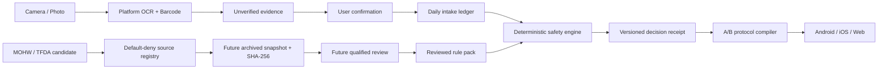

# Gym Come True

[English](README.md)

> **狀態：可稽核的跨平台 foundation + 台灣補充品 evidence contract draft，尚未達到 App Store / Google Play 上架條件。**  
> 專案使用 Kotlin Multiplatform（KMP）與 Compose Multiplatform，支援 Android、iOS 與 Web。它不是醫療器材，不提供診斷、治療、用藥建議或自動補充品劑量推薦。

## 目前 Stack

```text
PR #2  AUDITABLE_CROSS_PLATFORM_FOUNDATION
  └─ PR #15  TAIWAN_EVIDENCE_CONTRACT_DRAFT
       └─ Issue #8  REVIEWED_TAIWAN_RULE_PACK            # 尚未完成

後續：
#9  iOS native evidence / Apple Health / reminders / AlarmKit
#10 Android Health Connect / reminder reliability
#11 版權乾淨的 exercise catalog / licensed media
#12 Private LLM explanation gateway / adversarial evals
#13 Entitlements / privacy / stores / release operations
#14 Creator-market validation / launch evidence
```

PR #15 已重新鎖定到 PR #2 的最新 exact head，使用保留 ancestry 的 merge/relock，而不是 force reset。兩個 PR 都維持 Draft，直到 exact-head hosted validation 真正執行並通過。

## 核心定位

Gym Come True 不是另一個泛用 AI 健身聊天機器人，而是：

> **面向台灣與繁體中文市場的 evidence-backed fitness protocol executor。**

它把四個原本分散的工作合在同一條可追溯流程：

1. 在裝置端辨識補充品標籤；
2. 讓使用者逐欄確認，找出跨產品重複成分；
3. 只做 deterministic arithmetic，不把總量冒充成安全或建議劑量；
4. 將已確認的個人計畫編譯成 16:00 或 22:00 訓練日 timetable。

## 已完成的垂直切片

### PR #2 — Cross-platform foundation

- **Android**：system camera、bundled ML Kit Chinese + Latin OCR、barcode scanning、temporary image deletion、inexact reminder。
- **iOS**：Shared Compose UI host、PhotosPicker、Apple Vision OCR/barcode、local notification reminder。
- **Web**：Kotlin/Wasm、Kotlin/JS fallback、compatibility distribution。
- **Shared domain**：Traditional Chinese / English label parser、`mcg / mg / g` conversion、`IU / ml / 顆 / 錠 / unknown` fail closed、daily intake aggregation、duplicate ingredient detection、A/B schedule、LLM explanation-only contract。
- **Exercise data / media**：default-deny source/media registry，不包含 scraped 或第三方 hotlinked media。

### PR #15 — Taiwan evidence contract draft

- 台灣 product variant identity：market、barcode、internal product ID、formulation、label revision。
- Consent-aware corpus admission：raw image 預設不保存；unknown/withdrawn fail closed。
- OCR field observations：分開 first-pass exact accuracy 與 correction completion。
- MOHW / TFDA source candidate registry：全部維持 `REVIEW`，不捏造 snapshot hash。
- Deterministic Taiwan rule-pack admission：source mapping、reviewer coverage、七個 safety cases、rollback identity、decision receipt。
- Synthetic Traditional Chinese fixtures 與 JSON Schema transport contracts。

這個 slice 只是工程 admission contract。它**不包含** production Taiwan rule pack、真實 consented label corpus、personalized safe-dose threshold、藥物交互作用結論或 qualified reviewer attestation。

## 最重要的安全界線

- OCR 與 barcode 是 evidence，不是 truth。
- 使用者確認不等於臨床或官方來源驗證。
- `IU` 不能用通用公式轉成 `mg`。
- 每日總量只表示「已確認紀錄的算術加總」，不表示安全、有效或建議。
- 近期服藥、懷孕/哺乳、預定手術或異常症狀會阻擋 automation。
- 台灣 rule pack 尚未經合格專業審查，因此不能做 personalized dose / interaction 結論。
- LLM 不能補完缺失欄位、推薦劑量、判斷藥物安全或壓過 warning。
- provider key 不得放在 Android、iOS 或 Web client。
- local notification / inexact alarm 不是保證喚醒的 system alarm。
- AlarmKit 的系統 UI 有 stop control，因此不得宣稱「完成伏地挺身前無法關閉」。
- Schema validation 不代表 rule pack 可進 production；archived source evidence 與 qualified review 是獨立 hard gate。

## 主要資料流



## 建置與驗證

```bash
python3 scripts/validate_repository.py
python3 scripts/validate_taiwan_rule_pack.py
./gradlew :shared:jvmTest
./gradlew :androidApp:assembleDebug :androidApp:lintDebug
./gradlew :webApp:composeCompatibilityBrowserDistribution
```

iOS：

```bash
cd iosApp
xcodegen generate --spec project.yml
xcodebuild \
  -project GymComeTrue.xcodeproj \
  -scheme GymComeTrue \
  -sdk iphonesimulator \
  -configuration Debug \
  CODE_SIGNING_ALLOWED=NO \
  build
```

工具鏈固定為 JDK 21、Kotlin 2.4.10、AGP 9.1.0、Gradle 9.5.0、Compose Multiplatform 1.11.1。Hosted iOS validation 使用目前 foundation 所指定的 macOS 26 / Xcode 26 contract。

## Delivery State Machine

```text
EMPTY_REPOSITORY
  -> AUDITABLE_CROSS_PLATFORM_FOUNDATION       # PR #2
  -> TAIWAN_EVIDENCE_CONTRACT_DRAFT            # PR #15
  -> REVIEWED_TAIWAN_RULE_PACK                  # Issue #8，需真實 evidence + reviewer
  -> LICENSED_EXERCISE_CATALOG                  # Issue #11
  -> NATIVE_HEALTH_AND_ALARM_INTEGRATION        # Issues #9 / #10
  -> PRIVATE_LLM_EXPLANATION_GATEWAY            # Issue #12
  -> STORE_RELEASE_CANDIDATE                     # Issues #13 / #14
```

每個 transition 都必須具備 code、policy、provenance、privacy review 與 exact-head hosted build evidence；後續 state 不得弱化前面的 safety / rights invariants。

## Hosted CI 現況

PR #2 與 PR #15 仍為 Draft。PR #15 最新 exact-head workflow 在 runner allocation 前就被 GitHub Actions budget 阻擋，因此不能算 PASS，也不能把它誤判成 product-code failure。恢復 Actions budget 後必須重跑 exact head。

## 文件索引

- [Architecture](docs/architecture.md)
- [Health safety](docs/health-safety.md)
- [Taiwan supplement evidence contract](docs/taiwan-supplement-evidence.md)
- [Copyright / data governance](docs/copyright-and-data-governance.md)
- [Platform capability matrix](docs/platform-capability-matrix.md)
- [Store compliance](docs/store-compliance.md)
- [Implementation status](docs/implementation-status.md)
- [Roadmap](docs/roadmap.md)
- [Agent execution contract](AGENTS.md)
