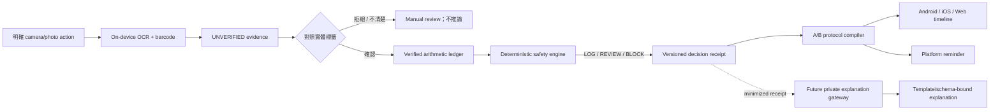
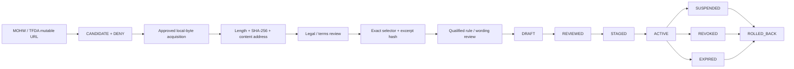
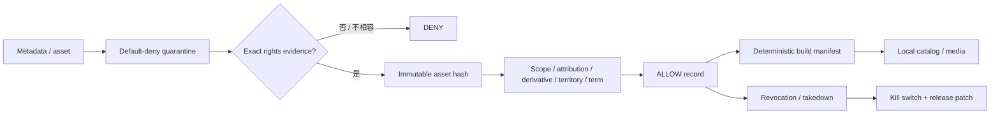
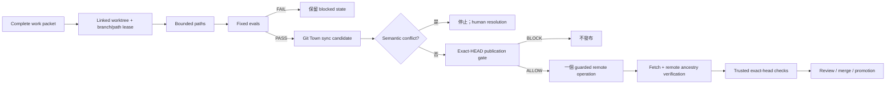

# Gym Come True

[English](README.md)

使用 Kotlin Multiplatform 與 Compose Multiplatform 建立的 evidence-first 健身 protocol 執行系統，支援 Android、iOS 與 Web。

> **目前真實狀態：** `main` 現在包含跨平台 foundation、台灣補充品 evidence contract、immutable Taiwan source lifecycle、文件／Git Town delivery graph，以及 machine-verified stacked delivery contract。整合不等於 admission：本 repo 至今沒有任何一次 hosted CI run 配置到 runner，因此以下沒有任何一項有 hosted evidence 背書。它不是醫療器材，尚未達到商店上架條件，沒有 clinically admitted Taiwan rule pack，沒有已授權的第三方健身媒體庫，也尚未 admit Git Town executable。

## 權威文件與狀態詞彙

先用本 README 了解全域，再依序閱讀 [AGENTS.md](AGENTS.md)、[Architecture](docs/architecture.md) 與 [Git / Stacked-PR governance](docs/git/README.md)。

| 詞彙 | 精確含義 |
|---|---|
| **OPEN DRAFT PR** | GitHub PR 已存在；不等於 merged、released 或 production admitted。 |
| **PLANNED WORK PACKET** | 已定義 parent、path lease、eval、rollback 與 Human Admit 的未來切片；不代表 branch 或 PR 已存在。 |
| **EXTERNAL GATE** | Repository 無法自行製造的 legal、clinical、store、billing、device、credential 或 rights evidence。 |
| `ABSENT` | 必要 evidence 或 executable 不存在。 |
| `NOT_IMPLEMENTED` | Repository 尚未實作該能力。 |
| `NOT_EXERCISED` | 尚未執行 subject-bound runtime canary。 |
| `SKIPPED_BY_POLICY` | Policy 刻意阻止操作；不是 test pass。 |
| `PASS` / `FAIL` | 指定 command 確實對指定 subject 執行。 |

## 已發布 Delivery Stack

這條 stack 是嚴格線性的、沒有任何 merge conflict，已由
`agent/git-town-admission-candidate` 以單次 fast-forward 併入 `main`（owner 指示的 merge）。

| PR | Merged head | Exact subject | Admission |
|---:|---|---|---|
| [#2](https://github.com/ed3c/gym-come-true/pull/2) | `58492815f22af65665172bcf98bfb661639ece92` | `agent/bootstrap-kmp-fitness-platform` | 已併入 `main`；仍需 hosted exact-head success |
| [#15](https://github.com/ed3c/gym-come-true/pull/15) | `79f8a65b370806925c32f0a15da88c7c0d7bda36` | `agent/taiwan-supplement-evidence` | 已併入 `main`；沒有 clinically reviewed pack |
| [#16](https://github.com/ed3c/gym-come-true/pull/16) | `f58a2feac580ca37bb4d7b3c30e122908bfd6b07` | `agent/taiwan-source-lifecycle` | 已併入 `main`；官方來源仍 denied |
| [#20](https://github.com/ed3c/gym-come-true/pull/20) | `ad065c8ac944f2fb4f9d60e65b008367b1291c43` | `agent/document-git-town-delivery-graph` | 已併入 `main`；documentation/convergence slice |
| [#22](https://github.com/ed3c/gym-come-true/pull/22) | `a70a52cc6e3e2f4107edae2f7bb2034029161568` | `agent/git-town-admission-candidate` | 已併入 `main`；Git Town runtime 仍 `NOT_EXERCISED` |

Merge 只整合了程式碼，並未產生 hosted evidence：本 repo 至今每一次 workflow run 都在配置 runner 之前就結束
（`PRE_RUN_BLOCKED_BY_ACTIONS_BUDGET`，Issue #45）。Issues #24–#48 是 requirements 與未來 work packets，不是已完成的 PR。

## 產品定位

Gym Come True 不是一般 workout logger，也不是 free-form supplement chatbot。目標是為台灣與繁體中文使用者提供可驗證的 protocol executor：

1. **Copyright-clean exercise intelligence**：metadata、media、anatomy asset、rendering code、UGC 分開治理；權利不明即 fail closed。
2. **Evidence-first label capture**：裝置端 OCR／barcode 只產生 candidate，不能自動成為 product truth。
3. **Deterministic supplement boundary**：通用程式只處理相容 mass units；IU、藥物情境、症狀、缺 serving 與 evidence conflict 都 fail closed。
4. **Daily Body Hacker ledger**：顯示已確認算術加總與重複成分，不把總量冒充安全或建議劑量。
5. **A/B protocol execution**：同一計畫可投影為 16:00 或 22:00 訓練日，包含跨午夜排序、餐食、恢復與提醒。
6. **Proof before explanation**：未來 LLM gateway 只能解釋 immutable decision receipt；不能擁有決策、建立規則、推薦劑量或壓過 warning。

## Repository Map：目錄分工與 State Machines

```text
.
├── shared/                     # deterministic domain truth 與 shared UI
├── androidApp/                 # Android permission、capture、ML Kit、temp-file、reminder adapters
├── iosApp/                     # canonical XcodeGen host、Vision evidence、local notifications
├── webApp/                     # JS/Wasm browser projection；不宣稱 native-health parity
├── data/                       # synthetic／Draft fixtures 與 transport schemas
├── legal/                      # source/media/provenance admission 與 revocation truth
├── assets/                     # first-party 或明確 admitted immutable assets
├── scripts/                    # validators 與 local-only source capture
├── docs/                       # architecture、safety、delivery、Git/Stacked-PR SSOT
├── .github/workflows/          # exact-head hosted evidence
├── AGENTS.md                   # root execution law 與 shared-Skill routing
└── THIRD_PARTY_NOTICES.md      # dependency／asset notice obligations
```

### 目錄責任矩陣

| Directory | 所屬 plane | State Machine | Input | Output | 目前狀態 |
|---|---|---|---|---|---|
| `shared/` | Deterministic domain | `UNVERIFIED -> USER_CONFIRMED -> RULE_EVALUATED -> DECISION_RECEIPT`；source `CANDIDATE -> CAPTURED -> HASH_VERIFIED -> LEGAL_REVIEWED -> VERIFIED_MAPPING -> REVIEWED -> STAGED -> ACTIVE` | Confirmed evidence、reviewed manifests、user-authored plan | Decisions、receipts、A/B timeline、shared UI state | Contract layer 已實作；沒有 production health-rule admission |
| `androidApp/` | Android adapter | permission、temporary capture、OCR candidate、inexact reminder | 明確 user action 與 shared commands | ML Kit 未驗證 evidence、reminder events | Foundation；Health Connect／reliability 在 Issue #10 |
| `iosApp/` | Apple adapter | picker／Vision candidate、notification authorization／schedule | 明確 photo selection 與 shared commands | Vision 未驗證 evidence、local notifications | Canonical `project.yml` + `NativeCapabilityBridge.swift`；HealthKit／AlarmKit 在 Issue #9 |
| `webApp/` | Browser projection | `BOOTSTRAP -> SHARED_UI_READY -> USER_INPUT -> LOCAL_RESULT` | Manual/imported evidence、shared state | JS/Wasm UI | Compatibility distribution 已實作；不宣稱 native parity |
| `data/` | Fixture/transport | `SYNTHETIC_OR_DRAFT -> STRUCTURALLY_VALIDATED -> TEST_ONLY` | Repo-authored fixtures、schemas | Test records、transport contracts | 真實 corpus 在 repo 外；fixture 不得自行 production admit |
| `legal/` | Rights/source admission | `UNKNOWN -> REVIEW -> ALLOW/DENY -> REVOKED` | License／contract／source evidence | Admission records、prohibited-use boundaries | Default deny；沒有 admitted third-party media 或 official source |
| `assets/` | Immutable asset | `QUARANTINED -> HASHED -> RIGHTS_REVIEWED -> ADMITTED -> PACKAGED -> REVOKED` | First-party work 或 executed rights | Content-addressed assets、provenance | 只有 first-party schematic |
| `scripts/` | Verification | `INPUT -> VALIDATED -> PASS/FAIL`；source capture `LOCAL_FILE -> HASH_VERIFIED + DENY` | Repository files 或 approved local bytes | Deterministic reports/receipts | Validators 與 no-network source capture 已實作 |
| `docs/` | Decision/handoff | `OBSERVED -> DOCUMENTED -> REVIEWED -> SUPERSEDED` | Code、Issues、PR graph、receipts | Human／Agent SSOT | PR #20 收斂 current state 與 branch graph |
| `.github/workflows/` | Hosted verification | `QUEUED -> RUNNER_ALLOCATED -> EXECUTED -> PASS/FAIL`；也可能 `PRE_RUN_BLOCKED` | Exact commit | Hosted checks/artifacts | Actions budget 在 runner allocation 前阻擋 |
| `docs/git/` | Branch/work governance | `TASK_PACKET_DRAFT -> LEASED -> SYNCED -> LOCALLY_VERIFIED -> PUBLICATION_ALLOW/BLOCK -> HUMAN_ADMIT` | Shared Skill、profile、packet、leases、evals | Branch graph 與 receipts | Policy 已文件化；Git Town runtime/canaries 仍 absent/not exercised |

## 端到端 Data Flows

### 補充品標籤與 Protocol



### Taiwan Regulatory Source 與 Rule Pack



`HASH_VERIFIED`、`LEGAL_REVIEWED`、`REVIEWED`、`ACTIVE`、`ADMITTED` 是不同狀態。Live URL、dataset ID、status field、model output 或手填 hash 都不能跳過 gate。

### Exercise Metadata／Media Rights



### Worker、Git Town 與 Publication



Git Town 只負責 branch hierarchy 與 synchronization；不能證明 correctness、publication admission、merge readiness、release readiness、legal 或 clinical acceptance。

## Git Town Adoption Status

Canonical method：shared [`git-town-stacked-pr-worker`](https://github.com/ed3c/skills-shared/tree/main/skills/git-town-stacked-pr-worker)。本 repo 只引用 shared body，不建立 shadow copy。

| Evidence | State |
|---|---|
| Shared canonical Skill resolved | `PASS` — 已檢視 blob `eb2d915bca3e8a3938625f7d33a10fae95a15769` |
| Repo profile、Worker policy、packet template、stack graph | 已放在 `docs/git/` |
| Exact Git Town version/executable | `ABSENT` |
| Checksum/provenance/license/SBOM/notices/legal admission | `ABSENT` |
| `.git-town.toml` | `NOT_IMPLEMENTED` |
| Worktree/lease、no-push sync、conflict、publication canaries | `NOT_EXERCISED` |
| Background synchronization | Disabled |
| Merge、ship、promotion、rollback | Human／trusted operator only |

詳見 [Git Town admission](docs/git/GIT_TOWN_ADMISSION.md)、[repository profile](docs/git/REPO_PROFILE.md)、[Worker protocol](docs/git/WORKER_PROTOCOL.md)、[molecular stack index](docs/git/STACKED_PRS.md)。

## 分子化末端 Stack PR Index

`OPEN DRAFT PR` 代表 PR 已存在；其餘 branch 除非另註，都是 proposed `PLANNED WORK PACKET`。

| ID | Issue | Parent | Branch | Primary transition | Status |
|---|---:|---|---|---|---|
| S0 | #1 | `main` | `agent/bootstrap-kmp-fitness-platform` | `EMPTY_REPOSITORY -> FOUNDATION` | **已 MERGED（PR #2）** |
| S1 | #8 | foundation | `agent/taiwan-supplement-evidence` | `FOUNDATION -> EVIDENCE_CONTRACT_DRAFT` | **已 MERGED（PR #15）** |
| S2 | #17 | Taiwan evidence | `agent/taiwan-source-lifecycle` | `EVIDENCE_DRAFT -> SOURCE_LIFECYCLE_DRAFT` | **已 MERGED（PR #16）** |
| S3 | #19 | source lifecycle | `agent/document-git-town-delivery-graph` | `SOURCE_LIFECYCLE_DRAFT -> DOCUMENTED_DELIVERY_GRAPH_DRAFT` | **已 MERGED（PR #20）** |
| S4 | #21 | delivery graph | `agent/git-town-admission-candidate` | `DELIVERY_GRAPH_DRAFT -> GIT_TOWN_CANDIDATE_RECORDED` | **已 MERGED（PR #22）** |
| S5 | #23 | Git Town candidate | 直接交付於 `main` | `CANDIDATE_RECORDED -> MACHINE_VERIFIED_STACKED_DELIVERY` | **已 MERGED** |
| TW1 | #24 | source lifecycle | `agent/tw-consent-corpus-contract` | `CORPUS_UNKNOWN -> CONSENT_CONTRACT_DRAFT` | PLANNED；需 consent/privacy |
| TW2 | #25 | TW1 | `agent/tw-ocr-evaluation-contract` | `CONSENT_DRAFT -> OCR_EVALUATION_DRAFT` | PLANNED；需 corpus/device |
| TW3 | #26 | TW2 | `agent/tw-reviewed-rule-pack` | `OCR_EVALUATED -> REVIEWED_TAIWAN_RULE_PACK` | PLANNED；需 external source/reviewer |
| I1 | #27 | foundation | `agent/ios-evidence-bridge` | `IOS_SHELL -> IOS_EVIDENCE_HANDOFF` | PLANNED sibling stack |
| I2 | #28 | I1 | `agent/ios-healthkit-minimal` | `IOS_EVIDENCE -> MINIMAL_HEALTH_READS` | PLANNED；需 Apple entitlement |
| I3 | #29 | I2 | `agent/ios-reminder-alarmkit-assessment` | `HEALTH_READS -> IOS_DELIVERY_EVIDENCE` | PLANNED；需 device evidence |
| A1 | #30 | foundation | `agent/android-health-connect-minimal` | `ANDROID_SHELL -> MINIMAL_HEALTH_READS` | PLANNED sibling stack |
| A2 | #31 | A1 | `agent/android-reminder-reliability` | `HEALTH_READS -> ANDROID_DELIVERY_EVIDENCE` | PLANNED；需 device farm |
| C1 | #32 | foundation | `agent/exercise-taxonomy-contract` | `DEMO_CATALOG -> TAXONOMY_CONTRACT` | PLANNED sibling stack |
| C2 | #33 | C1 | `agent/exercise-top50-content` | `TAXONOMY -> RIGHTS_CLEAN_TOP50` | PLANNED；需 editorial/rights |
| C3 | #34 | C2 | `agent/exercise-media-admission` | `TOP50 -> LICENSED_MEDIA_PIPELINE` | PLANNED；需 external rights |
| L1 | #35 | TW3 | `agent/explanation-gateway-contract` | `REVIEWED_RECEIPT -> GATEWAY_CONTRACT` | PLANNED；需 security review |
| L2 | #36 | L1 | `agent/explanation-gateway-provider` | `CONTRACT -> PROVIDER_DRAFT` | PLANNED；需 credential |
| L3 | #37 | L2 | `agent/explanation-gateway-adversarial-evals` | `PROVIDER_DRAFT -> EVALUATED_GATEWAY` | PLANNED；需 red-team |
| R1 | #38 | foundation | `agent/entitlement-contract` | `NO_ENTITLEMENT -> VERIFIED_ENTITLEMENT_DRAFT` | PLANNED sibling stack |
| R2 | #39 | R1 | `agent/privacy-delete-export` | `ENTITLEMENT -> ACCOUNT_DATA_LIFECYCLE_DRAFT` | PLANNED；需 storage/privacy |
| R3 | #40 | admitted domain heads | `agent/store-release-candidate` | `DOMAIN_SLICES -> STORE_RELEASE_CANDIDATE` | PLANNED；需 store/signing |
| M1 | #41 | foundation | `agent/market-interview-protocol` | `MARKET_UNKNOWN -> PROBLEM_EVIDENCE_DRAFT` | PLANNED sibling stack |
| M2 | #42 | M1 | `agent/creator-rights-contract` | `PROBLEM_EVIDENCE -> RIGHTS_CLEARED_CREATIVE` | PLANNED；需 creator contract |
| M3 | #43 | M2 | `agent/market-experiment-ledger` | `CREATIVE -> RETENTION_EVIDENCE_DRAFT` | PLANNED；需 audited campaign |
| N1 | #46 | Taiwan evidence | `agent/taiwan-food-nutrition-data` | `NO_FOOD_LAYER -> COPYRIGHT_CLEAN_FOOD_DATA_DRAFT` | PLANNED；需 reuse terms |
| N2 | #47 | N1 | `agent/meal-plan-compiler` | `FOOD_DATA_DRAFT -> DETERMINISTIC_MEAL_PLAN_DRAFT` | PLANNED；需 nutrition review |
| V1 | #48 | C1 | `agent/muscle-visualization-ui` | `SCHEMATIC_ASSET -> LOCAL_MUSCLE_VISUALIZATION` | PLANNED；需 first-party asset |
| X1 | #44 | admitted heads | `agent/release-convergence-index` | `REVIEWABLE_SLICES -> RELEASE_CONVERGENCE_DRAFT` | PLANNED Human-Admit convergence |

完整 path lease、eval、negative control、rollback 與 Human Admit 見 [STACKED_PRS.md](docs/git/STACKED_PRS.md)。互相獨立的 domains 是 foundation 的 sibling stacks，不是人工串成一條 serial chain。

## 已實作能力

- Shared parser、相容 mass normalization、daily arithmetic、duplicate detection、safety gates、A/B timetable、Compose UI。
- Android camera handoff、bundled Chinese/Latin ML Kit OCR、barcode、temporary-image deletion、inexact reminder。
- iOS canonical XcodeGen host、PhotosPicker/Vision candidate、local notification。
- JS/Wasm browser distribution。
- Taiwan product/corpus identity、OCR metrics、rule-pack admission、decision receipt、source snapshot/mapping/release lifecycle、synthetic fixtures、fail-closed validators。
- Default-deny source/media governance 與 first-party schematic assets。

詳細見 [Implementation status](docs/implementation-status.md)。

## Safety／Rights Contract

- OCR／barcode 一律從 `UNVERIFIED` 開始。
- 只有 `mcg/µg/μg`、`mg`、`g` 使用 generic mass conversion。
- IU、volume、count、proprietary blend、藥物情境、懷孕、手術、症狀、缺 evidence、conflict 都 fail closed。
- Daily total 只是 arithmetic observation，不是 safety limit 或 recommendation。
- Production corpus retention 必須具備 consent、encryption、expiry、withdrawal、hash、provenance。
- 不得捏造 official-source bytes、legal state、clinical review、signature、store approval、revenue 或 CI result。
- 沒有 exact rights evidence 與 `ALLOW` record 的 third-party exercise media 不得出貨。
- LLM 只能解釋，不能擁有 decision 或 warning。
- Android inexact alarm／iOS notification 是 reminder，不是 guaranteed alarm；AlarmKit 保留 system stop semantics。

## 驗證命令

```bash
python3 scripts/validate_repository.py
python3 scripts/validate_taiwan_rule_pack.py
python3 scripts/validate_taiwan_source_lifecycle.py
python3 scripts/validate_taiwan_source_hardening.py
python3 scripts/validate_stacked_delivery.py --self-test
sh ./gradlew :shared:jvmTest
sh ./gradlew :androidApp:assembleDebug :androidApp:lintDebug
sh ./gradlew :webApp:composeCompatibilityBrowserDistribution
```

Canonical iOS host：

```bash
cd iosApp
xcodegen generate --spec project.yml
xcodebuild \
  -project GymComeTrue.xcodeproj \
  -scheme GymComeTrue \
  -sdk iphonesimulator \
  -configuration Debug \
  CODE_SIGNING_ALLOWED=NO \
  ONLY_ACTIVE_ARCH=YES \
  ARCHS=arm64 \
  build
```

只有確實對指定 commit 執行的 command 才能標記 `PASS` 或 `FAIL`。

## Hosted Evidence／External Gates

PR #16 exact head `f58a2feac580ca37bb4d7b3c30e122908bfd6b07` 的 workflow run 為 `31878284072`（run #79）。所有 jobs 在 runner allocation 前因 Actions budget 結束。正確分類是 `PRE_RUN_BLOCKED_BY_ACTIONS_BUDGET`，不是 test pass，也不是 product-code failure。

External gates 仍包括：

- GitHub Actions capacity；
- approved immutable MOHW/TFDA bytes 與 exact reuse terms；
- consented Traditional Chinese corpus 與 operational delete/withdraw；
- qualified Taiwan reviewer、COI、rule/wording attestation；
- executed exercise-media rights 與 takedown；
- provider/store credentials 與 independently reviewed server adapters；
- App Store／Google Play signing、privacy forms、device evidence、release-console operations；
- 真實 rights-cleared creator campaigns 與 audited retention/contribution evidence。

## 文件索引

- [Architecture and directory state machines](docs/architecture.md)
- [Implementation status](docs/implementation-status.md)
- [Roadmap](docs/roadmap.md)
- [GitHub Issue / PR index](docs/github-issue-index.md)
- [Git and Stacked-PR governance](docs/git/README.md)
- [Repository Git Town profile](docs/git/REPO_PROFILE.md)
- [Molecular Stacked PR graph](docs/git/STACKED_PRS.md)
- [Worker protocol](docs/git/WORKER_PROTOCOL.md)
- [Git Town admission state](docs/git/GIT_TOWN_ADMISSION.md)
- [Work-packet template](docs/git/WORK_PACKET.template.md)
- [Health and supplement safety](docs/health-safety.md)
- [Taiwan supplement evidence](docs/taiwan-supplement-evidence.md)
- [Taiwan source lifecycle](docs/taiwan-source-lifecycle.md)
- [Copyright and data governance](docs/copyright-and-data-governance.md)
- [Platform capability matrix](docs/platform-capability-matrix.md)
- [Store compliance](docs/store-compliance.md)
- [Product strategy](docs/product-strategy.md)
- [Marketing plan](docs/marketing-plan.md)

## License

Application code 目前為 proprietary／all rights reserved。Third-party dependencies 保留各自 licenses，見 [THIRD_PARTY_NOTICES.md](THIRD_PARTY_NOTICES.md)。本 repository 不授予第三方 exercise media、official-source redistribution、medical approval 或 release authorization。
