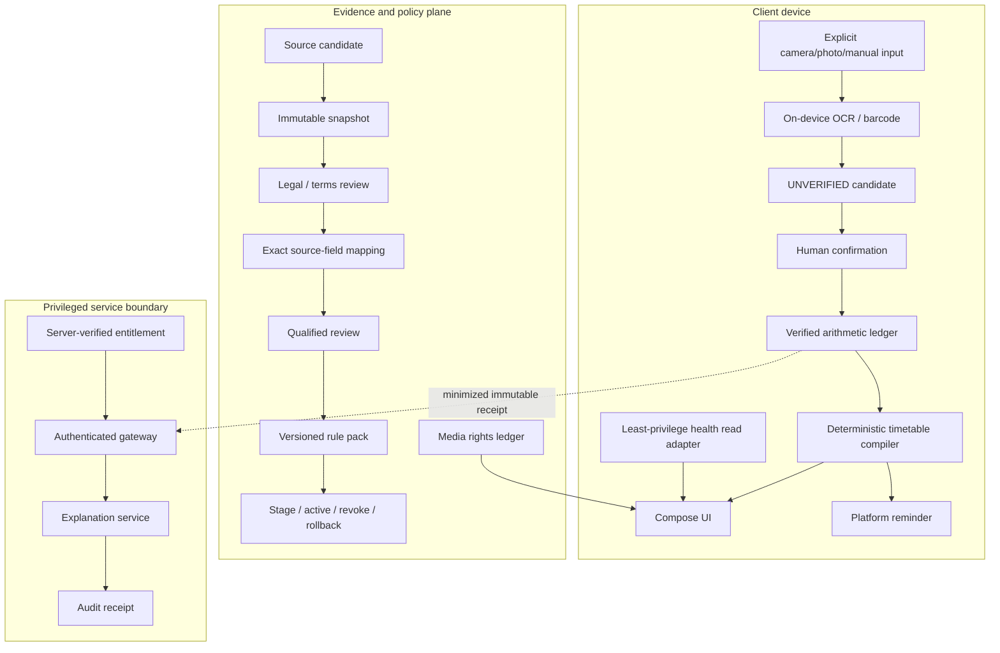
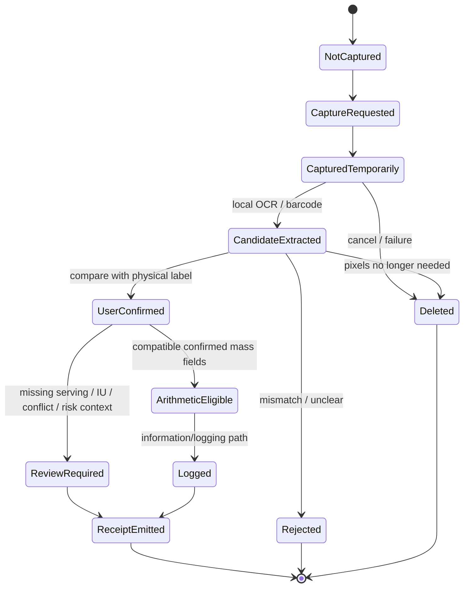
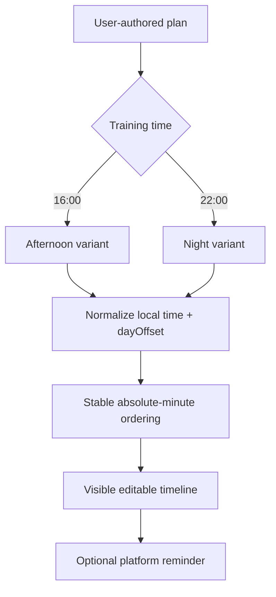
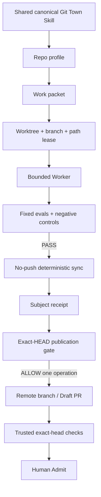

# Architecture, directory state machines, and data flow

## Decision

Gym Come True uses Kotlin Multiplatform for deterministic domain logic and Compose Multiplatform for the shared application surface. Platform shells own permissions, OCR, notifications, health-store adapters, and any future system-alarm integration. Source, media, clinical-review, entitlement, device, store, and model-provider authority remain separate planes.

Current engineering includes least-privilege Android Health Connect availability/permission/read adapters, an iOS HealthKit read bridge, Android reminder persistence/reconciliation, iOS notification scheduling, on-device label evidence paths, exercise/nutrition contracts, and receipt-only explanation boundaries. None of that proves real-device behavior, OEM compatibility, HealthKit entitlement/store acceptance, production privacy review, exact/system alarm reliability, a clinically admitted Taiwan rule pack, third-party exercise-media rights, provider deployment, or store-signed release.

```text
ADAPTER_PRESENT != REAL_DEVICE_VALIDATION
ENGINEERING_PRESENT != PRODUCTION_ADMITTED
```

## Authority chain

```text
AGENTS.md
  -> README.md / README.zh-TW.md
  -> docs/implementation-status.md
  -> docs/architecture.md
  -> docs/platform-capability-matrix.md + docs/store-compliance.md
  -> docs/git/README.md + REPO_PROFILE.md + STACKED_PRS.md
  -> assigned Issue / work packet
  -> nearest directory README
  -> executable tests and exact-head receipts
```

Architecture prose is a decision record. Executable code, immutable manifests, and exact-subject receipts remain implementation evidence. Live GitHub state outranks checked-in routing snapshots.

## Directory contract

```text
shared/
├── src/commonMain/kotlin/dev/ed3c/gymcometrue/
│   ├── domain/                 # evidence, arithmetic, protocol, nutrition, health policy
│   ├── explanation/            # receipt-only/provider-boundary contracts
│   └── ui/                     # shared Compose projection
├── src/commonTest/             # deterministic and negative controls
└── src/iosMain/                # ComposeUIViewController export

androidApp/
├── MainActivity.kt
├── scan/                       # bundled ML Kit candidate extraction
├── health/                     # Health Connect availability/permission/read adapters
├── reminder/                   # inexact reminder + persisted transition reconciliation
└── AndroidManifest.xml         # least-privilege declarations

iosApp/
├── project.yml                 # only admitted XcodeGen specification
└── GymComeTrue/
    ├── GymComeTrueApp.swift
    ├── ContentView.swift
    ├── NativeCapabilityBridge.swift  # Photos/Vision/notifications + NativeHealthReadBridge
    └── Info.plist              # declared usage descriptions

webApp/                         # JS/Wasm shared-UI projection

data/                           # synthetic/Draft exercise, nutrition and Taiwan fixtures
legal/                          # source/media/provenance/default-deny policy
assets/                         # first-party or admitted immutable assets only
scripts/                        # deterministic validators and bounded local-byte capture
docs/                           # architecture/status/safety/delivery/Git authority
.github/workflows/              # exact-head hosted verification
```

Shadow iOS project specifications and duplicate native bridges are prohibited; `iosApp/project.yml` and `NativeCapabilityBridge.swift` are the canonical paths.

## Directory-to-state-machine responsibility

| Directory | State machine | Authority boundary |
|---|---|---|
| `shared/domain` | evidence, arithmetic, protocol, nutrition, health-read policy, source/release states | deterministic transitions only; no platform permission or secret authority |
| `shared/explanation` | immutable receipt -> constrained explanation request/result | cannot create or override safety decisions |
| `shared/ui` | domain-state projection | may render state; cannot create stronger evidence |
| `androidApp` | permission, temporary capture, OCR candidate, Health Connect read, reminder lifecycle | adapter events only; no medical/store/device admission |
| `iosApp` | picker/Vision, HealthKit read bridge, notification lifecycle | no Health write authority; no entitlement/device/store admission |
| `webApp` | browser bootstrap/input/result lifecycle | does not emulate unavailable native capabilities |
| `data` | synthetic/Draft/test fixtures | cannot self-declare production admission |
| `legal` | candidate/review/allow/deny/revoke | rights/source authority; no clinical inference |
| `assets` | quarantine/hash/review/admit/package/revoke | exact asset scope only |
| `scripts` | fixed-input validation and local-byte capture | no arbitrary execution or mutable source capture in CI |
| `docs` | observed/documented/reviewed/superseded | describes truth; cannot replace executable evidence |
| `.github/workflows` | queued/allocated/executed/pass-or-fail | exact commit evidence only |
| `docs/git` | packet/lease/sync/eval/publication/human-admit | branch governance only; no product admission |

## Runtime planes



Provider deployment/credentials remain absent unless separately evidenced. The client never owns model-provider, store, KMS, or signing secrets; authoritative subscription state; private clinical rule packs; private license contracts; global mutable safety thresholds; or reviewer signature material.

## Label evidence state machine



A barcode may narrow a candidate identity but cannot prove formulation, country variant, serving size, expiry, or authenticity.

## Daily protocol compiler



Cross-midnight events use `dayOffset`. Arithmetic and scheduling do not become individualized medical advice.

## Android adapter state machines

### Health Connect

```text
FEATURE_DISABLED
  -> AVAILABILITY_CHECK
  -> UNAVAILABLE | PERMISSION_REQUIRED | READ_READY
  -> READ_RESULT | PERMISSION_REVOKED | READ_FAILED
```

The manifest declares only `READ_WEIGHT` and `READ_EXERCISE`. Adapter presence does not establish real-device/OEM behavior, Play declaration acceptance, privacy review, or broader data authority.

### Reminder

```text
UNSCHEDULED
  -> SCHEDULED_INEXACT
  -> FIRED | CANCELLED | PERMISSION_DENIED | OS_DEFERRED

persisted pending reminder
  -> BOOT_COMPLETED | MY_PACKAGE_REPLACED | TIMEZONE_CHANGED
  -> reconcile same inexact reminder contract
```

No exact-alarm permission or universal delivery guarantee is implied.

## iOS adapter state machines

### Evidence

```text
PICKER_IDLE
  -> USER_SELECTED
  -> VISION_PROCESSING
  -> UNVERIFIED_CANDIDATE | FAILED
  -> NATIVE_RESOURCE_RELEASED
```

### HealthKit

```text
FEATURE_DISABLED
  -> AVAILABILITY_CHECK
  -> AUTHORIZATION_REQUEST
  -> READ_ATTEMPT
  -> READ_RESULT | DENIED_OR_UNAVAILABLE | FAILED
```

`NativeHealthReadBridge` is read-only and least-privilege. HealthKit does not provide a general read-authorization truth oracle. Entitlement, real-device authorization, App Store disclosure, privacy review, and production behavior remain separate evidence.

### Notification

```text
AUTHORIZATION_UNKNOWN
  -> REQUESTED
  -> AUTHORIZED | DENIED
  -> SCHEDULED | CANCELLED | DELIVERY_NOT_OBSERVED
```

AlarmKit is not currently admitted as a product capability. If introduced, system stop controls, usage description, device behavior and store semantics must remain explicit.

## Web state machine

```text
BOOTSTRAP
  -> SHARED_UI_READY
  -> USER_INPUT
  -> LOCAL_DOMAIN_RESULT
  -> RENDERED
```

Native health parity and system alarms are unavailable; browser-specific capabilities require their own evidence.

## Exercise/media state machine

```text
DISCOVERED -> QUARANTINED -> RIGHTS_REVIEWED -> HASHED -> ADMITTED -> PACKAGED
                         \-> DENIED
ADMITTED/PACKAGED -> REVOKED -> REMOVED
```

Metadata, written instructions, translation, media, rendering code, anatomy/model assets and UGC require independent rights evidence. Repository Apache-2.0 does not grant third-party asset rights.

## Git / Worker architecture



Current Git Town state:

```text
candidate                  PINNED_CANDIDATE / v24.0.0
runtime                    CANDIDATE_METADATA_VERIFIED_RUNTIME_BLOCKED
consumer .git-town.toml    NOT_IMPLEMENTED
consumer canaries          NOT_EXERCISED
background sync            DISABLED
production use             DENY
```

```text
GIT_TOWN_CANDIDATE != GIT_TOWN_RUNTIME_ADMITTED
```

## Failure behavior

| Failure | Required behavior |
|---|---|
| OCR unclear | manual confirmation; no inference |
| Barcode mismatch | unresolved identity |
| Missing/invalid reviewed source | keep information/logging boundary; no invented rule |
| Network/model outage | deterministic UI remains available |
| Notification denied/deferred | timeline remains visible; expose delivery state |
| Health permission revoked | stop reads; retain only authorized local history |
| Timezone change | reproject/reconcile future events |
| Media rights absent/revoked | deny/remove asset; retain text/local fallback |
| Dirty worktree/lease conflict | stop Worker |
| Semantic Git conflict | Human Admit |
| Hosted runner unavailable | `PRE_RUN_BLOCKED`, not code PASS/FAIL |

## Observability without surveillance

Allowed structural events include `scan_started`, `scan_completed_locally`, `candidate_confirmed`, `reminder_permission_denied`, `health_permission_denied`, `source_manifest_rejected`, and `media_manifest_rejected`.

Do not send raw OCR text, image pixels, full barcode, medication free text, health samples, private source bytes, reviewer identity, secret values, or branch credentials into general analytics or portable receipts.
