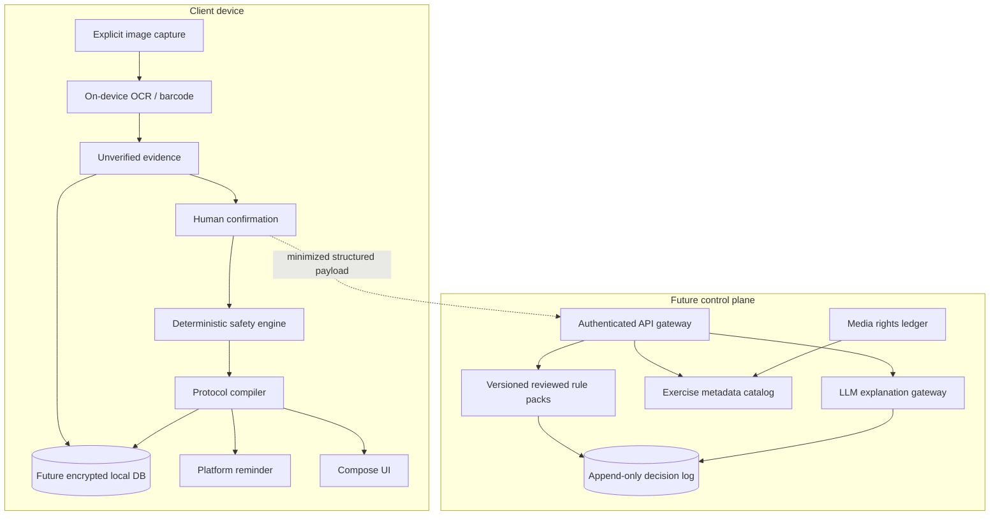
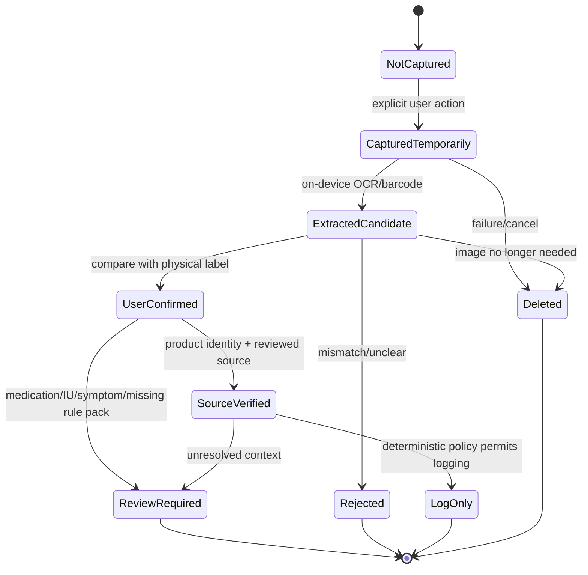
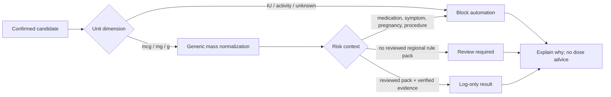
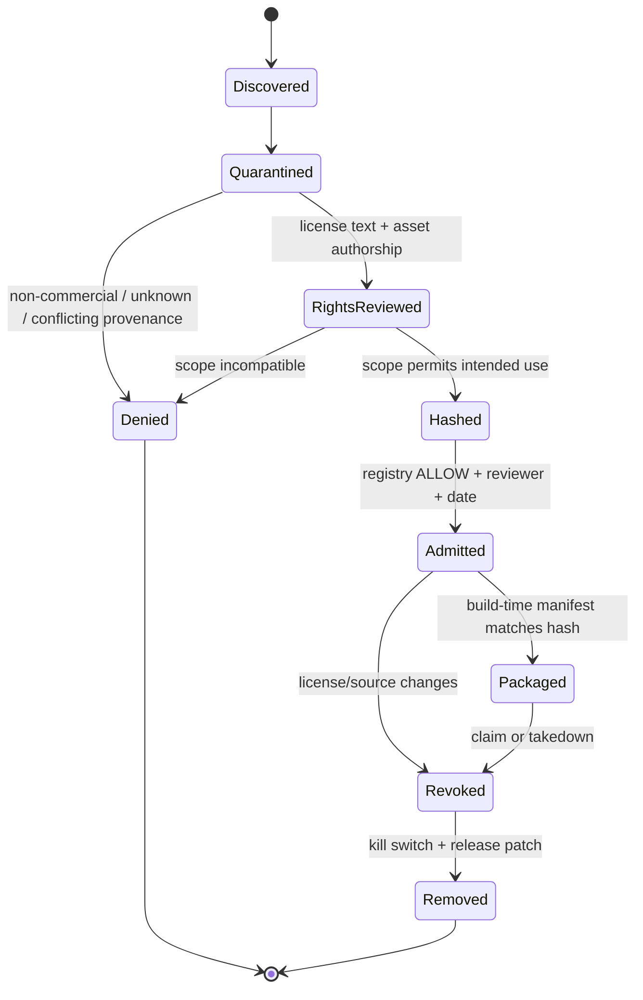
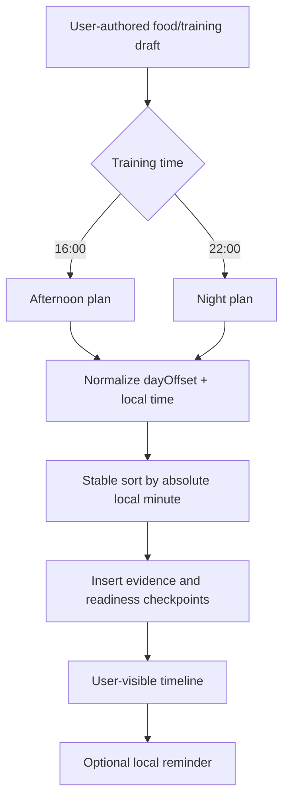

# Architecture and data flow

## Decision

Gym Come True uses Kotlin Multiplatform for deterministic domain logic and Compose Multiplatform for the shared application surface. Platform shells retain control of permissions, OCR, notifications, health stores, and future system alarms. A future server owns privileged health-rule packs, source admission, model-provider access, subscription entitlements, and audit evidence.

This foundation intentionally ships no backend, health-store integration, exact alarm, licensed media catalog, or client-side LLM key.

## Directory contract

```text
shared/
├── src/commonMain/
│   ├── domain/Domain.kt        # evidence, units, safety, protocol, LLM boundary
│   └── ui/App.kt               # dashboard, timeline, local muscle geometry
├── src/commonTest/             # deterministic contract tests
└── src/iosMain/                # ComposeUIViewController export

androidApp/
├── MainActivity.kt             # explicit camera and reminder actions
├── scan/                       # ML Kit adapter; cache image deletion
├── reminder/                   # inexact local reminder adapter
└── AndroidManifest.xml         # minimum permissions and private FileProvider

iosApp/
├── project.safe.yml            # explicit admitted Swift source set
└── GymComeTrue/
    ├── ContentView.swift       # shared Compose host
    └── NativeCapabilityBridgeV2.swift
                                # Vision evidence + UserNotifications bridge

webApp/
└── commonMain/                 # JS/Wasm host

legal/
├── source-registry.json        # candidate source decision record
└── media-registry.json         # immutable asset admission record

data/seed/                     # original media-free schema examples
```

## Runtime planes



### Client trust level

The client is inspectable and can be modified by an attacker. It may cache public catalog records and user-owned data, but it cannot hold:

- model-provider secrets;
- store server credentials;
- private clinical rule packs;
- source-license documents that contain commercial terms;
- authoritative subscription state;
- a mutable global safety threshold.

### Server trust level

The future server is still not a medical authority. It can enforce reviewed policy, attest rule-pack versions, minimize model payloads, and produce an audit record. Human clinical and legal review remain external controls.

## Label evidence flow



`ExtractedCandidate` is never silently promoted. A barcode narrows identity but does not prove formulation, serving size, country variant, expiry, or authenticity.

### Candidate schema

```json
{
  "rawTextSha256": "hex digest of recognized text",
  "barcode": "optional candidate",
  "candidates": [
    {
      "ingredient": "label string",
      "amount": 100,
      "unit": "MG",
      "evidenceStatus": "UNVERIFIED"
    }
  ],
  "warnings": ["human-readable extraction warnings"]
}
```

Raw label images are not part of the domain object. Future opt-in storage requires encryption, retention controls, export/delete support, and a separate privacy review.

## Unit and safety flow



The engine does not define a recommended intake. `LOG_ONLY` means the evidence can be recorded; it does not mean the product or amount is medically safe.

## Exercise and media admission flow



A production media record must bind:

- the exact asset, not merely a website or repository;
- source and acquisition date;
- license/contract evidence reference;
- allowed platforms, territories, term, derivative and CDN rights;
- SHA-256;
- reviewer and review date;
- revocation procedure.

## Visual rendering strategy

The first version draws a schematic body from Compose geometry. It demonstrates activation intensity without copying an anatomy illustration. This is not an anatomical diagnosis and does not imply biomechanical precision.

Future layers are separate:

1. **Schematic body map** — repository-authored vector geometry; lowest rights burden.
2. **Reviewed 2D anatomy asset** — admitted SVG paths with explicit authorship and license.
3. **Licensed 3D model** — separate asset SKU, GPU fallback, accessibility alternative, and mobile thermal budget.
4. **Exercise demonstration media** — independently licensed image/video with no coupling to metadata source.

## Daily protocol compiler



Cross-midnight events carry a `dayOffset`; therefore `+1d 00:15` follows `22:00` rather than sorting at the start of the day.

A future production schedule must also model:

- IANA time zone and daylight-saving changes;
- travel and missed-event policy;
- quiet hours;
- notification permission state;
- training readiness and pain stop-rules;
- meal/supplement evidence version;
- recurrence and one-off overrides;
- audit of user edits versus model explanations.

## Platform capability boundaries

| Capability | Shared contract | Android adapter | iOS adapter | Web behavior |
|---|---|---|---|---|
| Label evidence | `ScanEvidence` | ML Kit text + barcode | Vision text + barcode | manual/file import later |
| Camera | callback boundary | system camera via `TakePicture` | camera UI not yet wired | browser capture later |
| Reminder | protocol event | inexact `AlarmManager` + notification | `UserNotifications` bridge | browser notification later |
| Exact/system alarm | capability state | not implemented | AlarmKit not implemented | not applicable |
| Health records | normalized domain DTO | Health Connect future | HealthKit future | user export/import only |
| Model explanation | immutable payload contract | no direct provider call | no direct provider call | no direct provider call |

## Future service boundaries

```text
catalog-service
  source/version import, translations, exercise taxonomy, media manifest

protocol-service
  versioned user plans, recurrence, reminder projection, conflict handling

safety-policy-service
  reviewed rule-pack selection, deterministic evaluation, decision receipts

explanation-gateway
  payload minimization, provider routing, output schema validation, audit

entitlement-service
  App Store / Play / Web subscription receipts and feature flags

analytics-service
  consented aggregate events; no raw label photo or medical free text by default
```

These may begin as modules in one deployable service. Split only when scale, data-boundary, or ownership evidence justifies it.

## Failure behavior

| Failure | Required behavior |
|---|---|
| OCR unavailable or low confidence | manual confirmation; do not infer |
| Barcode absent or product mismatch | unresolved identity; no rule lookup |
| Network/model outage | deterministic UI and safety warning remain usable |
| Rule pack missing or expired | review required; no fallback to model intuition |
| Notification denied | timeline remains visible; show permission state |
| Exact alarm unavailable | downgrade honestly to reminder; no reliability claim |
| Media revoked | remove by manifest/kill switch; preserve metadata if independently licensed |
| Health permission revoked | stop reads immediately; retain only user-approved local history |
| Time-zone change | reproject future events and request confirmation for ambiguous local times |

## Observability without surveillance

Record structural events such as `scan_started`, `scan_completed_locally`, `candidate_confirmed`, `safety_blocked`, `reminder_permission_denied`, and `media_manifest_rejected`. Do not record raw OCR text, photo pixels, full barcode, medication free text, or health samples in general analytics.

Use a separate, consented diagnostic export when a user asks for support. The export must be inspectable before sharing.
