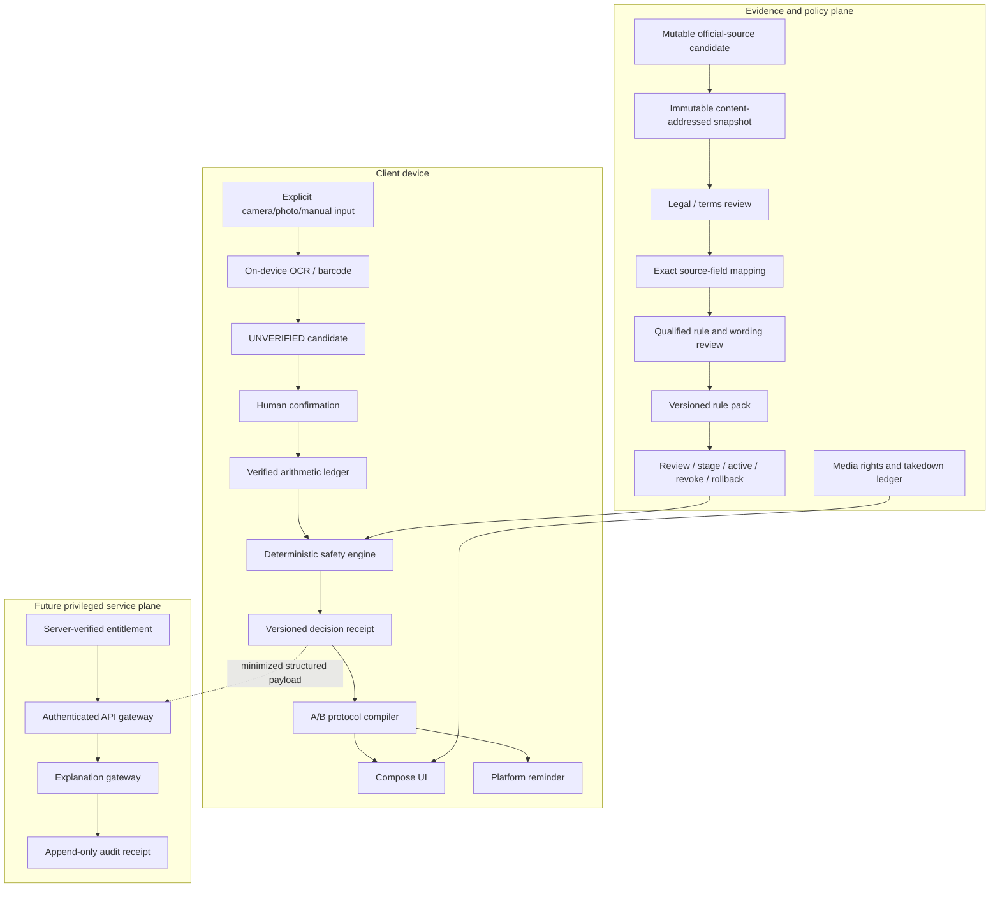
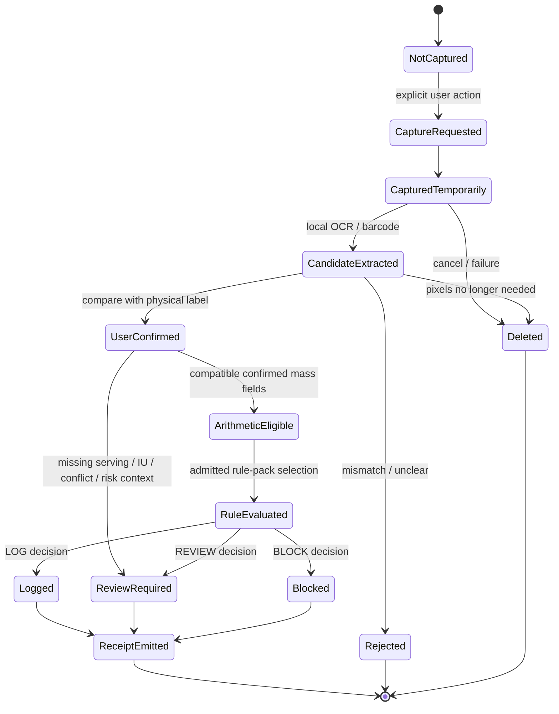
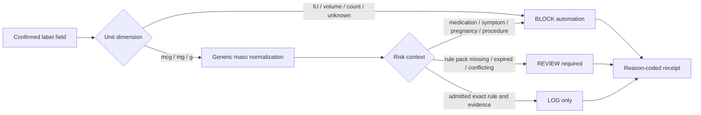
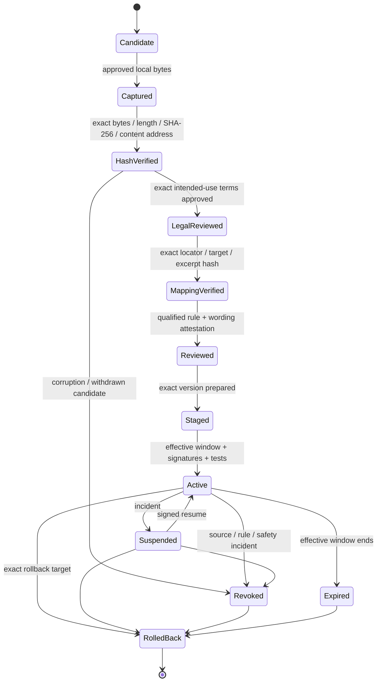
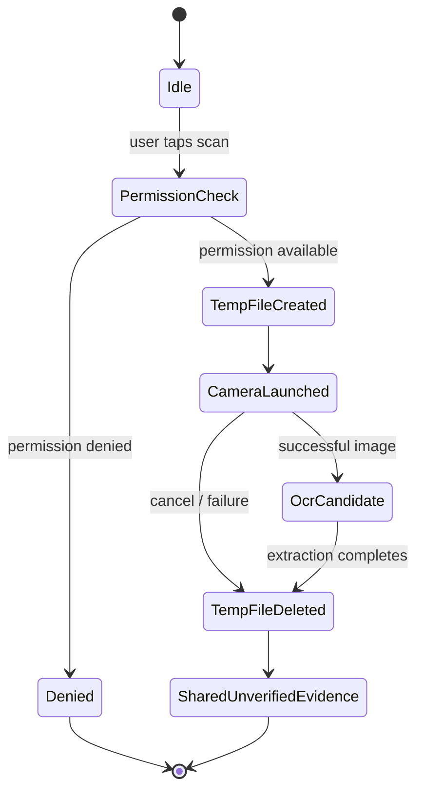
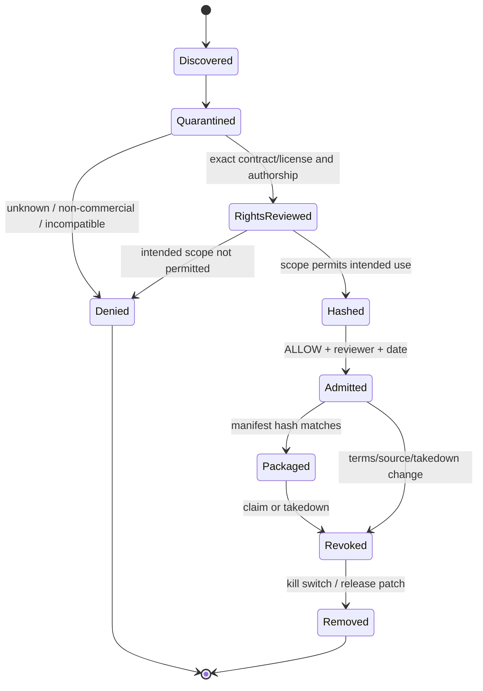
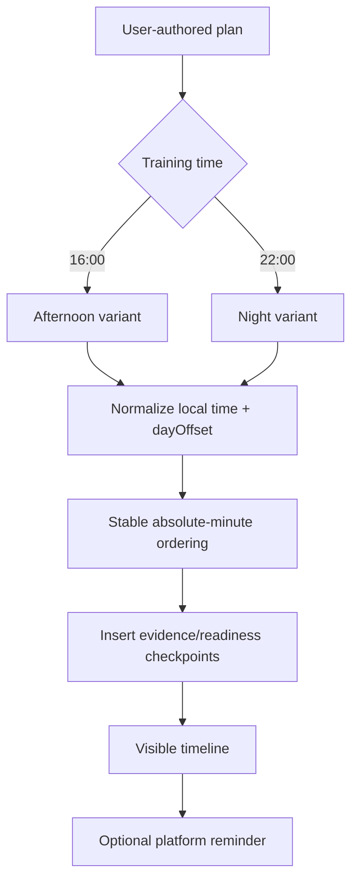
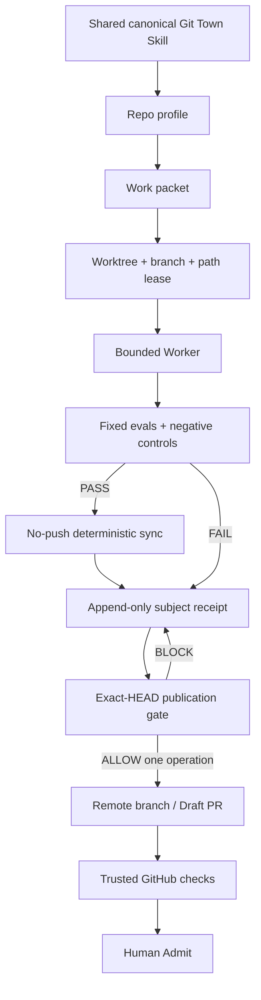

# Architecture, directory state machines, and data flow

## Decision

Gym Come True uses Kotlin Multiplatform for deterministic domain logic and Compose Multiplatform for the shared application surface. Platform shells own permissions, OCR, notifications, health stores, and future system-alarm integrations. Source, media, clinical-review, entitlement, and model-provider authority remain separate planes.

The current repository has no production backend, no HealthKit/Health Connect integration, no exact alarm, no clinically admitted Taiwan rule pack, no third-party exercise-media catalog, and no client-side provider secret.

## Authority chain

```text
AGENTS.md
  -> README.md / README.zh-TW.md
  -> docs/architecture.md
  -> docs/git/README.md + REPO_PROFILE.md + STACKED_PRS.md
  -> assigned Issue / work packet
  -> nearest directory README
  -> executable tests and exact-head receipts
```

Architecture prose is a decision record. Executable code, immutable manifests, and exact-subject receipts remain the implementation evidence.

## Directory contract

```text
shared/
├── src/commonMain/kotlin/dev/ed3c/gymcometrue/
│   ├── domain/
│   │   ├── Domain.kt                       # scan evidence, units, safety, protocol, LLM boundary
│   │   ├── DailyIntake.kt                  # verified arithmetic and duplicate ingredients
│   │   ├── TaiwanSupplementEvidence.kt     # corpus/rule-pack admission and decision receipts
│   │   └── TaiwanSourceLifecycle.kt        # immutable source/mapping/release lifecycle
│   └── ui/App.kt                           # shared dashboard and timeline
├── src/commonTest/.../domain/               # deterministic tests and negative controls
└── src/iosMain/.../MainViewController.kt    # ComposeUIViewController export

androidApp/
├── MainActivity.kt                          # explicit capture/reminder actions
├── scan/AndroidLabelScanner.kt              # bundled ML Kit candidate extraction
├── reminder/ProtocolReminder.kt             # inexact local reminder
└── AndroidManifest.xml                      # least-privilege declarations

iosApp/
├── project.yml                              # only admitted XcodeGen specification
└── GymComeTrue/
    ├── GymComeTrueApp.swift
    ├── ContentView.swift
    ├── NativeCapabilityBridge.swift         # PhotosPicker/Vision/UserNotifications bridge
    └── Info.plist

webApp/
└── src/commonMain/                          # JS/Wasm shared-UI projection

data/
├── seed/                                    # first-party/demo exercise metadata
└── taiwan-supplement/                       # synthetic/Draft fixtures and schemas

legal/
├── source-registry.json
├── media-registry.json
├── provenance/
├── taiwan-supplement-source-registry.json
└── taiwan-official-resource-candidates.json

assets/
└── first-party/                             # repository-authored schematic asset

scripts/
├── validate_repository.py
├── validate_taiwan_rule_pack.py
├── validate_taiwan_source_lifecycle.py
├── validate_taiwan_source_hardening.py
└── capture_taiwan_source.py                 # approved local bytes only; no HTTP client

docs/
├── architecture.md
├── implementation-status.md
├── roadmap.md
├── git/                                     # branch/worktree/Stacked-PR governance
└── domain-specific decisions

.github/workflows/
└── verify.yml                               # policy, Android/Web/domain, and iOS hosted lanes
```

Shadow iOS project specifications and duplicate native bridges are prohibited; `iosApp/project.yml` and `NativeCapabilityBridge.swift` are the sole canonical paths.

## Directory-to-state-machine responsibility

| Directory | State machine | Authority boundary |
|---|---|---|
| `shared/domain` | evidence, arithmetic, safety, rule-pack, source, mapping, and release states | Owns deterministic transitions; never owns platform permission or secret storage |
| `shared/ui` | domain-state projection into visible timeline/dashboard | May render state; cannot create stronger evidence |
| `androidApp` | Android permissions, temporary capture, OCR candidate, reminder lifecycle | Produces candidates/events; cannot admit health rules or product identity |
| `iosApp` | picker/Vision candidate and notification lifecycle | Produces candidates/events; canonical build is `project.yml` |
| `webApp` | browser bootstrap/input/result lifecycle | Does not emulate unavailable native capabilities |
| `data` | synthetic/Draft/test-only fixtures | Cannot self-declare production admission |
| `legal` | candidate/review/allow/deny/revoke | Rights/source authority; no clinical inference |
| `assets` | quarantine/hash/review/admit/package/revoke | Exact asset scope, not repository-wide assumption |
| `scripts` | fixed input validation and local-byte capture | No arbitrary command execution and no mutable source capture in CI |
| `docs` | observed/documented/reviewed/superseded | Describes truth; cannot replace executable evidence |
| `.github/workflows` | queued/allocated/executed/pass-or-fail | Pre-run billing block is a separate state |
| `docs/git` | packet/lease/sync/eval/publication/human-admit | Branch governance only; no product admission |

## Runtime planes



### Trust boundaries

The client is inspectable and modifiable. It may hold user-owned local state and public/admitted catalog records, but it cannot hold:

- model-provider, store, KMS, or signing secrets;
- authoritative subscription state;
- private clinical rule packs;
- private source archives or commercial license contracts;
- global mutable safety thresholds;
- qualified reviewer identity/signature material.

A future server can enforce an admitted policy version and produce receipts. It is still not a medical authority; clinical and legal review remain external controls.

## Label evidence state machine



A barcode may narrow a candidate identity but cannot prove formulation, country variant, serving size, expiry, or authenticity.

## Unit and safety state machine



`LOG` means the record can be logged under the stated evidence. It does not mean the product or amount is medically safe.

## Taiwan source and release state machine



Production admission is computed for an exact version and date. Input data cannot set `productionAdmitted=true` as authority.

## Android adapter state machines

### Capture



### Reminder

```text
UNSCHEDULED
  -> SCHEDULED_INEXACT
  -> FIRED | CANCELLED | PERMISSION_DENIED | OS_DEFERRED
```

The current adapter does not claim reboot, timezone, OEM, or exact-alarm reliability. Issue #10 owns that future evidence.

## iOS adapter state machines

### Evidence

```text
PICKER_IDLE
  -> USER_SELECTED
  -> VISION_PROCESSING
  -> UNVERIFIED_CANDIDATE | FAILED
  -> NATIVE_RESOURCE_RELEASED
```

### Notification

```text
AUTHORIZATION_UNKNOWN
  -> REQUESTED
  -> AUTHORIZED | DENIED
  -> SCHEDULED | CANCELLED | DELIVERY_NOT_OBSERVED
```

The canonical source set is `iosApp/project.yml` plus `GymComeTrueApp.swift`, `ContentView.swift`, and `NativeCapabilityBridge.swift`. Issue #9 owns future HealthKit, recurrence/timezone evidence, real-device tests, and AlarmKit assessment.

## Web state machine

```text
BOOTSTRAP
  -> SHARED_UI_READY
  -> USER_INPUT
  -> LOCAL_DOMAIN_RESULT
  -> RENDERED
```

Unavailable camera, health-store, exact-alarm, and native-notification features remain explicit `NOT_IMPLEMENTED` or use an honest manual-import fallback.

## Exercise and media state machine



Metadata source, media source, rendering code, anatomy/model asset, and UGC must each have independent rights evidence.

## Daily protocol compiler



Cross-midnight events use `dayOffset`, so `+1d 00:15` follows `22:00`.

## Git / Worker architecture



The current repository has the policy/profile layer only. Git Town executable admission and live worktree/sync/conflict/publication canaries are `ABSENT` or `NOT_EXERCISED`.

## Platform capability boundary

| Capability | Shared contract | Android | iOS | Web |
|---|---|---|---|---|
| Label evidence | `ScanEvidence` / Taiwan evidence contracts | ML Kit text + barcode | Vision text + barcode | manual/import later |
| Camera/photo | callback boundary | system camera | PhotosPicker; camera not yet wired | browser capture later |
| Reminder | protocol event | inexact AlarmManager | UserNotifications | browser notification later |
| Exact/system alarm | capability state | not implemented | AlarmKit not implemented | N/A |
| Health records | future normalized DTO | Health Connect planned | HealthKit planned | user import only |
| Rule-pack admission | deterministic common code | shared | shared | shared |
| Source lifecycle | deterministic common code | shared | shared | shared |
| Model explanation | immutable receipt contract | no provider call | no provider call | no provider call |

## Failure behavior

| Failure | Required behavior |
|---|---|
| OCR unavailable/unclear | manual confirmation; no inference |
| Barcode absent/mismatch | unresolved identity; no automatic rule lookup |
| Rule pack missing/expired/revoked | `REVIEW`/`BLOCK`; no model intuition fallback |
| Source hash or mapping mismatch | deny rule-pack activation |
| Legal/reviewer evidence absent | keep Draft/Review state |
| Network/model outage | deterministic UI and warnings remain available |
| Notification denied/deferred | timeline remains visible; show permission/delivery state |
| Exact alarm unavailable | honest reminder fallback |
| Media revoked | remove by manifest/kill switch |
| Health permission revoked | stop reads; retain only user-authorized local history |
| Timezone change | reproject future events and confirm ambiguity |
| Dirty worktree/lease conflict | stop Worker and preserve state |
| Semantic Git conflict | `BLOCKED_CONFLICT`; human resolution |
| GitHub Actions budget/no runner | `PRE_RUN_BLOCKED`; neither PASS nor code FAIL |

## Observability without surveillance

Allowed structural events include `scan_started`, `scan_completed_locally`, `candidate_confirmed`, `safety_blocked`, `reminder_permission_denied`, `source_manifest_rejected`, and `media_manifest_rejected`.

Do not send raw OCR text, image pixels, full barcode, medication free text, health samples, private source bytes, reviewer identity, secret values, or branch credentials into general analytics or portable receipts.
