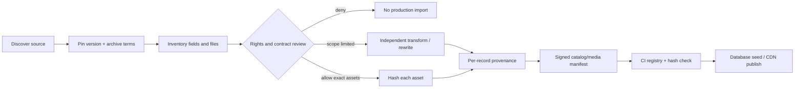

# Copyright and source governance

## Goal

Build a useful exercise catalog without depending on scraped media, ambiguous repository claims, or vendor CDN hotlinks. The legal and technical design assumes that metadata, instructions, translations, images, video, anatomy graphics, code, and trademarks can each have different rights owners and terms.

This document is an engineering control system, not legal advice. Counsel or another qualified reviewer must decide disputed or high-value rights questions.

## Core rule

```text
unknown rights -> DENY
marketing claim only -> REVIEW
repository license without asset authorship -> REVIEW
executed scope + exact asset + immutable hash -> eligible for ALLOW
```

A source is not admitted merely because it is:

- visible on GitHub;
- downloadable from Kaggle;
- reachable through a CDN;
- described as “royalty free” on a sales page;
- licensed permissively at the repository root;
- included in an API response;
- reproduced by another dataset.

## Rights domains

| Domain | Typical right or obligation | Required evidence |
|---|---|---|
| Application code | copyright and open-source notices | exact dependency/version and license |
| Exercise facts/taxonomy | database rights, selection/arrangement, contract | source terms, jurisdiction review, transformation record |
| Written instructions | copyright and attribution | authorship/license or repository-original text |
| Translation | translation copyright and attribution | translator/source/version and permitted use |
| Image/GIF/video | copyright, model/property releases, contract scope | exact asset license, invoice, releases where needed, hash |
| Anatomy SVG/3D model | code license plus asset authorship | model/path creator, license, derivative rights, hash |
| Trademark/product image | trademark and merchandising constraints | nominative-use/store review or permission |
| User upload | user rights, consent, moderation, retention | upload terms, consent receipt, delete/takedown process |
| API response | contract, caching and redistribution terms | current API terms and plan entitlement |

## Registry model

`legal/source-registry.json` records candidate sources and their broad decision. `legal/media-registry.json` records exact assets that may enter a build or CDN manifest.

### Source record

```json
{
  "id": "source-id",
  "status": "REVIEW",
  "scope": "metadata only; media excluded",
  "declaredLicense": "upstream declaration",
  "sourceUrl": "canonical source",
  "evidence": "what must be reviewed at a pinned version",
  "notes": "known ambiguity"
}
```

### Production media record

```json
{
  "id": "exercise-squat-loop-v1",
  "status": "ALLOW",
  "sourceId": "commercial-exercise-media",
  "sourceUrl": "vendor asset receipt or delivery reference",
  "licenseEvidenceRef": "private://legal/contracts/vendor/2026-001",
  "allowedPlatforms": ["android", "ios", "web"],
  "territories": ["worldwide"],
  "term": "perpetual or exact contract term",
  "derivativesAllowed": true,
  "cdnRedistributionAllowed": true,
  "sha256": "64 lowercase hex characters",
  "reviewedAt": "2026-08-15",
  "reviewedBy": "qualified reviewer id",
  "revocationKey": "manifest key used by kill switch"
}
```

Contract documents remain in a restricted legal store; the public/client manifest contains only a non-sensitive evidence reference.

## Candidate source decisions

### free-exercise-db

Potential value: a convenient metadata shape and broad exercise coverage.

Current decision: `REVIEW`, metadata only. No included image is admitted by this foundation. A repository-level Unlicense statement may be useful evidence for repository-authored data, but it does not prove that every contributed image was created or controlled by the person making the declaration.

Required before use:

- pin a commit and inventory every field;
- distinguish facts, original text, translated text, and media;
- inspect contribution history and open provenance issues;
- rewrite or independently author instructions when rights are unclear;
- keep every image excluded unless independently admitted.

### wger

Potential value: mature fitness/nutrition application behavior, multilingual community data, and a self-hosting reference.

Current decision: `REVIEW`. Do not treat code, exercise records, translations, and contributed media as one license. Network-use obligations, share-alike requirements, attribution, source availability, and per-record provenance must be evaluated against the intended proprietary service.

A safe architecture can use wger as an externally operated reference or an isolated service only after review; it must not silently contaminate a proprietary catalog or hide required source availability.

### hasaneyldrm/exercises-dataset and similar mirrors

Potential value: apparent breadth and convenient IDs.

Current decision: `DENY` for production. A mirror or scraper does not create rights to upstream data or media. Null media fields, copied identifiers, or front-end URL construction do not authorize hotlinking. The application must not depend on undocumented ExerciseDB CDN paths or another vendor's media identifiers.

### ExerciseDB / commercial API or export

Potential value: broad catalog, images/video, and visualizer services.

Current decision: `REVIEW`. An API subscription, cache permission, export purchase, and media redistribution license are different products. Before integration, obtain the current written terms for:

- persistent storage;
- client-side versus server-side cache;
- offline use;
- CDN redistribution;
- derivative thumbnails/transcodes;
- use in paid apps and multiple bundle IDs;
- cancellation and post-termination retention;
- data/media export rights;
- attribution and trademark use.

Do not calculate economics from an old price page until the current contract and usage model are verified.

### body-muscles and React muscle-map packages

Potential value: local rendering and interaction without a paid visualizer API.

Current decision: `REVIEW`; the foundation imports none of them. Verify the exact package/fork/version, code license, NOTICE obligations, and authorship/license of every embedded SVG path or model. A permissive package license is not a substitute for asset provenance.

The current app uses repository-authored Compose geometry, which avoids copying an anatomy illustration while the product tests whether a body map is valuable.

## Build-time admission pipeline



The importer must be reproducible and produce:

- upstream source and pinned revision;
- source snapshot hash;
- input record/file identifier;
- transformation code revision;
- normalized record identifier;
- authorship/license decision;
- reviewer and date;
- output content hash;
- reject reason for excluded records.

Manual spreadsheet edits are imported as versioned source files, never edited directly in production.

## Proposed catalog schema

```text
exercise
  id, canonical_name, movement_pattern, force, mechanics,
  difficulty, contraindication_disclaimer, provenance_version

exercise_translation
  exercise_id, locale, name, instructions, source_id,
  translator_id, status, content_sha256

muscle
  id, canonical_name, taxonomy_version

exercise_muscle
  exercise_id, muscle_id, role(primary|secondary|stabilizer),
  confidence, source_id, reviewer_id

exercise_equipment
  exercise_id, equipment_id, required, alternatives

media_asset
  id, exercise_id, kind, storage_key, sha256, width, height,
  duration_ms, rights_record_id, status, revocation_key

rights_record
  id, source_id, license_evidence_ref, scope_json,
  reviewed_by, reviewed_at, expires_at, status

catalog_release
  version, source_manifest_sha256, media_manifest_sha256,
  created_at, admitted_by, rollback_version
```

Facts with independent origins can coexist; do not overwrite provenance with a single “source” field.

## Media storage and CDN

When media is admitted:

1. Upload the exact hashed original to a private ingestion bucket.
2. Verify antivirus/content policy and compare the hash with the rights record.
3. Generate deterministic derivatives in a controlled pipeline.
4. Store originals and derivatives under content-addressed keys.
5. Publish only manifest-referenced derivatives through a controlled CDN.
6. Set cache policy according to the license and revocation need, not automatically “immutable forever.”
7. Keep a kill switch that removes a manifest entry and blocks fresh delivery.
8. Preserve an evidence bundle for the released hash.

Never use a third-party vendor CDN as the production media origin without explicit written permission.

## User-generated media

User-uploaded workout photos or videos create a separate system with privacy and moderation risk. Before enabling it, implement:

- explicit upload rights and consent;
- no public sharing by default;
- face/background privacy controls;
- child-safety and abuse reporting;
- storage region, retention, export, and deletion;
- model-training opt-in separated from product use;
- takedown and account appeal;
- access logs and signed URLs;
- derived pose/keypoint deletion policy.

User uploads cannot be repurposed as exercise demonstration media without separate, explicit commercial rights.

## Takedown and revocation

```text
claim received
  -> freeze new publication
  -> identify source/asset hashes and released versions
  -> legal/rights review
  -> deny, replace, or confirm
  -> revoke manifest entry when needed
  -> remove CDN origin and derivatives
  -> ship catalog patch / app fallback
  -> notify affected partners or users when required
  -> preserve evidence and incident timeline
```

The product must remain usable without the disputed media: show text instructions and the local schematic muscle view rather than a broken remote URL.

## Economic comparison rule

Compare vendor API, export purchase, commissioned media, and repository-authored media using verified terms and a common model:

```text
12-month total cost =
  license or subscription
  + request/egress/storage/transcode cost
  + legal/provenance review
  + integration and migration engineering
  + outage/vendor-lock risk reserve
  + takedown/replacement reserve
```

A cheap unverified dataset has a high expected cost when it can trigger store rejection, complete media failure, or a takedown. A commercial purchase is not automatically safe until its scope covers the intended platforms and distribution model.

## Release gate

No catalog or media release until:

- registries validate with default deny;
- all packaged asset hashes match `ALLOW` records;
- no code or data contains forbidden hotlinks;
- translations and instructions have per-record provenance;
- third-party notices and attribution are generated;
- revocation and fallback are tested;
- privacy/store disclosures match the actual media and user-upload paths;
- the release owner signs the manifest delta.
