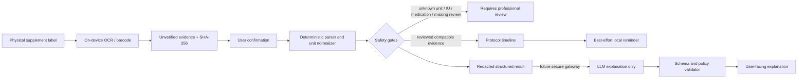
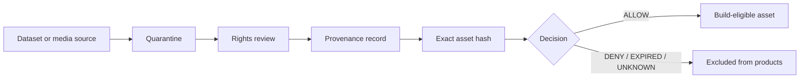

# Gym Come True — KMP foundation delivery status

Date: 2026-08-15  
Delivery branch: `agent/bootstrap-kmp-fitness-platform`  
Tracking issue: #1  
State transition: `EMPTY_REPOSITORY -> AUDITABLE_CROSS_PLATFORM_FOUNDATION`

## Status vocabulary

| State | Meaning |
|---|---|
| `IMPLEMENTED` | Source exists in this branch and is intended to be exercised by CI. |
| `PREPARED` | Contract, adapter, UI entry point, or policy exists, but the production capability is not complete. |
| `BLOCKED` | External account, reviewed rules, entitlement, device proof, or licensed asset is required. |
| `DENIED` | The repository must not ship or infer this capability without new evidence. |

## Capability matrix

| Capability | Shared | Android | iOS | Web | State |
|---|---:|---:|---:|---:|---|
| Compose dashboard and protocol timeline | Yes | Yes | Yes | Yes | `IMPLEMENTED` |
| 16:00 and 22:00 workout-day schedule models | Yes | Yes | Yes | Yes | `IMPLEMENTED` as editable demonstration data, not medical advice |
| Label evidence model and user-confirmation boundary | Yes | Yes | Yes | Yes | `IMPLEMENTED` |
| Compatible mass-unit normalization (`g`, `mg`, `mcg`) | Yes | Yes | Yes | Yes | `IMPLEMENTED` |
| Universal IU conversion or dose recommendation | No | No | No | No | `DENIED` |
| On-device OCR and barcode extraction | Contract | ML Kit path | Vision bridge | Browser upload/manual fallback | Android `IMPLEMENTED`; iOS `PREPARED`; Web `PREPARED` |
| Temporary image minimization | Contract | App-cache deletion path | In-memory native bridge | Browser-local boundary | `IMPLEMENTED`/`PREPARED` by platform |
| Best-effort protocol reminder | Contract | Local alarm/notification path | Local notification bridge | In-app/Web capability fallback | `PREPARED`; no exact-delivery claim |
| Exact alarm or challenge-to-dismiss | Contract | Not enabled | Not enabled | Not applicable | `BLOCKED` by policy, entitlement, UX, and device proof |
| Health Connect / HealthKit | Contract boundary | Not enabled | Not enabled | Not applicable | `BLOCKED` and tracked separately |
| LLM explanation | Output contract only | No client key | No client key | No client key | `BLOCKED` on secure gateway and reviewed rule packs |
| Exercise metadata import | Schema/policy | Offline-ready | Offline-ready | Offline-ready | `PREPARED`; no unreviewed bulk dataset ships |
| Exercise media | Provenance registry | None approved | None approved | None approved | `DENIED` until asset-level rights review |
| Store-signed release | N/A | Not signed | Not signed | Deploy not configured | `BLOCKED` on owner accounts and release secrets |

## Runtime data flow

The LLM is downstream from deterministic gates. It is never the source of ingredient identity, unit conversion, interaction clearance, or dose calculation.

## Copyright and data flow

Metadata and media are separate assets. A permissive JSON/data declaration does not prove image, video, animation, 3D model, translation, or trademark rights. Hotlinking is not an asset strategy.

## Product wedge

The first market wedge is **proof-before-advice Body Hacker scheduling for Taiwan and bilingual Asian labels**:

1. scan the product that is physically present;
2. show exactly what the device recognized and its evidence hash;
3. require confirmation rather than hiding uncertainty;
4. fail closed when units, medication context, or rule provenance are insufficient;
5. turn accepted evidence into an editable daily timeline aligned to a 16:00 or 22:00 training day;
6. explain the result in plain Traditional Chinese/English only after deterministic checks.

This avoids competing as another generic workout generator or supplement chatbot. The defensible assets are the reviewed label ontology, bilingual normalization cases, protocol adherence data, asset-rights ledger, safety eval corpus, and platform capability evidence.

## Initial marketing experiments

| Experiment | Native scene | Primary metric | Stop rule |
|---|---|---|---|
| `What did the label actually say?` | Macro shot of a Taiwan supplement label -> scan -> highlighted uncertain text | confirmed scans / qualified install | stop when confirmation completion remains below 25% after two creative revisions |
| `16:00 protocol` | Office lunch -> pre-workout checkpoint -> training -> recovery timeline | completed day protocols | stop when reminder opt-in does not improve completion |
| `22:00 protocol` | Late commute -> low-friction night workout plan -> sleep boundary | seven-day retained protocols | stop when late reminders increase disable/uninstall signals |
| `Proof before advice` | Generic AI answer contrasted with source/evidence/rule version | landing-to-onboarding conversion | stop when evidence messaging does not outperform feature messaging |
| `Trainer review mode` | Coach checks the same evidence/timeline without receiving raw photos | invited coach reviews | stop before building marketplace features without repeated demand |

Downloads and views are diagnostic only. The north-star event is a **confirmed, safety-gated protocol completed without an unresolved high-risk warning**.

## Release gates

The branch cannot be promoted as store-ready until all of the following have evidence:

- hosted CI passes at the exact PR head;
- Android and iOS device tests cover scan cancellation, permission denial, OCR failure, deletion, notification denial, timezone changes, and process death;
- App Privacy / Data safety answers match the generated data-flow registry;
- a qualified reviewer signs the active Taiwan supplement rule pack;
- every shipped exercise media file has an active `ALLOW` provenance decision and matching hash;
- Apple/Google signing, identifiers, agreements, privacy-policy operator data, and store records are configured outside source control;
- marketing claims are derived from implemented capability tests rather than roadmap text.

## Follow-up work

- asset-level exercise data/media provenance pipeline;
- HealthKit and Health Connect adapters;
- reviewed alarm/notification capability matrix;
- secure LLM explanation gateway and Taiwan rule packs;
- Android/iOS/Web release engineering and store compliance.
