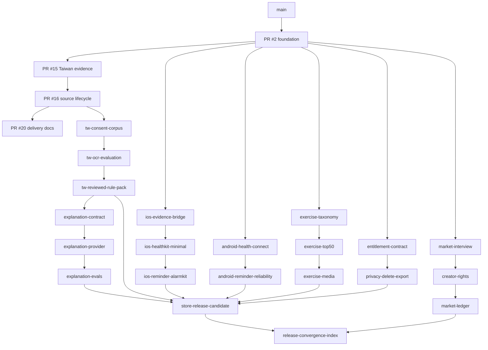

# Molecular Stacked PR index

This is the branch-level delivery source of truth for `gym-come-true`.

## Machine projection

Prose cannot be gated. Every packet below is also recorded in
[`stacked-delivery-manifest.json`](stacked-delivery-manifest.json), validated against
[`schemas/stacked-delivery-manifest.schema.json`](schemas/stacked-delivery-manifest.schema.json) by:

```bash
python3 scripts/validate_stacked_delivery.py --self-test
```

The validator is offline and fail-closed. It rejects graph cycles, unknown or self parents,
orphan packets that never reach `main`, sibling path-lease overlap, planned packets carrying
publication evidence, merged packets missing their exact head, drift between this file's SHA-256
and the digest the manifest declares, and any Git Town runtime admission that has not been
evidenced by an executed canary. `--self-test` plants sixteen mutations and fails if any survives.

This file stays the human narrative; the manifest stays the machine truth. Editing this file
without updating `narrativeSource.sha256` in the manifest is a `FAIL`, by design.

Status vocabulary:

```text
OPEN_DRAFT_PR        GitHub PR exists and remains unmerged
BRANCH_CREATED       branch exists; review admission is not implied
PLANNED_WORK_PACKET  proposed subject only
EXTERNAL_GATE        evidence must come from an authorized external process
```

The shared `git-town-stacked-pr-worker` method governs branch hierarchy and synchronization. This repository owns branch names, parent graph, path leases, eval sets, receipts, publication guards, and Human Admit boundaries.

## Molecularity rule

One terminal PR has:

```text
one state transition
+ one explicit parent
+ one bounded path lease
+ one primary outcome
+ fixed evals
+ planted negative controls
+ one immutable rollback subject
+ explicit Human Admit operations
```

Independent domains are sibling stacks from the closest common admitted parent. Shared indexes and release traceability belong to convergence branches.

## Current and planned graph



The diagram expresses logical dependencies. It does not authorize merge or publication.

## Eval sets

### E-BASE

```bash
python3 scripts/validate_repository.py
sh ./gradlew :shared:jvmTest
sh ./gradlew :androidApp:assembleDebug :androidApp:lintDebug
sh ./gradlew :webApp:composeCompatibilityBrowserDistribution
# macOS: canonical project.yml + unsigned simulator host
```

### E-TW

```bash
python3 scripts/validate_repository.py
python3 scripts/validate_taiwan_rule_pack.py
python3 scripts/validate_taiwan_source_lifecycle.py
python3 scripts/validate_taiwan_source_hardening.py
sh ./gradlew :shared:jvmTest
```

### E-DOC

```text
required headings and relative links
actual Issue numbers #8-#14
canonical iOS paths; no shadow paths
published PR vs planned packet distinction
explicit Git Town ABSENT / NOT_IMPLEMENTED / NOT_EXERCISED
compare parent...head: behind_by=0
```

### E-IOS

```text
E-BASE shared tests
canonical XcodeGen/simulator build
permission denied/revoked tests
synthetic native-to-shared handoff
real-device evidence when the packet claims it
```

### E-ANDROID

```text
E-BASE Android/shared tests
availability/permission/revocation
reboot/timezone/package-change/OEM matrix where applicable
Play data-safety consistency
```

### E-CATALOG

```text
schema/version/migration/identity
per-record provenance and hash
bilingual/accessibility completeness
no remote media ID/hotlink
asset derivative and takedown drill where applicable
```

### E-LLM

```text
receipt binding and payload minimization
auth/timeout/cost/fallback/audit/kill switch
output schema and forbidden actions
prompt injection, diagnosis, dose, warning-suppression adversarial cases
```

### E-RELEASE

```text
entitlement replay/idempotency/refund/restore/grace
privacy export/delete/retention/redaction
signing/SBOM/vulnerability/provenance
store forms, listing, accessibility, localization, performance, offline, upgrade
support/incident/rollback drill
```

### E-MARKET

```text
consent/anonymization
creator rights/disclosure/music/font/person/property/claim scope
aggregate spend/view/install/trial/paid/refund/day-30/contribution consistency
stop/revise/repeat/scale decision contract
```

## Published packets

### S0 — PR #2 / Issue #1

```yaml
status: OPEN_DRAFT_PR
parent: main
head: agent/bootstrap-kmp-fitness-platform
transition: EMPTY_REPOSITORY -> AUDITABLE_CROSS_PLATFORM_FOUNDATION
path_lease: repository bootstrap surfaces recorded in Issue #1
evals: E-BASE
negative_controls:
  - no client provider secret
  - no automatic dose advice
  - no scraped or hotlinked media
rollback: 0148e135a4855a700bb666e1181e65611517507c
human_admit:
  - merge
  - release/store promotion
```

### S1 — PR #15 / Issue #8

```yaml
status: OPEN_DRAFT_PR
parent: agent/bootstrap-kmp-fitness-platform
head: agent/taiwan-supplement-evidence
transition: FOUNDATION -> TAIWAN_EVIDENCE_CONTRACT_DRAFT
path_lease:
  - Taiwan supplement domain/tests
  - data/taiwan-supplement/**
  - legal/taiwan-supplement-source-registry.json
  - scripts/validate_taiwan_rule_pack.py
  - related docs/policy wiring
evals: E-TW applicable subset
negative_controls:
  - Draft pack cannot execute
  - unknown/withdrawn consent denies admission
  - modelUsedForDecision remains false
rollback: 58492815f22af65665172bcf98bfb661639ece92
human_admit:
  - clinical/legal acceptance
  - merge
```

### S2 — PR #16 / Issue #8

```yaml
status: OPEN_DRAFT_PR
parent: agent/taiwan-supplement-evidence
head: agent/taiwan-source-lifecycle
transition: TAIWAN_EVIDENCE_CONTRACT_DRAFT -> TAIWAN_SOURCE_LIFECYCLE_DRAFT
path_lease:
  - TaiwanSourceLifecycle domain/tests
  - official resource candidates
  - source snapshot/mapping/lifecycle fixtures and schemas
  - capture_taiwan_source.py
  - source lifecycle/hardening validators
evals: E-TW
negative_controls:
  - synthetic snapshot cannot enter production
  - capture command has no network client
  - mismatched mapping is rejected
  - skipped lifecycle state is rejected
  - rollback target must equal declared prior version
rollback: 79f8a65b370806925c32f0a15da88c7c0d7bda36
human_admit:
  - source acquisition and legal terms
  - clinical review and activation/rollback
  - merge
```

### S3 — PR #20 / Issue #19

```yaml
status: OPEN_DRAFT_PR
parent: agent/taiwan-source-lifecycle
parent_sha_at_creation: f58a2feac580ca37bb4d7b3c30e122908bfd6b07
head: agent/document-git-town-delivery-graph
initial_publication_head: 5995ac50058f6a4c0a9fd72c96d211046631fd35
transition: TAIWAN_SOURCE_LIFECYCLE_DRAFT -> DOCUMENTED_GIT_TOWN_DELIVERY_GRAPH_DRAFT
stack_class: documentation-convergence
path_lease:
  - README.md
  - README.zh-TW.md
  - AGENTS.md
  - docs/architecture.md
  - docs/implementation-status.md
  - docs/roadmap.md
  - docs/github-issue-index.md
  - docs/git/**
evals: E-DOC
negative_controls:
  - no Git Town runtime PASS claim
  - no planned branch marked as existing PR
  - no Actions budget block marked code PASS/FAIL
rollback: f58a2feac580ca37bb4d7b3c30e122908bfd6b07
human_admit:
  - documentation review
  - merge order and merge
```

## Planned Taiwan rule-pack stack — Issue #8

### TW1 — Consent corpus contract

```yaml
status: PLANNED_WORK_PACKET
parent: agent/taiwan-source-lifecycle
head: agent/tw-consent-corpus-contract
transition: CORPUS_UNKNOWN -> CONSENT_CONTRACT_DRAFT
path_lease:
  - data/taiwan-supplement/consent/**
  - consent transport schemas
  - TaiwanConsent domain/tests
  - validate_taiwan_consent.py
  - docs/taiwan-consent-and-retention.md
evals: E-TW + consent validator
negative_controls:
  - UNKNOWN/WITHDRAWN/expired consent denies use
  - deletion cannot be a manifest-only claim
rollback: exact parent head at branch creation
external_gate:
  - privacy/legal review
  - production storage/deletion system
human_admit:
  - privacy/legal acceptance
  - merge
```

### TW2 — OCR evaluation contract

```yaml
status: PLANNED_WORK_PACKET
parent: agent/tw-consent-corpus-contract
head: agent/tw-ocr-evaluation-contract
transition: CONSENT_CONTRACT_DRAFT -> OCR_EVALUATION_DRAFT
path_lease:
  - data/taiwan-supplement/ocr-eval/**
  - OCR evaluation schemas/domain/tests/validator/docs
evals: consent validator + OCR evaluation validator + shared JVM tests
negative_controls:
  - corrected output cannot count as first-pass exact
  - engine/device/model versions cannot mix silently
  - aggregate output cannot contain raw label/image path
rollback: exact TW1 head
external_gate:
  - consented corpus
  - authorized Android/iOS device execution
human_admit:
  - corpus/device/privacy approval
  - merge
```

### TW3 — Reviewed Taiwan rule pack

```yaml
status: PLANNED_WORK_PACKET
parent: agent/tw-ocr-evaluation-contract
head: agent/tw-reviewed-rule-pack
transition: OCR_EVALUATED -> REVIEWED_TAIWAN_RULE_PACK
path_lease:
  - production rule-pack manifests
  - exact official-source/legal/reviewer receipts
  - deterministic production rules/tests/validator/docs
evals: all Taiwan validators + activation/revocation/rollback drills
negative_controls:
  - no model-created rule
  - no source without immutable bytes/hash
  - no high-impact field without qualified reviewer
  - no unbounded effective window
  - no personal dose recommendation
rollback: exact prior pack version plus parent head
external_gate:
  - approved MOHW/TFDA bytes and reuse terms
  - qualified reviewer and COI
  - signed wording/rule/test bundle
human_admit:
  - clinical/legal acceptance
  - signing, stage, activation, revocation, rollback, merge
```

## Planned iOS stack — Issue #9

| ID | Parent → Head | Transition | Path lease | Evals / negative controls | Rollback / Human Admit |
|---|---|---|---|---|---|
| I1 | foundation → `agent/ios-evidence-bridge` | `IOS_SHELL -> IOS_EVIDENCE_HANDOFF` | canonical native bridge, ContentView, project.yml, shared transport DTO/tests | E-IOS; raw pixels not retained/uploaded; candidate cannot auto-confirm | exact foundation head; permission review/merge |
| I2 | I1 → `agent/ios-healthkit-minimal` | `IOS_EVIDENCE -> IOS_MINIMAL_HEALTH_READS` | HealthKit adapter, Info.plist/project.yml, shared health DTO, privacy docs | E-IOS; no broad categories, hidden background reads, or medical interpretation | exact I1 head; Apple/store/privacy acceptance/merge |
| I3 | I2 → `agent/ios-reminder-alarmkit-assessment` | `HEALTH_READS -> IOS_DELIVERY_EVIDENCE` | reminder/timezone/AlarmKit adapters and evidence docs | E-IOS; no guaranteed alarm, no removal of system stop, no challenge-to-dismiss claim | exact I2 head; store/device review/merge |

## Planned Android stack — Issue #10

| ID | Parent → Head | Transition | Path lease | Evals / negative controls | Rollback / Human Admit |
|---|---|---|---|---|---|
| A1 | foundation → `agent/android-health-connect-minimal` | `ANDROID_SHELL -> ANDROID_MINIMAL_HEALTH_READS` | Health Connect adapter, manifest, shared health DTO, privacy docs | E-ANDROID; no hidden background collection or medical interpretation | exact foundation head; Play/privacy review/merge |
| A2 | A1 → `agent/android-reminder-reliability` | `HEALTH_READS -> ANDROID_DELIVERY_EVIDENCE` | reminder implementation/tests and OEM evidence docs | E-ANDROID; no default exact-alarm access or universal reliability claim | exact A1 head; device-farm/Play review/merge |

## Planned catalog/media stack — Issue #11

| ID | Parent → Head | Transition | Path lease | Evals / negative controls | Rollback / Human Admit |
|---|---|---|---|---|---|
| C1 | foundation → `agent/exercise-taxonomy-contract` | `DEMO_CATALOG -> TAXONOMY_CONTRACT` | catalog schemas/domain/tests/validator | E-CATALOG; duplicate/unknown taxonomy rejected | exact foundation head; taxonomy review/merge |
| C2 | C1 → `agent/exercise-top50-content` | `TAXONOMY -> RIGHTS_CLEAN_TOP50` | bilingual exercise metadata, provenance, authoring docs | E-CATALOG; no scraped text or unsupported medical claim | exact C1 head; editorial/rights review/merge |
| C3 | C2 → `agent/exercise-media-admission` | `TOP50 -> LICENSED_MEDIA_PIPELINE` | exercise assets, media rights, manifests, derivative scripts | E-CATALOG; no remote URL/vendor ID/repository-license shortcut | exact C2 head + prior manifest; legal/procurement/revocation/merge |

C3 external gate: executed rights or commissioned first-party assets and private contract evidence.

## Planned explanation-gateway stack — Issue #12

| ID | Parent → Head | Transition | Path lease | Evals / negative controls | Rollback / Human Admit |
|---|---|---|---|---|---|
| L1 | TW3 → `agent/explanation-gateway-contract` | `REVIEWED_RECEIPT -> GATEWAY_CONTRACT` | server/shared contracts and docs | E-LLM; no raw image/OCR/free-form medication context or decision mutation | exact TW3 head; security/privacy review/merge |
| L2 | L1 → `agent/explanation-gateway-provider` | `GATEWAY_CONTRACT -> PROVIDER_DRAFT` | provider/audit adapters and operations docs | E-LLM; no secret in Git/client/log and no provider decision authority | exact L1 head; credential/provider/legal/deployment/merge |
| L3 | L2 → `agent/explanation-gateway-adversarial-evals` | `PROVIDER_DRAFT -> EVALUATED_GATEWAY` | eval corpus, filters, reports | E-LLM; planted unsafe output must be rejected | exact L2 head; red-team and production promotion/merge |

L2 external gate: protected provider credentials and independent security review.

## Planned release stack — Issue #13

| ID | Parent → Head | Transition | Path lease | Evals / negative controls | Rollback / Human Admit |
|---|---|---|---|---|---|
| R1 | foundation → `agent/entitlement-contract` | `NO_ENTITLEMENT -> VERIFIED_ENTITLEMENT_DRAFT` | shared/server entitlement contracts and docs | E-RELEASE subset; client callback/local boolean cannot grant access | exact foundation head; provider-design review/merge |
| R2 | R1 → `agent/privacy-delete-export` | `ENTITLEMENT -> ACCOUNT_DATA_LIFECYCLE_DRAFT` | account-data implementation, privacy inventory/forms | E-RELEASE; health data not for advertising; delete is not UI-only | exact R1 head; privacy/legal/storage review/merge |
| R3 | admitted heads → `agent/store-release-candidate` | `ADMITTED_DOMAIN_SLICES -> STORE_RELEASE_CANDIDATE` | release manifests, store docs, public-safe indexes | full E-RELEASE; no signing secret, stale head, or client-only entitlement | exact prior manifest + parent set; signing/store submission/promotion/rollback/merge |

R3 external gate: Apple/Google/Web provider accounts, signing credentials, store-console operations, trusted exact-head CI.

## Planned market stack — Issue #14

| ID | Parent → Head | Transition | Path lease | Evals / negative controls | Rollback / Human Admit |
|---|---|---|---|---|---|
| M1 | foundation → `agent/market-interview-protocol` | `MARKET_UNKNOWN -> PROBLEM_EVIDENCE_DRAFT` | consented interview/research docs | E-MARKET subset; no fabricated interview/quote | exact foundation head; participant recruitment/consent/merge |
| M2 | M1 → `agent/creator-rights-contract` | `PROBLEM_EVIDENCE -> RIGHTS_CLEARED_CREATIVE` | marketing assets, creator rights/contracts | E-MARKET; no hidden sponsorship, unlicensed media, unsupported medical/alarm claim | exact M1 head; contract/legal/payment/publication/merge |
| M3 | M2 → `agent/market-experiment-ledger` | `CREATIVE -> RETENTION_EVIDENCE_DRAFT` | aggregate market evidence and validator | E-MARKET; no user-level attribution/fabricated metrics/scale from views alone | exact M2 head; campaign spend/audit/scale decision/merge |

M2/M3 external gate: executed creator contracts and real audited campaigns.

## Final convergence

### X1 — Release convergence index

```yaml
status: PLANNED_WORK_PACKET
issue: 13
parent: human-selected admitted domain heads
head: agent/release-convergence-index
transition: REVIEWABLE_DOMAIN_SLICES -> RELEASE_CONVERGENCE_DRAFT
stack_class: convergence
path_lease:
  - root docs and shared delivery indexes
  - release/index/**
evals:
  - exact parent-head and remote ancestry
  - all applicable domain evals
  - no hidden legal/clinical/privacy/store blocker
negative_controls:
  - convergence cannot repair domain code
  - stale or failed parent blocks admission
rollback: exact pre-convergence branch and parent-head manifest
human_admit:
  - semantic conflicts
  - merge order/queue
  - release promotion/rollback
```

## Publication and merge rules

- Workers may prepare branches/Draft PRs only through an authorized publication packet.
- Background sync cannot publish.
- A child remains Draft while its base is not admitted.
- Trusted checks must execute on the exact current head.
- `ALLOW` permits one remote operation, not merge.
- Merge order is parent before child unless a human-approved alternative preserves ancestry/evidence.
- Legal, clinical, store, credential, campaign, release, merge, and destructive rollback operations remain Human Admit.
