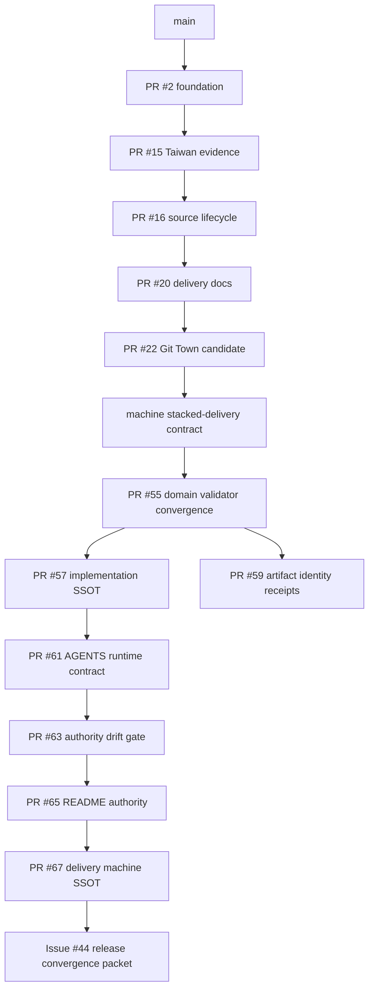

# Molecular Stacked PR index

**Authoritative snapshot:** 2026-08-19  
**Repository:** `ed3c/gym-come-true`  
**Machine projection:** [`stacked-delivery-manifest.json`](stacked-delivery-manifest.json)

This file is the human delivery-graph source. The manifest SHA-256 binds these exact bytes, and `python3 scripts/validate_stacked_delivery.py --self-test` verifies graph, publication state, sibling path leases, narrative identity, templates, CI wiring, and the Git Town runtime boundary.

## Status vocabulary

```text
MERGED_TO_MAIN       historical PR is integrated into main
DELIVERED_ON_MAIN    repository-owned packet exists on main without its own PR
OPEN_DRAFT_PR        published PR exists and remains unmerged
PLANNED_WORK_PACKET  future bounded packet; no PR or branch existence implied
```

These are delivery states, not production admission states.

```text
MERGED_ENGINEERING != EXTERNAL_ADMISSION
OPEN_DRAFT_PR != MERGED_TO_MAIN
GITHUB_CHECK_PASS != HUMAN_ADMIT
```

## Current graph



The diagram expresses evidence ancestry only. It does not authorize merge, release, legal/clinical/rights acceptance, device/store admission, provider deployment, or Git Town runtime use.

## Historical merged packets

| ID | PR / Issue | Exact head | Transition | Current meaning |
|---|---|---|---|---|
| S0 | PR #2 / #1 | `58492815f22af65665172bcf98bfb661639ece92` | `EMPTY_REPOSITORY -> AUDITABLE_CROSS_PLATFORM_FOUNDATION` | merged foundation |
| S1 | PR #15 / #8 | `79f8a65b370806925c32f0a15da88c7c0d7bda36` | `AUDITABLE_CROSS_PLATFORM_FOUNDATION -> TAIWAN_EVIDENCE_CONTRACT_DRAFT` | merged evidence contracts |
| S2 | PR #16 / #17 | `f58a2feac580ca37bb4d7b3c30e122908bfd6b07` | `TAIWAN_EVIDENCE_CONTRACT_DRAFT -> TAIWAN_SOURCE_LIFECYCLE_DRAFT` | merged source lifecycle |
| S3 | PR #20 / #19 | `ad065c8ac944f2fb4f9d60e65b008367b1291c43` | `TAIWAN_SOURCE_LIFECYCLE_DRAFT -> DOCUMENTED_GIT_TOWN_DELIVERY_GRAPH_DRAFT` | merged delivery documentation |
| S4 | PR #22 / #21 | `a70a52cc6e3e2f4107edae2f7bb2034029161568` | `DOCUMENTED_GIT_TOWN_DELIVERY_GRAPH_DRAFT -> GIT_TOWN_CANDIDATE_EVIDENCE_RECORDED` | pinned v24.0.0 candidate; runtime blocked |
| S5 | Issue #23 | delivered on `main` | `GIT_TOWN_CANDIDATE_EVIDENCE_RECORDED -> MACHINE_VERIFIED_STACKED_DELIVERY_DRAFT` | manifest/schema/validator/templates |

Historical `PRE_RUN_BLOCKED_BY_ACTIONS_BUDGET` receipts on older exact heads remain historical. Current hosted execution is proven separately by the active Draft runs below.

## Active Draft evidence stack

| ID | PR / Issue | Exact head | Transition | Hosted evidence |
|---|---|---|---|---|
| X2 | PR #55 / #54 | `1338b6fd2a1007cf06e24aca3a6a4bd07f9b7fa5` | `MERGED_DOMAIN_LANES_WITH_EVIDENCE_GAPS -> DOMAIN_VALIDATORS_OWNED_BY_CI_DRAFT` | run #88, 3/3 PASS |
| X3 | PR #57 / #56 | `58e4fc14aa0347b9c47dd15ff8f7f58f8b97f8d6` | `STALE_IMPLEMENTATION_SNAPSHOT -> CURRENT_PUBLIC_REPO_SSOT_DRAFT` | run #89, 3/3 PASS |
| X4 | PR #59 / #58 | `036951d5a57809809564cca824013f428bc1ce3e` | `HOSTED_BUILD_ARTIFACTS_WITH_AMBIGUOUS_HASH_SEMANTICS -> TRANSPORT_AND_SEMANTIC_IDENTITIES_SEPARATED_DRAFT` | run #90, 3/3 PASS |
| X5 | PR #61 / #60 | `7a59f6b80f806476fdcea90f4b7722dc0ecc8ef3` | `STALE_AGENT_AUTHORITY_SURFACE -> CURRENT_AGENT_RUNTIME_CONTRACT_DRAFT` | run #91, 3/3 PASS |
| X6 | PR #63 / #62 | `0c76c71413a73194986418e5f24571840623197f` | `MANUALLY_RECONCILED_AUTHORITY -> MACHINE_GATED_AUTHORITY_DRAFT` | run #92, 3/3 PASS |
| X7 | PR #65 / #64 | `3046807758d025e0a9ad903f1109d1c6942e312f` | `MACHINE_GATED_AGENT_STATUS_AUTHORITY -> README_AUTHORITY_RECONCILED_AND_GATED_DRAFT` | run #96, 3/3 PASS |
| X8 | PR #67 / #66 | current branch head | `PUBLIC_AUTHORITY_SURFACES_CURRENT_BUT_DELIVERY_GRAPH_STALE -> LIVE_DELIVERY_GRAPH_RECONCILED_DRAFT` | fresh exact-head run required |

X4 is a sibling of X3 under X2. X5→X8 is serial under X3. No green result is inherited across moved heads.

## Domain implementation is not a planned-branch list

The old graph modeled many Issues #24–#48 as future branches. That became stale once domain contracts landed on `main`. Current engineering truth is recorded separately:

| Domain | Engineering present | Remaining admission |
|---|---|---|
| Taiwan evidence/source | evidence and immutable-source lifecycle contracts | official bytes/reuse/legal/qualified review/activation |
| Exercise | taxonomy + first-party bilingual 50-record DRAFT catalog + validator | editorial/rights/media admission |
| Nutrition | synthetic/default-deny catalog + admission contract + meal-plan compiler | real source/version/license/mappings |
| Explanation | receipt-only decision-preserving gateway/provider-boundary contracts | live credentials/deployment/security/privacy |
| Android/iOS health | Health Connect / HealthKit adapter surfaces | real-device, entitlement, OEM/store/privacy evidence |
| Product surface | disclaimer/information-only hardening represented on main | signing/store/release admission |
| Git Town | pinned v24.0.0 candidate metadata/verifier/harness | runtime/config/canaries/supply-chain/legal admission |

Open Issues may therefore represent remaining acceptance, not absent implementation.

## Git Town runtime boundary

```yaml
state: CANDIDATE_METADATA_VERIFIED_RUNTIME_BLOCKED
candidate: v24.0.0
executable: PINNED_CANDIDATE
canary: NOT_EXERCISED
runtime_admitted: false
consumer_config_admitted: false
background_sync_enabled: false
publication_enabled: false
production_use: DENY
```

The shared `ed3c/skills-shared/skills/git-town-stacked-pr-worker` method governs branch hierarchy and synchronization policy. This repository still does not admit a consumer `.git-town.toml`, live consumer sync, publication, ship, or merge authority.

## Eval sets

### E-BASE
Repository policy + shared JVM + Android debug/lint + Web compatibility + canonical unsigned iOS simulator host.

### E-DOC
Authority/index consistency, exact PR/Issue distinctions, exact-head evidence laws, and no external admission inflation.

### E-GIT
Stack manifest/schema/graph/path leases/narrative digest/templates/CI wiring and Git Town candidate/runtime separation.

### E-IDENTITY
Transport-vs-semantic artifact identity self-tests and receipt generation.

## Packet molecularity

Every machine packet carries:

```text
one transition
+ explicit parent(s)
+ bounded path lease
+ eval set
+ negative controls
+ rollback subject
+ Human Admit boundary
```

Independent sibling packets must not lease overlapping paths. A `PLANNED_WORK_PACKET` cannot carry PR or merged-head evidence.

## Next genuine planned packet

### G1 — Issue #44 release convergence index

`G1` is intentionally the only future packet in this machine projection. It may bind exact Human-selected admitted heads and run applicable evals, but it cannot repair domain code or convert missing legal/clinical/rights/device/provider/store/signing evidence into PASS.

```text
LIVE_DELIVERY_GRAPH_RECONCILED_DRAFT
  -> RELEASE_CONVERGENCE_DRAFT
```

Merge order, release promotion, and destructive rollback remain Human Admit.

## Hard evidence laws

```text
HISTORICAL_PRE_RUN_BLOCKED != CURRENT_ACTIONS_STATE
OPEN_ISSUE != ABSENT_IMPLEMENTATION
HOSTED_PASS(commit A) != HOSTED_PASS(commit B)
SEMANTIC_PAYLOAD_HASHED != REPRODUCIBLE_BUILD_PROVEN
ADAPTER_PRESENT != REAL_DEVICE_VALIDATION
GIT_TOWN_CANDIDATE != GIT_TOWN_RUNTIME_ADMITTED
GITHUB_CHECK_PASS != HUMAN_ADMIT
```
