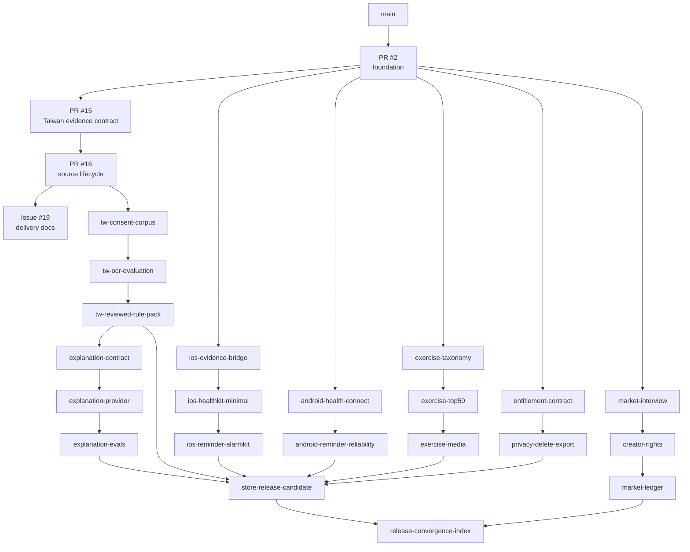

# Molecular Stacked PR index

This is the branch-level delivery source of truth for `gym-come-true`.

It distinguishes:

- **OPEN DRAFT PR** — GitHub PR exists;
- **BRANCH CREATED** — branch exists, but review admission is not implied;
- **PLANNED WORK PACKET** — proposed subject only;
- **EXTERNAL GATE** — evidence must come from an authorized external process.

The shared canonical `git-town-stacked-pr-worker` method governs branch hierarchy and synchronization. This repository owns the branch names, parent graph, path leases, evals, receipts, and Human Admit boundaries.

## Molecularity rule

One terminal PR should have:

```text
one state transition
+ one explicit parent
+ one bounded path lease
+ one primary outcome
+ fixed eval commands
+ planted negative controls
+ one immutable rollback subject
+ explicit Human Admit operations
```

Do not bundle independent domains into one PR. Do not split one indivisible invariant across branches that can be merged independently.

## Branch graph



The Git graph may use a convergence branch or reviewed merge order where Git cannot have multiple parents before merge. The diagram expresses logical dependencies, not permission to auto-merge.

## Published stack

### S0 — Foundation

```yaml
status: OPEN_DRAFT_PR
issue: 1
pull_request: 2
parent_branch: main
head_branch: agent/bootstrap-kmp-fitness-platform
transition: EMPTY_REPOSITORY -> AUDITABLE_CROSS_PLATFORM_FOUNDATION
path_lease:
  - repository bootstrap surfaces recorded in Issue #1
required_evals:
  - python3 scripts/validate_repository.py
  - sh ./gradlew :shared:jvmTest
  - sh ./gradlew :androidApp:assembleDebug :androidApp:lintDebug
  - sh ./gradlew :webApp:composeCompatibilityBrowserDistribution
  - canonical iOS XcodeGen + unsigned simulator build
rollback: 0148e135a4855a700bb666e1181e65611517507c
human_owned:
  - merge admission
  - release or store promotion
```

### S1 — Taiwan evidence admission

```yaml
status: OPEN_DRAFT_PR
issue: 8
pull_request: 15
parent_branch: agent/bootstrap-kmp-fitness-platform
head_branch: agent/taiwan-supplement-evidence
transition: AUDITABLE_CROSS_PLATFORM_FOUNDATION -> TAIWAN_EVIDENCE_CONTRACT_DRAFT
path_lease:
  - shared/.../TaiwanSupplementEvidence.kt
  - shared/.../TaiwanSupplementEvidenceTest.kt
  - data/taiwan-supplement/**
  - legal/taiwan-supplement-source-registry.json
  - scripts/validate_taiwan_rule_pack.py
  - related documentation and policy wiring
required_evals:
  - python3 scripts/validate_repository.py
  - python3 scripts/validate_taiwan_rule_pack.py
  - sh ./gradlew :shared:jvmTest
negative_controls:
  - Draft pack cannot execute
  - unknown or withdrawn consent denies admission
  - modelUsedForDecision cannot become true
rollback: 58492815f22af65665172bcf98bfb661639ece92
human_owned:
  - qualified reviewer selection
  - clinical and legal acceptance
  - merge admission
```

### S2 — Immutable source lifecycle

```yaml
status: OPEN_DRAFT_PR
issue: 8
pull_request: 16
parent_branch: agent/taiwan-supplement-evidence
head_branch: agent/taiwan-source-lifecycle
transition: TAIWAN_EVIDENCE_CONTRACT_DRAFT -> TAIWAN_SOURCE_LIFECYCLE_DRAFT
path_lease:
  - shared/.../TaiwanSourceLifecycle.kt
  - shared/.../TaiwanSourceLifecycle*Test.kt
  - legal/taiwan-official-resource-candidates.json
  - data/taiwan-supplement/source-*
  - data/taiwan-supplement/field-mapping*
  - data/taiwan-supplement/lifecycle*
  - scripts/capture_taiwan_source.py
  - scripts/validate_taiwan_source_*.py
required_evals:
  - python3 scripts/validate_repository.py
  - python3 scripts/validate_taiwan_rule_pack.py
  - python3 scripts/validate_taiwan_source_lifecycle.py
  - python3 scripts/validate_taiwan_source_hardening.py
  - sh ./gradlew :shared:jvmTest
negative_controls:
  - synthetic snapshot cannot enter production
  - capture command has no network client
  - mapping with wrong snapshot/source is rejected
  - skipped lifecycle state is rejected
  - rollback target must match declared prior version
rollback: 79f8a65b370806925c32f0a15da88c7c0d7bda36
human_owned:
  - source acquisition approval
  - legal terms acceptance
  - clinical review
  - activation or rollback
  - merge admission
```

### S3 — Documentation convergence

```yaml
status: BRANCH_CREATED
issue: 19
pull_request: PENDING_IN_THIS_SLICE
parent_branch: agent/taiwan-source-lifecycle
parent_sha: f58a2feac580ca37bb4d7b3c30e122908bfd6b07
head_branch: agent/document-git-town-delivery-graph
transition: TAIWAN_SOURCE_LIFECYCLE_DRAFT -> DOCUMENTED_GIT_TOWN_DELIVERY_GRAPH_DRAFT
stack_class: documentation-convergence
path_lease:
  - README.md
  - README.zh-TW.md
  - AGENTS.md
  - docs/architecture.md
  - docs/implementation-status.md
  - docs/roadmap.md
  - docs/github-issue-index.md
  - docs/git/**
required_evals:
  - documentation heading/link/state consistency
  - reject stale iOS paths
  - require actual Issue numbers 8-14
  - require explicit Git Town ABSENT/NOT_EXERCISED states
  - compare parent...head and require behind_by=0
negative_controls:
  - no Git Town runtime PASS claim
  - no planned branch marked as an existing PR
  - no hosted budget block marked PASS/FAIL
rollback: f58a2feac580ca37bb4d7b3c30e122908bfd6b07
human_owned:
  - documentation review
  - merge order
```

## Planned Issue #8 Taiwan stack

### TW1 — Consent, retention, withdrawal, and deletion contract

```yaml
status: PLANNED_WORK_PACKET
issue: 8
parent_branch: agent/taiwan-source-lifecycle
head_branch: agent/tw-consent-corpus-contract
transition: CORPUS_UNKNOWN -> CONSENT_CONTRACT_DRAFT
stack_class: serial-child
path_lease:
  - data/taiwan-supplement/consent/**
  - data/taiwan-supplement/schemas/consent-*.schema.json
  - shared/src/commonMain/.../domain/TaiwanConsent.kt
  - shared/src/commonTest/.../domain/TaiwanConsentTest.kt
  - scripts/validate_taiwan_consent.py
  - docs/taiwan-consent-and-retention.md
excluded_paths:
  - androidApp/**
  - iosApp/**
  - real label images
  - private consent receipts
required_evals:
  - python3 scripts/validate_repository.py
  - python3 scripts/validate_taiwan_rule_pack.py
  - python3 scripts/validate_taiwan_consent.py
  - sh ./gradlew :shared:jvmTest
negative_controls:
  - UNKNOWN and WITHDRAWN deny use
  - expired retention denies image access
  - delete receipt cannot be fabricated from a manifest flag
evidence_boundary:
  - schemas and synthetic fixtures only
  - real consent/storage/deletion operations remain external
rollback: exact agent/taiwan-source-lifecycle head at branch creation
human_owned:
  - privacy/legal approval
  - production storage and deletion-system admission
  - merge
```

### TW2 — Cross-platform OCR evaluation contract

```yaml
status: PLANNED_WORK_PACKET
issue: 8
parent_branch: agent/tw-consent-corpus-contract
head_branch: agent/tw-ocr-evaluation-contract
transition: CONSENT_CONTRACT_DRAFT -> OCR_EVALUATION_DRAFT
stack_class: serial-child
path_lease:
  - data/taiwan-supplement/ocr-eval/**
  - data/taiwan-supplement/schemas/ocr-*.schema.json
  - shared/src/commonMain/.../domain/OcrEvaluation.kt
  - shared/src/commonTest/.../domain/OcrEvaluationTest.kt
  - scripts/validate_taiwan_ocr_evaluation.py
  - docs/taiwan-ocr-evaluation.md
excluded_paths:
  - raw corpus images
  - platform scanner implementation unless a separate child packet owns it
required_evals:
  - consent validator
  - OCR evaluation validator
  - shared JVM tests
negative_controls:
  - corrected output cannot count as first-pass exact
  - engine/device/model versions cannot be mixed silently
  - aggregate report cannot contain raw label text or image paths
evidence_boundary:
  - contract can be local PASS
  - real ML Kit/Vision field metrics are NOT_EXERCISED until devices/corpus run
rollback: exact TW1 head at branch creation
human_owned:
  - corpus access
  - device execution authorization
  - privacy review
  - merge
```

### TW3 — Reviewed Taiwan rule pack

```yaml
status: PLANNED_WORK_PACKET
issue: 8
parent_branch: agent/tw-ocr-evaluation-contract
head_branch: agent/tw-reviewed-rule-pack
transition: OCR_EVALUATION_DRAFT -> REVIEWED_TAIWAN_RULE_PACK
stack_class: serial-child
path_lease:
  - data/taiwan-supplement/rule-packs/**
  - legal/taiwan-rule-pack/**
  - shared/src/commonMain/.../domain/TaiwanProductionRules.kt
  - shared/src/commonTest/.../domain/TaiwanProductionRulesTest.kt
  - scripts/validate_taiwan_production_rule_pack.py
  - docs/taiwan-rule-pack-release.md
required_evals:
  - all Taiwan validators
  - shared JVM tests
  - source/hash/mapping/reviewer/wording/signature bundle checks
  - activation/revocation/rollback drills
negative_controls:
  - no model-created rule
  - no source without immutable bytes/hash
  - no high-impact field without qualified reviewer
  - no unbounded effective window
  - no personal dose recommendation
external_gates:
  - approved MOHW/TFDA bytes and reuse terms
  - qualified Taiwan reviewer and COI record
  - signed wording/rule/test bundle
rollback: declared exact prior pack version plus parent branch head
human_owned:
  - clinical and legal acceptance
  - signing
  - stage/activate/revoke/rollback
  - merge
```

## Planned Issue #9 iOS stack

### I1 — Native evidence handoff

```yaml
status: PLANNED_WORK_PACKET
issue: 9
parent_branch: agent/bootstrap-kmp-fitness-platform
head_branch: agent/ios-evidence-bridge
transition: IOS_SHELL -> IOS_EVIDENCE_HANDOFF
stack_class: sibling-stack
path_lease:
  - iosApp/GymComeTrue/NativeCapabilityBridge.swift
  - iosApp/GymComeTrue/ContentView.swift
  - iosApp/project.yml
  - shared/src/commonMain/.../platform/IosEvidenceTransport.kt
  - shared/src/commonTest/.../platform/IosEvidenceTransportTest.kt
required_evals:
  - shared JVM tests
  - canonical iOS XcodeGen/simulator build
  - synthetic handoff tests
negative_controls:
  - raw pixels not retained or uploaded
  - candidate never enters confirmed state automatically
rollback: exact PR #2 head at branch creation
human_owned:
  - device permission review
  - merge
```

### I2 — Minimal HealthKit

```yaml
status: PLANNED_WORK_PACKET
issue: 9
parent_branch: agent/ios-evidence-bridge
head_branch: agent/ios-healthkit-minimal
transition: IOS_EVIDENCE_HANDOFF -> IOS_MINIMAL_HEALTH_READS
path_lease:
  - iosApp/GymComeTrue/HealthKit/**
  - iosApp/GymComeTrue/Info.plist
  - iosApp/project.yml
  - shared/src/commonMain/.../health/**
  - docs/privacy/ios-healthkit.md
required_evals:
  - least-privilege data-schema tests
  - permission denied/revoked tests
  - export/delete behavior
  - canonical iOS build and privacy-manifest review
negative_controls:
  - no broad category request
  - no hidden background read
  - no medical interpretation
rollback: exact I1 head
human_owned:
  - Apple capability/store/privacy acceptance
  - merge
```

### I3 — Reminder and AlarmKit assessment

```yaml
status: PLANNED_WORK_PACKET
issue: 9
parent_branch: agent/ios-healthkit-minimal
head_branch: agent/ios-reminder-alarmkit-assessment
transition: IOS_MINIMAL_HEALTH_READS -> IOS_DELIVERY_EVIDENCE
path_lease:
  - iosApp/GymComeTrue/Reminder/**
  - iosApp/GymComeTrue/AlarmKit/**
  - docs/platform/ios-reminder-reliability.md
required_evals:
  - recurrence/cancel/timezone/permission tests
  - capability and fallback tests
  - real-device evidence
negative_controls:
  - no guaranteed alarm
  - no removal of system stop control
  - no challenge-to-dismiss claim
rollback: exact I2 head
human_owned:
  - store-policy and device evidence review
  - merge
```

## Planned Issue #10 Android stack

### A1 — Minimal Health Connect

```yaml
status: PLANNED_WORK_PACKET
issue: 10
parent_branch: agent/bootstrap-kmp-fitness-platform
head_branch: agent/android-health-connect-minimal
transition: ANDROID_SHELL -> ANDROID_MINIMAL_HEALTH_READS
stack_class: sibling-stack
path_lease:
  - androidApp/src/main/.../health/**
  - androidApp/src/main/AndroidManifest.xml
  - shared/src/commonMain/.../health/**
  - docs/privacy/android-health-connect.md
required_evals:
  - shared JVM tests
  - Android assemble/lint
  - availability/permission/revocation tests
  - Play data-safety consistency
negative_controls:
  - no hidden background collection
  - no read beyond visible feature need
  - no medical interpretation
rollback: exact PR #2 head
human_owned:
  - Play permission/data-safety acceptance
  - merge
```

### A2 — Reminder reliability harness

```yaml
status: PLANNED_WORK_PACKET
issue: 10
parent_branch: agent/android-health-connect-minimal
head_branch: agent/android-reminder-reliability
transition: ANDROID_MINIMAL_HEALTH_READS -> ANDROID_DELIVERY_EVIDENCE
path_lease:
  - androidApp/src/main/.../reminder/**
  - androidApp/src/androidTest/**/reminder/**
  - docs/platform/android-reminder-reliability.md
required_evals:
  - recurrence/reboot/timezone/package-change tests
  - API/device/OEM evidence matrix
  - exact-alarm need assessment
negative_controls:
  - no default exact-alarm special access
  - no universal reliability claim
rollback: exact A1 head
human_owned:
  - device-farm and Play policy review
  - merge
```

## Planned Issue #11 catalog/media stack

### C1 — Taxonomy contract

```yaml
status: PLANNED_WORK_PACKET
issue: 11
parent_branch: agent/bootstrap-kmp-fitness-platform
head_branch: agent/exercise-taxonomy-contract
transition: DEMO_CATALOG -> TAXONOMY_CONTRACT
stack_class: sibling-stack
path_lease:
  - data/catalog/schemas/**
  - shared/src/commonMain/.../catalog/**
  - shared/src/commonTest/.../catalog/**
  - scripts/validate_exercise_taxonomy.py
required_evals:
  - schema/migration/identity tests
  - duplicate/unknown taxonomy negative controls
rollback: exact PR #2 head
human_owned:
  - taxonomy review
  - merge
```

### C2 — Rights-clean top-50 metadata

```yaml
status: PLANNED_WORK_PACKET
issue: 11
parent_branch: agent/exercise-taxonomy-contract
head_branch: agent/exercise-top50-content
transition: TAXONOMY_CONTRACT -> RIGHTS_CLEAN_TOP50_METADATA
path_lease:
  - data/catalog/exercises/**
  - legal/provenance/exercises/**
  - docs/content/exercise-authoring/**
required_evals:
  - per-record/per-field provenance
  - bilingual completeness
  - accessibility text
  - hash and deterministic build checks
negative_controls:
  - no scraped text
  - no unsupported medical claim
rollback: exact C1 head
human_owned:
  - editorial and rights review
  - merge
```

### C3 — Media admission

```yaml
status: PLANNED_WORK_PACKET
issue: 11
parent_branch: agent/exercise-top50-content
head_branch: agent/exercise-media-admission
transition: RIGHTS_CLEAN_TOP50_METADATA -> LICENSED_MEDIA_PIPELINE
path_lease:
  - assets/exercises/**
  - legal/media/**
  - data/catalog/media-manifest/**
  - scripts/media/**
required_evals:
  - exact asset hash and contract reference
  - deterministic derivative test
  - attribution generation
  - takedown/kill-switch drill
negative_controls:
  - no remote URL or vendor media ID
  - no repository license used as per-asset proof
external_gates:
  - executed rights or first-party commission
  - private contract evidence
rollback: exact C2 head plus media-manifest prior version
human_owned:
  - legal acceptance
  - asset procurement
  - revocation/merge
```

## Planned Issue #12 explanation-gateway stack

### L1 — Gateway contract

```yaml
status: PLANNED_WORK_PACKET
issue: 12
parent_branch: agent/tw-reviewed-rule-pack
head_branch: agent/explanation-gateway-contract
transition: REVIEWED_RECEIPT -> EXPLANATION_GATEWAY_CONTRACT
path_lease:
  - server/explanation-gateway/contracts/**
  - shared/src/commonMain/.../explanation/**
  - docs/llm/explanation-gateway.md
required_evals:
  - payload minimization and receipt-binding tests
  - output-schema and forbidden-action tests
negative_controls:
  - no raw image/OCR/free-form medication context
  - no decision mutation or dose advice
rollback: exact TW3 head
human_owned:
  - security/privacy review
  - merge
```

### L2 — Provider adapter

```yaml
status: PLANNED_WORK_PACKET
issue: 12
parent_branch: agent/explanation-gateway-contract
head_branch: agent/explanation-gateway-provider
transition: EXPLANATION_GATEWAY_CONTRACT -> PROVIDER_INTEGRATION_DRAFT
path_lease:
  - server/explanation-gateway/provider/**
  - server/explanation-gateway/audit/**
  - docs/llm/provider-operations.md
required_evals:
  - auth/timeout/cost/fallback/kill-switch tests
  - provider/version trace and redaction tests
negative_controls:
  - no secret in Git/client/log
  - no provider output as decision authority
external_gates:
  - protected provider credentials
  - security review
rollback: exact L1 head
human_owned:
  - credential setup
  - provider/legal approval
  - deployment/merge
```

### L3 — Adversarial evals

```yaml
status: PLANNED_WORK_PACKET
issue: 12
parent_branch: agent/explanation-gateway-provider
head_branch: agent/explanation-gateway-adversarial-evals
transition: PROVIDER_INTEGRATION_DRAFT -> EVALUATED_EXPLANATION_GATEWAY
path_lease:
  - evals/explanation-gateway/**
  - server/explanation-gateway/filters/**
  - docs/llm/eval-report/**
required_evals:
  - missing evidence / IU / medication / symptom
  - prompt injection / diagnosis / dose / warning suppression
  - provider timeout/failure/fallback
negative_controls:
  - planted unsafe output must be rejected
rollback: exact L2 head
human_owned:
  - red-team acceptance
  - production promotion/merge
```

## Planned Issue #13 release stack

### R1 — Entitlement contract

```yaml
status: PLANNED_WORK_PACKET
issue: 13
parent_branch: agent/bootstrap-kmp-fitness-platform
head_branch: agent/entitlement-contract
transition: NO_ENTITLEMENT -> SERVER_VERIFIED_ENTITLEMENT_DRAFT
stack_class: sibling-stack
path_lease:
  - shared/src/commonMain/.../entitlement/**
  - server/entitlements/contracts/**
  - docs/store/entitlement-model.md
required_evals:
  - replay/idempotency/restore/refund/cancel/grace tests
negative_controls:
  - client callback/local boolean cannot grant access
rollback: exact PR #2 head
human_owned:
  - billing-provider design acceptance
  - merge
```

### R2 — Privacy/export/delete

```yaml
status: PLANNED_WORK_PACKET
issue: 13
parent_branch: agent/entitlement-contract
head_branch: agent/privacy-delete-export
transition: SERVER_VERIFIED_ENTITLEMENT_DRAFT -> ACCOUNT_DATA_LIFECYCLE_DRAFT
path_lease:
  - server/account-data/**
  - docs/privacy/**
  - docs/store/data-inventory/**
required_evals:
  - export/delete/retention/consent-history
  - sensitive-field redaction
  - privacy-form/runtime consistency
negative_controls:
  - health data cannot enter advertising
  - deletion cannot be a UI-only flag
rollback: exact R1 head
human_owned:
  - privacy/legal review
  - regional storage decision
  - merge
```

### R3 — Store release candidate

```yaml
status: PLANNED_WORK_PACKET
issue: 13
parent_branch: convergence-after-required-domain-heads
head_branch: agent/store-release-candidate
transition: ADMITTED_DOMAIN_SLICES -> STORE_RELEASE_CANDIDATE
stack_class: convergence
path_lease:
  - release/**
  - docs/store/**
  - public-safe manifests and shared release indexes
required_evals:
  - exact parent-head admission
  - signing/SBOM/vulnerability/provenance
  - store forms/listing/screenshots
  - accessibility/localization/performance/offline/upgrade
  - support/incident/rollback drills
negative_controls:
  - no signing secret in Git
  - no stale domain head
  - no client-only entitlement
external_gates:
  - Apple/Google/Web provider accounts
  - signing credentials
  - store-console operations
  - trusted exact-head CI
rollback: exact prior release manifest and admitted parent set
human_owned:
  - merge order
  - signing
  - store submission
  - release promotion/rollback
```

## Planned Issue #14 market stack

### M1 — Problem evidence

```yaml
status: PLANNED_WORK_PACKET
issue: 14
parent_branch: agent/bootstrap-kmp-fitness-platform
head_branch: agent/market-interview-protocol
transition: MARKET_UNKNOWN -> PROBLEM_EVIDENCE_DRAFT
stack_class: sibling-stack
path_lease:
  - research/interviews/**
  - docs/market/problem-evidence/**
required_evals:
  - consented interview protocol
  - anonymization and evidence-quality rubric
negative_controls:
  - no fabricated interview or quote
rollback: exact PR #2 head
human_owned:
  - participant recruitment/consent
  - merge
```

### M2 — Creator rights

```yaml
status: PLANNED_WORK_PACKET
issue: 14
parent_branch: agent/market-interview-protocol
head_branch: agent/creator-rights-contract
transition: PROBLEM_EVIDENCE_DRAFT -> RIGHTS_CLEARED_CREATIVE_DRAFT
path_lease:
  - docs/marketing-assets/**
  - legal/creator/**
  - docs/market/creator-contracts/**
required_evals:
  - creation/posting/view/raw-footage/paid-use/platform/territory/term separation
  - sponsorship/music/font/person/property/claim review
negative_controls:
  - no hidden sponsorship
  - no unlicensed media
  - no unsupported medical or alarm claim
external_gates:
  - executed creator contracts
rollback: exact M1 head
human_owned:
  - contract/legal acceptance
  - creator payment/publication
  - merge
```

### M3 — Experiment ledger

```yaml
status: PLANNED_WORK_PACKET
issue: 14
parent_branch: agent/creator-rights-contract
head_branch: agent/market-experiment-ledger
transition: RIGHTS_CLEARED_CREATIVE_DRAFT -> RETENTION_EVIDENCE_DRAFT
path_lease:
  - data/market/aggregate/**
  - docs/market/experiment-ledger/**
  - scripts/validate_market_evidence.py
required_evals:
  - aggregate spend/view/install/trial/paid/refund/day-30/contribution consistency
  - stop/revise/repeat/scale decision contract
negative_controls:
  - no user-level attribution
  - no fabricated comments/revenue/reliability
  - no scale decision from views/installs alone
external_gates:
  - real audited campaigns and rights-cleared assets
rollback: exact M2 head
human_owned:
  - campaign spend
  - metric audit
  - scale decision/merge
```

## Final convergence

### X1 — Release convergence index

```yaml
status: PLANNED_WORK_PACKET
issue: 13
parent_branch: human-selected-admitted-domain-heads
head_branch: agent/release-convergence-index
transition: REVIEWABLE_DOMAIN_SLICES -> RELEASE_CONVERGENCE_DRAFT
stack_class: convergence
path_lease:
  - README.md
  - README.zh-TW.md
  - AGENTS.md
  - docs/implementation-status.md
  - docs/roadmap.md
  - docs/github-issue-index.md
  - docs/git/STACKED_PRS.md
  - release/index/**
required_evals:
  - exact parent-head and remote ancestry verification
  - all applicable domain evals
  - no unresolved rights/clinical/privacy/store blocker hidden
negative_controls:
  - convergence cannot repair domain code
  - stale or failed parent blocks admission
rollback: exact pre-convergence branch and parent-head manifest
human_owned:
  - semantic conflicts
  - merge order
  - merge queue
  - release promotion/rollback
```

## Publication and merge rules

- Workers may prepare branches and Draft PRs only through an authorized publication packet.
- Background sync cannot publish.
- A child PR remains Draft while its base PR is not admitted.
- Trusted checks must execute on the exact current head.
- `ALLOW` from a publication gate is one remote operation, not merge authority.
- Merge order is parent before child unless a human-approved alternative preserves ancestry and evidence.
- Legal, clinical, store, credential, campaign, and release operations remain Human Admit.
