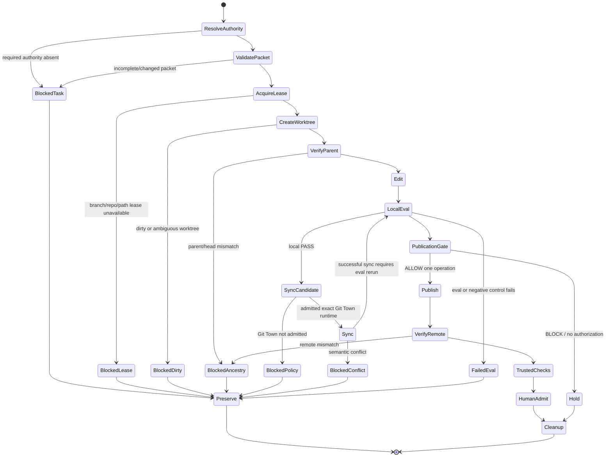

# Worker protocol

This protocol binds the shared `git-town-stacked-pr-worker` method to `gym-come-true`.

It is a repository policy, not proof that a Git Town executable is installed. Current runtime admission is blocked; see [GIT_TOWN_ADMISSION.md](GIT_TOWN_ADMISSION.md).

## Worker objective

A Worker may advance one bounded task packet from a reviewed parent to the furthest safe local or publication state while preserving:

- exact branch ancestry;
- one linked worktree and one branch writer lease;
- disjoint path ownership;
- deterministic evals and negative controls;
- safety, rights, privacy, and source-lineage invariants;
- append-only subject receipts;
- Human Admit boundaries.

## Worker lifecycle



## Phase 0 — Resolve authority

Required reads:

1. shared canonical Skill;
2. root `AGENTS.md`;
3. root README;
4. architecture;
5. repository profile;
6. stack index;
7. Git Town admission;
8. assigned Issue/work packet;
9. nearest README files;
10. exact current GitHub PR/base/head state.

Block with `BLOCKED_TASK_PACKET` when:

- issue or parent is ambiguous;
- required path lease is absent;
- exact base/head cannot be resolved;
- task packet changed after execution began;
- evidence authority would have to be guessed;
- requested operation belongs to Human Admit.

## Phase 1 — Validate the work packet

Validate all fields in [WORK_PACKET.template.md](WORK_PACKET.template.md).

Rules:

- one primary state transition;
- one branch class;
- exact base and parent SHAs;
- explicit allowed/excluded paths;
- sibling overlap denied;
- fixed commands only;
- negative controls before implementation;
- external evidence boundary;
- immutable rollback subject;
- Human Admit list.

Create a digest of the normalized packet for receipts. Secret values and private evidence are excluded.

## Phase 2 — Acquire leases

Required logical leases:

```text
repository lease   only for convergence/shared-index work
branch lease       always
worktree lease     always
path lease         always
```

Lease properties:

- atomic acquisition;
- owner/task/branch identity;
- start/expiry/heartbeat;
- stale takeover policy;
- append-only acquisition/release receipt;
- no secret or absolute private path in portable output.

Stable outcomes:

- `BLOCKED_BRANCH_LEASE`
- `BLOCKED_POLICY` for overlapping sibling paths
- `FAILED_TOOL` for lease-store errors

The current repository has no admitted live lease implementation. Its canary is `NOT_EXERCISED`.

## Phase 3 — Create isolated worktree

Safe defaults:

- do not mutate the primary checkout;
- create a linked worktree under a host-owned root;
- verify repository identity and credential-free remote;
- verify clean state;
- attach/create only the packet’s head branch;
- verify parent relationship;
- suppress editors and credential prompts.

Reject:

- dirty worktree;
- branch checked out elsewhere without approved ownership;
- symlink/path escape;
- wrong repository;
- credential-bearing remote URL;
- unexpected submodule or nested repository;
- primary checkout mutation.

## Phase 4 — Edit bounded paths

The Worker may write only leased paths.

Before every write:

- resolve the normalized repository-relative path;
- reject escape outside the worktree;
- reject forbidden/private data classes;
- verify generated-file ownership;
- stop if packet digest or lease changes.

Shared high-contention surfaces require convergence ownership:

```text
README.md
README.zh-TW.md
AGENTS.md
docs/architecture.md
docs/implementation-status.md
docs/roadmap.md
docs/github-issue-index.md
docs/git/STACKED_PRS.md
.github/workflows/**
settings.gradle.kts
gradle/**
```

## Phase 5 — Run local evals

Use typed, fixed commands from the packet/profile. Do not accept arbitrary trailing shell.

Default executable set:

```bash
python3 scripts/validate_repository.py
python3 scripts/validate_taiwan_rule_pack.py
python3 scripts/validate_taiwan_source_lifecycle.py
python3 scripts/validate_taiwan_source_hardening.py

sh ./gradlew :shared:jvmTest
sh ./gradlew :androidApp:assembleDebug :androidApp:lintDebug
sh ./gradlew :webApp:composeCompatibilityBrowserDistribution
```

macOS:

```bash
cd iosApp
xcodegen generate --spec project.yml
xcodebuild \
  -project GymComeTrue.xcodeproj \
  -scheme GymComeTrue \
  -sdk iphonesimulator \
  -configuration Debug \
  CODE_SIGNING_ALLOWED=NO \
  ONLY_ACTIVE_ARCH=YES \
  ARCHS=arm64 \
  build
```

A packet selects applicable commands but cannot skip a validator whose authority changed.

Receipt each command with:

- normalized command ID;
- exact head;
- start/end;
- exit code;
- bounded stdout/stderr digest;
- result `PASS`, `FAIL`, `NOT_EXERCISED`, or `SKIPPED_BY_POLICY`;
- reason for any skip.

`FAILED_EVAL` preserves the worktree and blocks publication.

## Phase 6 — Synchronization

This phase is disabled until Git Town admission is complete.

After admission, safe behavior is:

```text
exact admitted executable
+ one owned stack
+ non-interactive
+ bounded timeout
+ no auto-resolve
+ dry-run/preflight
+ no push
+ before/after graph
+ post-sync ancestry
+ eval rerun
```

A successful sync may return:

- `SYNCED`
- `NO_CHANGE`

Blocked/failed results include:

- `BLOCKED_CONFLICT`
- `BLOCKED_PROMPT`
- `BLOCKED_TIMEOUT`
- `BLOCKED_ANCESTRY`
- `FAILED_TOOL`
- `FAILED_EVAL`

Git Town operations `continue`, `skip`, `undo`, and `ship` are never automatic.

## Phase 7 — Publication gate

Publication is separate from synchronization.

Required policy inputs:

- exact current head;
- current base/parent graph;
- work-packet digest;
- local verification receipt;
- changed-path set;
- publication intent;
- remote policy;
- external blocker set;
- no active conflict/lease/drift.

Allowed intents:

```text
initial-pr
ready-for-review
batched-repair
```

Gate outcomes:

```text
ALLOW <intent> <single-operation>
BLOCK <stable-reason>
INVALID_POLICY_INPUT
```

Current repository publication policy is disabled pending canary. Connector-backed publication in a user-authorized session must still preserve the same exact-head and Human Admit boundaries, and must never be described as a Git Town publication canary.

## Phase 8 — Remote verification

After one admitted publication operation:

1. fetch remote;
2. verify pushed head is exact expected head;
3. verify base/parent ancestry;
4. verify PR base/head metadata;
5. record remote URLs and object IDs;
6. wait for trusted checks;
7. classify no-runner/billing block separately;
8. never mark ready/merge automatically.

A remote check is trusted only when it actually executed on the exact current head.

## Phase 9 — Human Admit

Only a human/trusted operator may:

- resolve semantic conflicts;
- choose merge order;
- run Git Town continue/skip/undo/ship;
- approve legal/license terms;
- approve clinical sources/rules/wording;
- set provider/store/signing credentials;
- recover billing/permissions;
- submit stores or deploy production;
- promote/revoke/rollback production;
- merge or admit a merge queue.

The Worker provides evidence, not authority.

## Phase 10 — Cleanup

Safe cleanup requires:

- final worktree status;
- residual diff/ignored/untracked inventory;
- lease release;
- worktree removal only when preservation is not required;
- branch retention according to publication state;
- cleanup receipt;
- no deletion of human-owned or drifted state.

Preserve the worktree when:

- semantic conflict exists;
- eval failed and evidence is needed;
- publication/remote ancestry is ambiguous;
- task packet changed;
- lease ownership is disputed;
- cleanup would destroy uncommitted evidence.

## Rollback

Rollback uses immutable subjects:

```text
expected current branch/head
+ rollback target
+ expected parent/base
+ expected remote state
+ clean/known worktree state
```

Refuse with `ROLLBACK_REFUSED_DRIFT` if any expected subject has moved.

A Worker may prepare a rollback proposal or revert commit only when the packet authorizes it. Destructive rollback, release rollback, and drifted branch rewrite remain Human Admit.

## Receipt schema minimum

```yaml
schema: git-town-stacked-pr-worker/receipt/v1
repository_identity: github-repository-id:1334805292
issue_id: <public issue identifier>
task_packet_sha256: <digest>
branch:
  base: <name + sha>
  parent: <name + sha>
  head: <name + before/after sha>
leases:
  repository: <state>
  worktree: <state>
  branch: <state>
  paths: <state>
graph:
  before: <bounded graph/hash>
  after: <bounded graph/hash>
evals:
  - command_id: <typed id>
    exact_head: <sha>
    result: PASS|FAIL|NOT_EXERCISED|SKIPPED_BY_POLICY
    exit_code: <integer or null>
    log_sha256: <digest or null>
publication:
  intent: <intent or none>
  decision: <ALLOW/BLOCK/INVALID>
remote:
  published: <boolean>
  ancestry_verified: <boolean or not exercised>
cleanup:
  result: <stable outcome>
  residue: <bounded public-safe summary>
```

Receipts must never include tokens, secret values, private paths, raw label/source bytes, reviewer identity/signatures, or unbounded model output.

## Negative controls

Before runtime admission, plant and verify:

- primary checkout rejection;
- dirty worktree;
- wrong parent;
- duplicate branch lease;
- sibling path overlap;
- incomplete or changed packet;
- wrong/missing Git Town version;
- mutated checksum/license evidence;
- credential-bearing remote;
- editor/credential prompt;
- deterministic semantic conflict;
- timeout;
- unexpected remote movement;
- publication without both guards;
- protected branch rewrite;
- cleanup residue;
- attempted automatic continue/skip/undo/ship;
- attempt to label a no-runner Actions job as test PASS/FAIL.

Static document checks and live canaries are separate evidence lanes.
