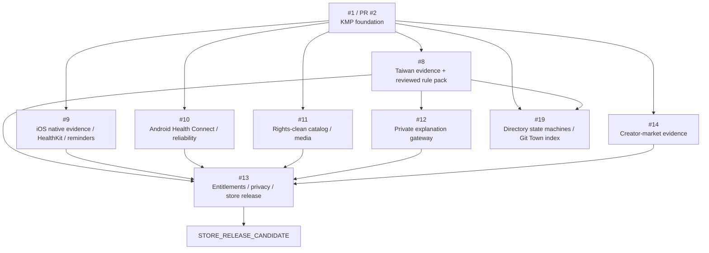

# Delivery roadmap

## Operating rule

The roadmap is dependency-ordered and evidence-gated. A later slice cannot weaken safety, privacy, rights, source-lineage, or branch-lineage contracts delivered by an earlier slice.

Actual GitHub Issue numbers are authoritative:

```text
#1   KMP foundation
#8   Taiwan supplement evidence and reviewed rule pack
#9   iOS native evidence / HealthKit / reminders / AlarmKit assessment
#10  Android Health Connect / reminder reliability
#11  Copyright-clean exercise catalog / licensed media
#12  Private LLM explanation gateway / adversarial evals
#13  Entitlements / privacy / stores / release operations
#14  Creator-market validation / launch evidence
#19  Directory state machines and Git Town stacked delivery index
```

See [GitHub Issue / PR index](github-issue-index.md) for duplicate/superseded issue notes and [Stacked PR index](git/STACKED_PRS.md) for branch-level work packets.

## Current published graph

```text
main
└── PR #2 / Issue #1
    agent/bootstrap-kmp-fitness-platform
    └── PR #15 / Issue #8
        agent/taiwan-supplement-evidence
        └── PR #16 / Issue #8
            agent/taiwan-source-lifecycle
            └── Issue #19
                agent/document-git-town-delivery-graph
```

All published PRs remain Draft and unmerged.

## Dependency graph



Independent domain work is represented as sibling stacks from the nearest common parent. It must not be serialized merely to make the branch graph visually simple.

## Phase 0 — Published foundation and evidence contracts

### Issue #1 / PR #2 — Auditable KMP foundation

**State:** Merged into `main`; hosted exact-head evidence still missing (Issue #45).  
**Branch:** `agent/bootstrap-kmp-fitness-platform` → `main`.

Delivered:

- shared KMP domain/UI and tests;
- Android OCR/barcode candidate flow and inexact reminder;
- iOS and Web hosts;
- default-deny source/media governance;
- no client provider secret, automatic dosing, scraped media, Health API, or exact-alarm completion claim.

Gate:

- exact-head hosted checks must execute and pass;
- product/release claims remain bounded by the capability matrix.

### Issue #8 / PR #15 — Taiwan evidence contract

**State:** Merged into `main`; hosted exact-head evidence still missing (Issue #45).  
**Branch:** `agent/taiwan-supplement-evidence` → `agent/bootstrap-kmp-fitness-platform`.

Delivered:

- product variant and serving schemas;
- consent-aware corpus contract;
- field-level OCR accuracy/correction metrics;
- deterministic rule-pack admission;
- seven safety cases;
- reviewer/wording/rollback gates;
- versioned decision receipts.

Missing:

- real consented corpus;
- exact official source bytes and mappings;
- qualified reviewer;
- production rules and signatures.

### Issue #8 / PR #16 — Immutable source and release lifecycle

**State:** Merged into `main`; hosted exact-head evidence still missing (Issue #45).  
**Branch:** `agent/taiwan-source-lifecycle` → `agent/taiwan-supplement-evidence`.

Delivered:

- mutable official candidates remain `CANDIDATE + DENY`;
- local-only content-addressed source capture;
- source/snapshot identity and exact mappings;
- deterministic review/stage/active/suspend/revoke/expire/rollback lifecycle;
- synthetic fixtures and hardening controls.

Missing:

- real MOHW/TFDA archive bytes;
- exact reuse-rights decision;
- verified official mappings;
- qualified clinical review and signed activation;
- hosted exact-head execution.

### Issue #19 — Documentation and Git Town delivery graph

**State:** Merged into `main`; hosted exact-head evidence still missing (Issue #45).  
**Branch:** `agent/document-git-town-delivery-graph`.

Outcome:

- root README maps directories to state machines and data flows;
- AGENTS routes branch work through the shared Git Town Skill;
- `docs/git/` contains repository profile, admission state, Worker protocol, work-packet template, and molecular stack graph;
- roadmap numbers match actual Issues #8–#14;
- stale iOS architecture paths are removed.

Git Town executable/runtime adoption remains blocked until exact version/provenance admission and live canaries.

### Issue #21 / PR #22 — Git Town candidate evidence and canary harness

**State:** Merged into `main`; hosted exact-head evidence still missing (Issue #45).  
**Branch:** `agent/git-town-admission-candidate`.

Outcome:

- exact upstream `v24.0.0` candidate metadata, license bytes, and digests recorded under `docs/git/admission/`;
- `scripts/git-town/verify_admission.py` verifies metadata, archive, and binary with a `--self-test`;
- `scripts/git-town/run_disposable_canary.sh` exercises no-push canaries in a disposable repository;
- `workflow_dispatch`-only admission workflow refuses to configure or synchronize the consumer repository.

Runtime remains `NOT_EXERCISED`: the canary workflow has never been dispatched, so no binary has run here.

### Issue #23 — Machine-verifiable stacked delivery contract

**State:** Delivered on `main`; hosted exact-head evidence still missing (Issue #45).

Outcome:

- `docs/git/stacked-delivery-manifest.json` records every published and planned packet with parents, path leases, evals, negative controls, rollback subjects, and Human Admit operations;
- `docs/git/schemas/stacked-delivery-manifest.schema.json` fixes the transport shape;
- `scripts/validate_stacked_delivery.py` rejects graph cycles, unknown or self parents, orphan packets, sibling path-lease overlap, planned-as-published drift, missing merged heads, narrative digest drift, and premature Git Town runtime admission;
- `--self-test` plants sixteen mutations and fails if any survives;
- Issue and pull-request templates require the work packet, evidence lanes, negative controls, rollback subject, and Human Admit boundary;
- the validator runs in the `policy-and-provenance` job.

## Phase 1 — Issue #8 reviewed Taiwan rule-pack stack

```text
agent/taiwan-source-lifecycle
└── agent/tw-consent-corpus-contract
    └── agent/tw-ocr-evaluation-contract
        └── agent/tw-reviewed-rule-pack
```

### TW1 — Consent corpus contract

State transition:

```text
CORPUS_UNKNOWN -> CONSENT_CONTRACT_DRAFT
```

Work:

- consent receipt schema;
- withdrawal and deletion receipts;
- encrypted retention policy;
- representative-corpus sampling plan outside Git;
- no raw image in repository;
- tests for unknown/withdrawn/expired consent.

Gate: privacy/legal review and operational storage/deletion environment.

### TW2 — OCR evaluation contract

State transition:

```text
CONSENT_CONTRACT_DRAFT -> OCR_EVALUATION_DRAFT
```

Work:

- Android ML Kit and Apple Vision field observations;
- first-pass accuracy, correction requirement, correction completion, unresolved fields;
- device/model/version identity;
- aggregate report without image or raw-label leakage;
- negative controls for fabricated or mixed-engine results.

Gate: real consented corpus and device execution.

### TW3 — Reviewed Taiwan rule pack

State transition:

```text
OCR_EVALUATED -> REVIEWED_TAIWAN_RULE_PACK
```

Work:

- immutable official snapshots;
- exact source-field mappings and excerpt hashes;
- deterministic production rules and conflict precedence;
- bounded effective window;
- signed source/legal/clinical/wording/test bundle;
- stage/activate/revoke/rollback receipts;
- incident and kill-switch drill.

Gate: qualified Taiwan reviewer, conflict-of-interest evidence, legal source scope, exact-head tests. No model-created rules or personal dose advice.

## Phase 2 — Native platform sibling stacks

### Issue #9 — iOS

```text
agent/bootstrap-kmp-fitness-platform
└── agent/ios-evidence-bridge
    └── agent/ios-healthkit-minimal
        └── agent/ios-reminder-alarmkit-assessment
```

Terminal slices:

1. **Evidence bridge:** structured Vision candidates reach shared confirmation state; temporary images are released.
2. **Minimal HealthKit:** only user-selected records required by a visible feature; consent/revocation/export/delete.
3. **Reminder/AlarmKit:** recurrence, cancellation, timezone, permission denial, capability detection, honest fallback, real-device/store evidence.

Hard limits: no default photo upload, broad HealthKit collection, guaranteed alarm, or challenge-to-dismiss claim.

### Issue #10 — Android

```text
agent/bootstrap-kmp-fitness-platform
└── agent/android-health-connect-minimal
    └── agent/android-reminder-reliability
```

Terminal slices:

1. **Minimal Health Connect:** explicit availability/permission, user-selected records, no hidden background collection.
2. **Reliability harness:** recurrence, reboot/timezone/package changes, OEM/API matrix, measured delivery receipts, exact-alarm need assessment.

Hard limits: no universal-device reliability claim or default exact-alarm special access.

## Phase 3 — Issue #11 rights-clean catalog stack

```text
agent/bootstrap-kmp-fitness-platform
└── agent/exercise-taxonomy-contract
    └── agent/exercise-top50-content
        └── agent/exercise-media-admission
```

### C1 — Taxonomy

- canonical exercise, muscle, equipment, movement, and difficulty identifiers;
- schema/version/migration contract;
- deterministic import validation.

### C2 — Top-50 metadata

- independently authored Traditional Chinese and English instructions;
- per-record/per-field provenance;
- accessibility text;
- retention/usefulness validation before breadth.

### C3 — Media admission

- executed asset rights or commissioned first-party assets;
- content-addressed originals and deterministic derivatives;
- platform/territory/term/derivative/CDN scope;
- attribution and takedown/kill-switch drill;
- signed catalog/media manifests.

Hard limits: no scraped mirror, vendor hotlink, or repository-level license used as proof for every asset.

## Phase 4 — Issue #12 explanation gateway stack

Depends on TW3’s admitted decision receipt.

```text
agent/tw-reviewed-rule-pack
└── agent/explanation-gateway-contract
    └── agent/explanation-gateway-provider
        └── agent/explanation-gateway-adversarial-evals
```

Terminal slices:

1. authenticated receipt-only API and minimized schema;
2. provider abstraction, protected secret boundary, timeout/cost/fallback/audit;
3. adversarial tests for missing evidence, IU, medication, symptoms, prompt injection, diagnosis, dose advice, and warning suppression.

Hard limits: no client key, raw photo upload, model-created rules, or model-owned decisions.

## Phase 5 — Issue #13 entitlement, privacy, and release convergence

```text
agent/bootstrap-kmp-fitness-platform
└── agent/entitlement-contract
    └── agent/privacy-delete-export
        └── agent/store-release-candidate   # convergence after admitted domain heads
```

### R1 — Entitlement contract

- StoreKit/Play/Web receipt DTOs;
- server validation;
- replay/idempotency;
- restore/refund/cancel/offline-grace projection;
- no client-only entitlement authority.

### R2 — Account data lifecycle

- data inventory and purpose;
- consent history;
- export/delete;
- retention and regional storage;
- analytics/crash redaction;
- privacy policy/forms matching runtime flow.

### R3 — Store release candidate

- admitted domain heads and exact merge order;
- signing and protected secrets;
- SBOM/vulnerability/provenance;
- store forms, screenshots, listings, support, incident, rollback;
- accessibility/localization/performance/offline/upgrade tests.

Gate: Human Admit, provider/store accounts, device evidence, exact-head trusted checks.

## Phase 6 — Issue #14 market evidence sibling stack

```text
agent/bootstrap-kmp-fitness-platform
└── agent/market-interview-protocol
    └── agent/creator-rights-contract
        └── agent/market-experiment-ledger
```

Terminal slices:

1. problem interviews and seven-day concierge protocol;
2. creator contracts separating creation/posting/views/raw footage/paid usage/platform/territory/term and disclosure;
3. aggregate cohort ledger for activation, paid conversion, refund, day-30 retention, contribution, and safety complaints.

Hard limits: no hidden sponsorship, fabricated metrics/comments, copied CPM forecast, or scale decision based only on views/installs.

## Final convergence

```text
admitted TW3
+ admitted iOS/Android slices
+ admitted catalog/media
+ evaluated explanation gateway
+ entitlement/privacy/store evidence
+ market evidence
  -> agent/release-convergence-index
  -> STORE_RELEASE_CANDIDATE
```

The convergence branch owns only shared indexes, exact parent heads, merge ordering, release evidence, and rollback references. It must not silently repair domain failures.

## Git Town adoption roadmap

Documentation adoption:

```text
shared Skill resolved
  -> repo profile
  -> work-packet and branch graph
  -> Worker laws
  -> admission checklist
```

Runtime adoption remains:

```text
ABSENT exact executable/version/provenance
  -> legal/transitive/notices admission
  -> .git-town.toml
  -> linked-worktree/lease canary
  -> dry-run no-push sync canary
  -> planted conflict canary
  -> guarded publication canary
  -> ADMITTED runtime
```

No step may be inferred from documentation presence.

## Release trains

### Foundation 0.1

- PR #2 scope only;
- internal/demo distribution;
- first-party schematic;
- no backend, health integration, or medical claim.

### Evidence Alpha 0.2

- safe reviewed subset of Issue #8, #9, and #10;
- closed consented cohort;
- no public personalized supplement-intelligence claim.

### Catalog Beta 0.3

- Issue #11 rights-clean top-50;
- revocation drill;
- rights-cleared creator alpha.

### Release Candidate 1.0

- admitted scope of Issues #8–#13;
- Issue #14 retained-contribution evidence;
- exact store builds, privacy declarations, support, incident, and rollback readiness.

## Definition of done

A terminal slice is done only when all applicable dimensions pass:

```text
complete work packet + path lease
+ code / deterministic tests
+ negative and mutation controls
+ platform/device evidence
+ source and rights evidence
+ health/safety/privacy review
+ observability without sensitive leakage
+ failure / incident / rollback path
+ user-facing wording matching reality
+ exact-head remote ancestry
+ trusted hosted checks
+ Human Admit
```

A screenshot, prompt response, branch name, schema-valid fixture, local-only build, Git Town sync exit code, or issue comment cannot replace this evidence set.
