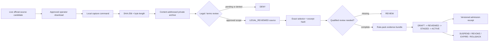

# Taiwan source snapshot, field-mapping, and rule-pack lifecycle

> **Status:** Phase 8B engineering contract / Draft stacked slice.  
> This document does not admit an official source, clinical rule, personal dose, medication-interaction conclusion, or production rule pack.

## 執行摘要

Phase 8A defined the product, corpus, OCR, rule-pack, reviewer, and decision-receipt contracts. Phase 8B closes the next engineering gap:

1. a mutable government URL is recorded only as a `CANDIDATE`;
2. an operator captures exact local bytes without using an LLM or CI network fetch;
3. the capture command creates a content-addressed `HASH_VERIFIED` receipt that still defaults to `DENY`;
4. legal review is a separate `LEGAL_REVIEWED` transition;
5. every domain claim uses an exact source selector and excerpt hash;
6. release promotion must follow `DRAFT -> REVIEWED -> STAGED -> ACTIVE`;
7. suspension, revocation, expiry, and rollback are signed deterministic events.

The repository contains one synthetic text artifact to prove the machinery. It contains no regulator text, product, person, barcode, or third-party media.

## Hard laws

```text
LIVE_URL != IMMUTABLE_EVIDENCE
HASH_VERIFIED != LEGAL_REVIEWED
LEGAL_REVIEWED != CLINICALLY_REVIEWED
REVIEWED != ADMITTED
ACTIVE_WITH_BLOCKERS != PRODUCTION_ADMITTED
MODEL_OUTPUT != RELEASE_AUTHORITY
```

A live dataset URL, HTML page, attachment ID, or dataset number can change. It cannot authorize a production rule until the exact bytes, hash, retrieval metadata, license/terms review, field mapping, reviewer evidence, tests, effective window, and rollback identity are bound to one release.

## Data flow



No source capture or mapping step creates a personal dose recommendation. The deterministic safety engine remains responsible for blocking automation when serving size, units, medication context, symptoms, or source evidence are unresolved.

## Repository layout

```text
legal/
└── taiwan-official-resource-candidates.json
    # Mutable live-source metadata only; every source is CANDIDATE + DENY.

data/taiwan-supplement/
├── source-snapshot.synthetic.json
├── source-snapshots/
│   └── synthetic-labeling-guidance-v1.txt
├── field-mapping.draft.example.json
├── lifecycle.draft.example.json
└── schemas/
    ├── source-snapshot.schema.json
    ├── source-field-mapping.schema.json
    └── rule-pack-lifecycle.schema.json

shared/src/commonMain/.../
└── TaiwanSourceLifecycle.kt

shared/src/commonTest/.../
└── TaiwanSourceLifecycleTest.kt

scripts/
├── capture_taiwan_source.py
└── validate_taiwan_source_lifecycle.py
```

## Official source candidates

The candidate registry records the live endpoints and observed fields needed for later operator capture. It intentionally contains no snapshot hash or archive URI.

| Candidate | Observed engineering use | Explicit boundary |
|---|---|---|
| MOHW vitamin/mineral tablet/capsule labeling page and attachments | label schema and wording candidates | website/attachment terms, exact bytes, line mapping, and qualified review still missing |
| TFDA dataset 9047 | product registration identity and regulator ingredient-text candidates | registration is not safety, efficacy, or medication-compatibility evidence |
| TFDA dataset 9640 | food-additive category and restriction-text candidates | no direct conversion into a person's supplement dose |
| TFDA dataset 8938 | business identity reconciliation | no health, quality, efficacy, or product-safety inference |

The three data.gov.tw datasets are recorded with their observed CSV/JSON/XML distribution candidates. Dataset 8938 is treated as a possible ZIP capture because the portal describes the large resource as compressed. Capture must preserve the original downloaded bytes before extraction.

## Local capture command

`scripts/capture_taiwan_source.py` accepts a **local regular file only**. It has no HTTP client and therefore cannot silently replace an admitted source with new bytes during CI.

Example using a repository-authored synthetic file:

```bash
python3 scripts/capture_taiwan_source.py \
  --source-id synthetic-example \
  --snapshot-id synthetic-example-v1 \
  --input /approved/local/path/example.txt \
  --artifact-kind TEXT \
  --canonical-url repo://synthetic/example \
  --captured-at 2026-08-15 \
  --media-type text/plain \
  --license-id REPOSITORY_SYNTHETIC \
  --attribution-text "Repository-authored synthetic fixture" \
  --note "Contract test only." \
  --archive-root /private/evidence/taiwan-sources \
  --archive-uri-prefix evidence://private/taiwan-sources \
  --manifest-out /private/evidence/receipts/synthetic-example-v1.json \
  --synthetic \
  --redistributable
```

The command:

- rejects symlink and non-regular inputs;
- enforces a maximum artifact size;
- copies bytes through an atomic temporary file;
- computes SHA-256 and byte length while copying;
- verifies an existing content-address target before reuse;
- writes the manifest atomically;
- always emits `state=HASH_VERIFIED`;
- always emits `productionUse=DENY`;
- never emits `legalReviewRef`;
- never emits `modelGenerated=true`.

An operator or separate reviewed workflow must later bind the receipt to a legal-review record. Editing the generated hash or changing `DENY` to `ALLOW` by hand is not an admission path.

## Immutable snapshot contract

A production source artifact requires all of the following:

```text
jurisdiction = TW
canonical HTTPS source
capturedAtIsoDate
exact media type
positive byte length
lowercase SHA-256
content-addressed archive URI containing the same SHA-256
license / terms identity
attribution text
synthetic = false
state = LEGAL_REVIEWED
legalReviewRef
productionUse = ALLOW
modelGenerated = false
```

`redistributable=false` does not prevent a private internal evidence archive when the reviewed terms permit that scope. It does prevent treating the artifact as public application content. Legal review must state the admitted storage, processing, redistribution, attribution, territory, and retention scope.

## Exact source-field mapping

A rule cannot cite only a source ID. It must identify the exact evidence location:

| Selector | Required location |
|---|---|
| `CSV_COLUMN` | exact header name |
| `JSON_POINTER` | RFC 6901-style pointer beginning with `/` |
| `XML_XPATH` | absolute XPath beginning with `/` |
| `PDF_PAGE_LINE` | page number plus ordered line range in the archived extraction |
| `HTML_SELECTOR` | exact selector in the archived document |
| `TEXT_RANGE` | ordered 1-based line range |

A `VERIFIED` mapping requires:

- `sourceId`;
- `snapshotId`;
- matching source/snapshot identity;
- deterministic transform;
- target domain field;
- SHA-256 of the exact selected excerpt;
- `modelGenerated=false`.

`REGULATORY_TEXT`, `REFERENCE_VALUE`, and `TOLERANCE_RANGE` mappings additionally require a qualified reviewer attestation before production. A raw field such as “使用食品範圍及限量” remains regulator text; it is not transformed into personalized supplement advice.

The repository fixture contains:

- one `VERIFIED + TEST_ONLY` mapping against synthetic text;
- official-source mappings that remain `DRAFT + DENY`;
- no production `ALLOW` mapping.

## Rule-pack release lifecycle

```text
DRAFT
  --REVIEW--> REVIEWED
  --STAGE----> STAGED
  --ACTIVATE-> ACTIVE
```

The resolver rejects skipped states. `REVIEW` requires hashes for:

- rule-pack content;
- source evidence bundle;
- deterministic test suite;
- qualified reviewer attestation;
- user-facing wording.

Production also requires a bounded effective window, exact admitted mappings, a distinct rollback version, contiguous signed events, and an `ACTIVE` final state with no blocker.

Operational transitions:

```text
ACTIVE ----SUSPEND----> SUSPENDED
SUSPENDED -RESUME-----> ACTIVE
REVIEWED/STAGED/ACTIVE/SUSPENDED --REVOKE--> REVOKED
ACTIVE/SUSPENDED ------------------EXPIRE--> EXPIRED
ACTIVE/SUSPENDED/REVOKED/EXPIRED --ROLLBACK--> ROLLED_BACK
```

Suspension, resume, revocation, and rollback require both a reason code and incident ID. Rollback requires the event target to equal the candidate's exact `rollbackToVersion`.

An input manifest cannot set `productionAdmitted=true`. The resolver computes admission only when:

```text
production mode
AND final state = ACTIVE
AND no blocker
```

## Source change and incident behavior

When a live source changes:

1. retain the previously admitted artifact and receipt;
2. capture the new bytes as a new snapshot ID and hash;
3. do not mutate the old snapshot;
4. compare exact mappings and affected rules;
5. rerun deterministic tests and reviewer workflow;
6. stage a new pack version;
7. keep the old active version until promotion succeeds or an incident requires suspension;
8. revoke or roll back through signed lifecycle events.

A URL update alone never modifies the active rule pack.

## Validation

```bash
python3 scripts/validate_repository.py
python3 scripts/validate_taiwan_rule_pack.py
python3 scripts/validate_taiwan_source_lifecycle.py
./gradlew :shared:jvmTest
```

`validate_taiwan_source_lifecycle.py` verifies:

- all official records remain candidate-only with null hashes and `DENY`;
- the synthetic file matches its SHA-256 and byte length receipt;
- exact excerpt hashing works;
- no official mapping is `VERIFIED` or `ALLOW`;
- the draft lifecycle contains no fabricated signatures or review evidence;
- the capture command produces a content-addressed `DENY` receipt in a temporary directory;
- the Kotlin source retains release, rollback, and model-authority invariants;
- twelve source/lifecycle contract tests remain present.

Hosted Android, Web, and iOS checks are still required on the exact stacked head. A job that never receives a runner is an infrastructure blocker, not passing evidence and not an application-code failure.

## Remaining external gates

Phase 8B does **not** complete Issue #8. Still required:

1. approved downloads of the exact MOHW/TFDA resources;
2. immutable private storage and real hashes;
3. legal review of each source and distribution scope;
4. exact selectors recalculated against those archived bytes;
5. deterministic production rules linked to verified mappings;
6. representative consented Traditional Chinese labels outside git;
7. Android ML Kit and Apple Vision field metrics;
8. qualified Taiwan reviewer qualification, conflict-of-interest, signature, rule coverage, and wording review;
9. signed promotion, revocation, incident, and rollback receipts;
10. exact-head hosted CI after the Actions budget gate is removed.

Until those gates pass, all official sources remain `CANDIDATE`, all official mappings remain `DRAFT`, and the Taiwan rule pack remains non-executable.
