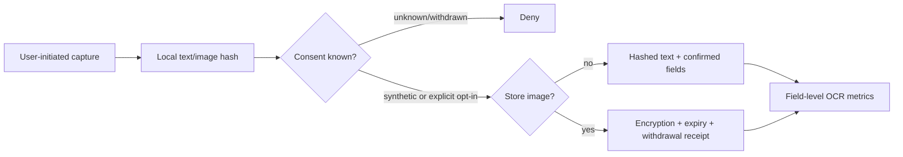

# Taiwan supplement evidence and rule-pack contract

## Status

This is an engineering and review workflow, not medical advice. No production Taiwan rule pack is clinically reviewed or admitted in this repository.

## Why product variants are first-class

A barcode alone is insufficient. The same marketed product can differ by country, formulation, serving unit, and label revision. The canonical identity therefore includes:

```text
market + barcode? + internal product id + formulation + label revision
```

Serving size remains nullable until a user or reviewed source confirms both amount and unit. OCR may create candidates; it cannot resolve ambiguity by itself.

## Corpus admission



First-pass exact accuracy and correction completion are separate metrics. A system can have low first-pass accuracy but high correction completion; hiding that distinction would overstate OCR quality.

## Primary source registry

Initial candidates are deliberately `REVIEW`, not `ALLOW`:

- Ministry of Health and Welfare 2019 vitamin/mineral tablet and capsule labeling announcement.
- TFDA imported tablet/capsule food registration dataset (dataset 9047).
- TFDA food-additive use/limit/specification dataset (dataset 9640).
- TFDA food-business registration dataset (dataset 8938).

These sources can support label structure, product identity, or narrowly mapped regulatory facts. They do **not** establish an individualized safe dose, efficacy, or medication compatibility.

Before use, archive the exact resource, calculate SHA-256, record the retrieval/effective dates and license terms, and map each rule to exact fields. A changing web page or dataset ID is not enough evidence.

## Rule-pack admission state machine

```text
MISSING
  -> DRAFT                    # inspectable, never executable
  -> CLINICALLY_REVIEWED      # only after all admission gates
  -> ADMITTED                 # validator result for a date
  -> EXPIRED / REVOKED        # represented by date or rollback outside the client
```

`CLINICALLY_REVIEWED` is rejected unless all gates pass:

1. Taiwan jurisdiction and valid effective window.
2. Pack content hash.
3. Archived primary-source hashes.
4. Deterministic rules with no missing source references.
5. No conflicting rules at the same ingredient/condition/priority key.
6. All seven safety cases: IU, missing serving, duplicates, proprietary blends, medication context, symptoms, and source conflict.
7. Qualified reviewer attestation covering every rule.
8. Reviewed user-facing wording hash.
9. A distinct rollback version.

The validator proves completeness of the review contract. It does not prove that the medical content is correct; qualified domain review remains mandatory.

## Decision receipts

A receipt preserves:

- product-variant key;
- confirmed evidence SHA-256;
- deterministic decision and reasons;
- triggered rule IDs;
- rule-pack ID, version, and content hash;
- confirmation date.

`modelUsedForDecision` is hard-coded false. A later LLM gateway may explain the receipt but cannot own or alter the decision.

## Next evidence work

- Acquire a consented, representative Traditional Chinese label corpus outside git.
- Define product/serving field annotation guidelines.
- Measure field-level OCR accuracy on Android ML Kit and Apple Vision separately.
- Archive official source resources with immutable hashes.
- Recruit a qualified Taiwan reviewer and define conflict-of-interest records.
- Build signed review and rollback tooling.
